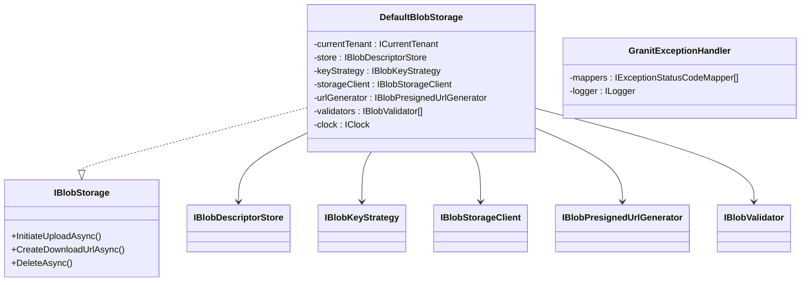

## Definition

The Facade pattern provides a simplified interface to a complex subsystem. It
hides the complexity of interactions between multiple components behind a
single, cohesive entry point.

## Diagram



## Implementation in Granit

| Facade | File | Orchestrated sub-components |
|--------|------|-----------------------------|
| `DefaultBlobStorage` | `src/Granit.BlobStorage/Internal/DefaultBlobStorage.cs` | `ICurrentTenant`, `IBlobDescriptorStore`, `IBlobKeyStrategy`, `IBlobStorageClient`, `IBlobPresignedUrlGenerator`, `IBlobValidator[]`, `IClock` |
| `GranitExceptionHandler` | `src/Granit.Http.ExceptionHandling/GranitExceptionHandler.cs` | `IExceptionStatusCodeMapper[]`, `ILogger`, `ExceptionHandlingOptions` |

## Rationale

Without the `DefaultBlobStorage` facade, application code would have to
manually orchestrate tenant resolution, S3 key generation, descriptor
creation, presigned URL generation, and validation -- on every operation. The
facade encapsulates this complexity behind 3 public methods.

`GranitExceptionHandler` centralizes exception-to-`ProblemDetails` conversion
(RFC 7807), hiding the mapper chain and ISO 27001 rules (masking internal
details in production).

## Usage example

```csharp
// The caller interacts with a simple API -- complexity is hidden
IBlobStorage blobStorage = serviceProvider.GetRequiredService<IBlobStorage>();

// Behind this call: tenant resolution, descriptor creation,
// S3 key generation, presigned URL, database persistence
PresignedUploadTicket ticket = await blobStorage.InitiateUploadAsync(
    "avatars",
    new BlobUploadRequest("photo.jpg", "image/jpeg", MaxAllowedBytes: 5_000_000),
    cancellationToken);
```

## Further reading

- [Facade -- refactoring.guru](https://refactoring.guru/design-patterns/facade)
