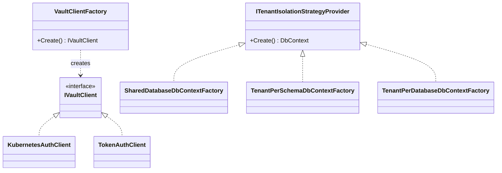

## Definition

The Factory Method pattern delegates object creation to subclasses or
specialized methods, allowing the type of created object to vary without
modifying calling code. The caller works with the interface; the factory
selects the concrete implementation.

## Diagram



## Implementation in Granit

| Factory | File | Selection |
|---------|------|-----------|
| `VaultClientFactory` | `src/Granit.Vault/Services/VaultClientFactory.cs` | Switch expression on `AuthMethod` (Kubernetes / Token) |
| `SharedDatabaseDbContextFactory` | `src/Granit.Persistence/MultiTenancy/SharedDatabaseDbContextFactory.cs` | SharedDatabase strategy |
| `TenantPerSchemaDbContextFactory` | `src/Granit.Persistence/MultiTenancy/TenantPerSchemaDbContextFactory.cs` | SchemaPerTenant strategy |
| `TenantPerDatabaseDbContextFactory` | `src/Granit.Persistence/MultiTenancy/TenantPerDatabaseDbContextFactory.cs` | DatabasePerTenant strategy |

**Custom variant**: the persistence factories combine Factory Method +
Strategy -- the strategy is selected at configuration time, and the factory
creates the appropriate `DbContext` per request.

## Rationale

The choice of Vault authentication method (Kubernetes in production, Token in
development) and tenant isolation strategy must be resolved at runtime
without `if/else` in application code.

## Usage example

```csharp
// The factory is resolved via DI -- calling code is unaware of the implementation
IVaultClient client = vaultClientFactory.Create();
SecretData secret = await client.V1.Secrets.KeyValue.V2
    .ReadSecretAsync("app/database", cancellationToken: ct);
```

## Further reading

- [Factory Method -- refactoring.guru](https://refactoring.guru/design-patterns/factory-method)
