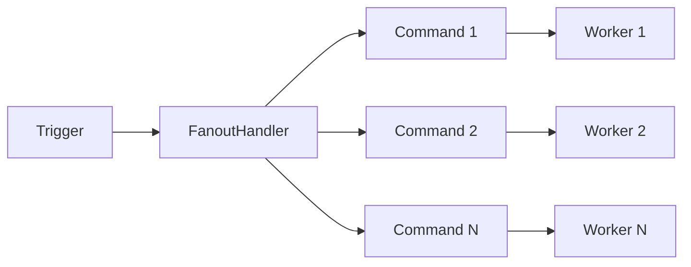
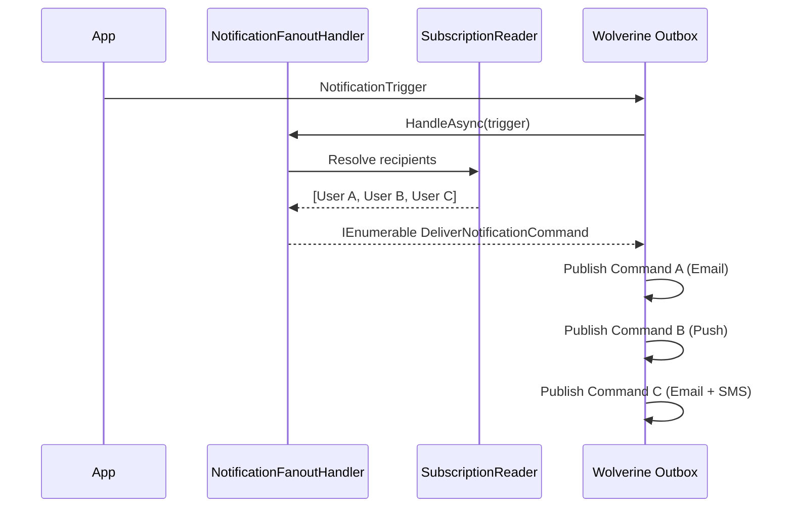

## Definition

**Fan-Out** (or Scatter) transforms a single message into N independent messages,
each processed in parallel. In a messaging context, the handler receives a trigger
and returns a collection of commands -- the bus publishes each command individually
within the same Outbox transaction. Granit uses this pattern in notifications
(one trigger to N deliveries per recipient x channel) and webhooks (one event
to N sends per active subscription).

## Diagram





## Implementation in Granit

Granit implements Fan-Out in 2 distinct modules, leveraging the Wolverine
`Task<IEnumerable<TCommand>>` convention: each returned element is published
as an independent message within the same Outbox transaction.

### 1. NotificationFanoutHandler -- multi-channel notifications

Transforms a `NotificationTrigger` into N `DeliverNotificationCommand` (one per
recipient x preferred channel).

| Element | Detail |
| --- | --- |
| Class | `NotificationFanoutHandler` |
| Package | `Granit.Notifications` |
| Input | `NotificationTrigger` |
| Output | `IEnumerable<DeliverNotificationCommand>` |
| Resolution | Explicit > Followers > Subscribers (decreasing priority) |

```csharp
public async Task<IEnumerable<DeliverNotificationCommand>> HandleAsync(
    NotificationTrigger trigger,
    CancellationToken cancellationToken)
{
    // 1. Resolve recipients (explicit > followers > subscribers)
    // 2. Load channel preferences per user
    // 3. Create a DeliverNotificationCommand per recipient x channel
    // Return empty if no recipients -- no exception
}
```

**Channel resolution logic**: each recipient can have preferences (opt-out by
channel). The `NotificationDefinition` provides default channels. The handler
filters out disabled channels before creating commands.

### 2. WebhookFanoutHandler -- webhooks per subscription

Transforms a `WebhookTrigger` into N `SendWebhookCommand` (one per active
subscription for the event type).

| Element | Detail |
| --- | --- |
| Class | `WebhookFanoutHandler` |
| Package | `Granit.Webhooks` |
| Input | `WebhookTrigger` |
| Output | `IEnumerable<SendWebhookCommand>` |
| Filtering | Active subscriptions for `EventType` |

```csharp
public async Task<IEnumerable<SendWebhookCommand>> HandleAsync(
    WebhookTrigger trigger,
    CancellationToken cancellationToken)
{
    // 1. Query active subscriptions for trigger.EventType
    // 2. Create a standardized WebhookEnvelope (metadata + payload)
    // 3. Create a SendWebhookCommand per subscription
    // Return empty if no subscriptions -- no exception
}
```

Each command receives a distinct `DeliveryId` (separate from the shared `EventId`),
enabling individual tracking and isolated retry.

### Common architectural properties

| Property | Detail |
| --- | --- |
| Wolverine convention | `Task<IEnumerable<T>>` -- automatic cascade into the Outbox |
| Transactional guarantee | All commands published in the same Outbox transaction |
| Empty case | Returns `Enumerable.Empty<T>()` -- no exception |
| Idempotency | Unique `DeliveryId` per command for audit and retry |
| Multi-tenancy | Ambient `ICurrentTenant` context with fallback to embedded `TenantId` |
| Observability | OpenTelemetry Activity with fan-out cardinality |

### Reference files

| File | Role |
| --- | --- |
| `src/Granit.Notifications/Handlers/NotificationFanoutHandler.cs` | Notification fan-out |
| `src/Granit.Notifications/Messages/NotificationTrigger.cs` | Trigger message |
| `src/Granit.Notifications/Messages/DeliverNotificationCommand.cs` | Delivery command |
| `src/Granit.Webhooks/Handlers/WebhookFanoutHandler.cs` | Webhook fan-out |
| `src/Granit.Webhooks/Messages/WebhookTrigger.cs` | Trigger message |
| `src/Granit.Webhooks/Messages/SendWebhookCommand.cs` | Send command |

## Rationale

| Problem | Solution |
| --- | --- |
| Notification to 100 recipients blocks the handler | Fan-out into 100 independent commands, processed in parallel |
| One webhook failure must not block the others | Each `SendWebhookCommand` has its own isolated retry |
| Message loss if crash during fan-out | Wolverine Outbox -- atomic commit of all commands |
| Recipient opts out of a channel | Filtering by preferences before creating commands |
| Audit trail per delivery | Unique `DeliveryId` per command (distinct from `EventId`) |

## Usage example

```csharp
// --- Trigger a notification (automatic fan-out) ---
await messageBus.PublishAsync(
    new NotificationTrigger(
        NotificationId: guidGenerator.Create(),
        NotificationTypeName: "appointment.reminder",
        Data: JsonSerializer.SerializeToElement(new { PatientName = "Dupont" }),
        RecipientUserIds: [doctorId, secretaryId]),
    cancellationToken).ConfigureAwait(false);

// The NotificationFanoutHandler resolves preferred channels for each recipient
// and publishes a DeliverNotificationCommand per recipient x channel.

// --- Trigger a webhook (automatic fan-out) ---
await messageBus.PublishAsync(
    new WebhookTrigger(
        EventId: guidGenerator.Create(),
        EventType: "invoice.paid",
        Payload: JsonSerializer.SerializeToElement(invoiceDto),
        OccurredAt: timeProvider.GetUtcNow()),
    cancellationToken).ConfigureAwait(false);

// The WebhookFanoutHandler creates a SendWebhookCommand per active subscription
// for "invoice.paid". Each delivery is signed and sent independently.
```

## Further reading

- [Enterprise Integration Patterns -- Splitter](https://www.enterpriseintegrationpatterns.com/patterns/messaging/Sequencer.html)
- [Wolverine Cascading Messages](https://wolverine.netlify.app/guide/handlers/cascading.html)
