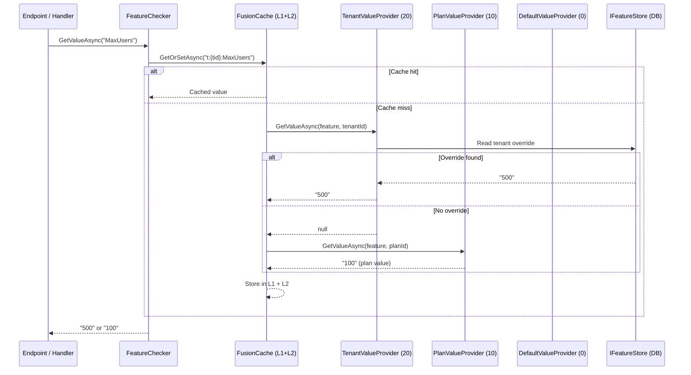

## Definition

The Feature Flags pattern enables activating or deactivating features at runtime
without redeployment. Granit extends this pattern for SaaS tiering: feature
resolution follows a multi-level cascade **Tenant > Plan > Default**, with a
FusionCache L1/L2 cache for performance.

Three feature types are supported:

- **Toggle**: enabled/disabled (boolean)
- **Numeric**: numeric value with min/max constraints (SaaS quotas)
- **Selection**: value from an allowed set of choices

## Diagram



## Implementation in Granit

### Feature definition (code-first)

| Component | File | Role |
|-----------|------|------|
| `FeatureDefinition` | `src/Granit.Features/Definitions/FeatureDefinition.cs` | Name, default value, type, constraints |
| `FeatureDefinitionProvider` | `src/Granit.Features/Definitions/FeatureDefinitionProvider.cs` | Abstract class to be implemented by the application |
| `FeatureDefinitionStore` | `src/Granit.Features/Definitions/FeatureDefinitionStore.cs` | Singleton registry aggregating all providers |
| `FeatureGroupDefinition` | `src/Granit.Features/Definitions/FeatureGroupDefinition.cs` | Logical grouping of features |

### Multi-level resolution

| Provider | Order | File | Source |
|----------|-------|------|--------|
| `TenantFeatureValueProvider` | 20 | `src/Granit.Features/ValueProviders/TenantFeatureValueProvider.cs` | `IFeatureStore` (DB) |
| `PlanFeatureValueProvider` | 10 | `src/Granit.Features/ValueProviders/PlanFeatureValueProvider.cs` | `IPlanFeatureStore` (application) |
| `DefaultValueFeatureValueProvider` | 0 | `src/Granit.Features/ValueProviders/DefaultValueFeatureValueProvider.cs` | `FeatureDefinition.DefaultValue` (code) |

### Cache and invalidation

| Component | File | Role |
|-----------|------|------|
| `FeatureChecker` | `src/Granit.Features/Internal/FeatureChecker.cs` | Resolution orchestration + `IFusionCache` |
| `FeatureCacheKey` | `src/Granit.Features/Cache/FeatureCacheKey.cs` | Format: `t:{tenantId}:{featureName}` |
| `FeatureCacheInvalidationHandler` | `src/Granit.Features/Cache/FeatureCacheInvalidationHandler.cs` | Listens to `FeatureValueChangedEvent`, expires cache entries |

### Numeric limit guard

| Component | File | Role |
|-----------|------|------|
| `IFeatureLimitGuard` | `src/Granit.Features/Limits/IFeatureLimitGuard.cs` | `CheckAsync(feature, currentCount)` -- throws `FeatureLimitExceededException` |
| `FeatureLimitGuard` | `src/Granit.Features/Limits/FeatureLimitGuard.cs` | Implementation |

### ASP.NET Core + Wolverine integration

| Component | File | Role |
|-----------|------|------|
| `[RequiresFeature]` | `src/Granit.Features/AspNetCore/RequiresFeatureAttribute.cs` | Attribute on actions/endpoints |
| `RequiresFeatureFilter` | `src/Granit.Features/AspNetCore/RequiresFeatureFilter.cs` | `IAsyncActionFilter` for MVC |
| `RequiresFeatureEndpointFilter` | `src/Granit.Features/AspNetCore/RequiresFeatureEndpointFilter.cs` | Minimal API filter |
| `RequiresFeatureMiddleware` | `src/Granit.Features/Wolverine/RequiresFeatureMiddleware.cs` | Wolverine handler middleware |

## Rationale

| Problem | Solution |
|---------|----------|
| Different SaaS plans (Free/Pro/Enterprise) with different limits | `Numeric` features with `NumericConstraint` + `FeatureLimitGuard` |
| Per-tenant override without redeployment | `TenantFeatureValueProvider` reads overrides from DB |
| Performance: resolution must not query the DB on every request | FusionCache L1 (in-memory) + L2 (Redis) with event-driven invalidation |
| Multi-instance consistency: a feature change must be visible everywhere | `FeatureValueChangedEvent` expires cache entries via `ExpireAsync` + backplane |
| API protection: block access if the feature is disabled | `[RequiresFeature]` on MVC, Minimal API, and Wolverine handlers |

## Usage example

```csharp
// 1. Define features (code-first)
public sealed class AcmeFeatureDefinitionProvider : FeatureDefinitionProvider
{
    public override void Define(IFeatureDefinitionContext context)
    {
        FeatureGroupDefinition group = context.AddGroup("Acme");

        group.AddFeature("Acme.MaxUsers",
            defaultValue: "50",
            valueType: FeatureValueType.Numeric,
            numericConstraint: new NumericConstraint(Min: 1, Max: 10_000));

        group.AddFeature("Acme.Telehealth",
            defaultValue: "false",
            valueType: FeatureValueType.Toggle);
    }
}

// 2. Check in a handler
public static class CreatePatientHandler
{
    public static async Task Handle(
        CreatePatientCommand command,
        IFeatureLimitGuard limitGuard,
        IFeatureChecker features,
        PatientDbContext db,
        CancellationToken cancellationToken)
    {
        // Throws FeatureLimitExceededException if quota is reached
        long currentCount = await db.Patients.CountAsync(ct);
        await limitGuard.CheckAsync("Acme.MaxUsers", currentCount, ct);

        // Check that a feature toggle is enabled
        await features.RequireEnabledAsync("Acme.Telehealth", ct);

        // Business logic...
    }
}

// 3. Protect an endpoint
app.MapPost("/api/patients", CreatePatientEndpoint.Handle)
    .RequiresFeature("Acme.MaxUsers");
```

## Further reading

- [Feature Management -- Microsoft Azure App Configuration](https://learn.microsoft.com/en-us/azure/azure-app-configuration/concept-feature-management)
