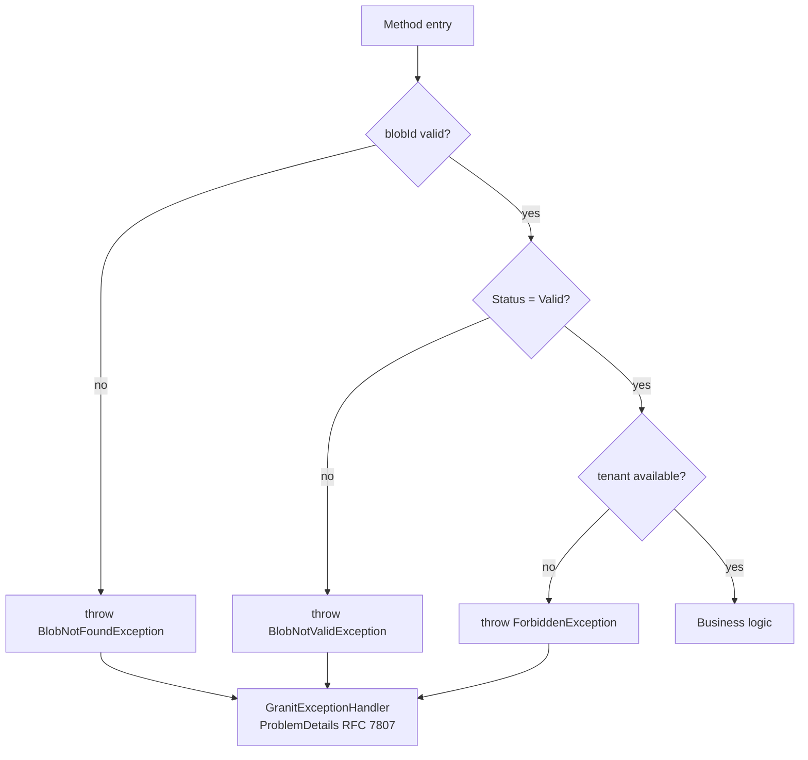

## Definition

The Guard Clause pattern validates preconditions at the start of a method and
immediately throws a semantic exception if a condition is not met. This pattern
prevents invalid states from propagating and produces clear, actionable error
messages.

## Diagram



## Implementation in Granit

### Semantic exceptions

| Exception | File | HTTP Code | ErrorCode |
|-----------|------|-----------|-----------|
| `BusinessException` | `src/Granit/Exceptions/BusinessException.cs` | 400 | Configurable |
| `NotFoundException` | `src/Granit/Exceptions/NotFoundException.cs` | 404 | -- |
| `EntityNotFoundException` | `src/Granit/Exceptions/EntityNotFoundException.cs` | 404 | -- |
| `ConflictException` | `src/Granit/Exceptions/ConflictException.cs` | 409 | Configurable |
| `ForbiddenException` | `src/Granit/Exceptions/ForbiddenException.cs` | 403 | -- |
| `ValidationException` | `src/Granit/Exceptions/ValidationException.cs` | 422 | Field errors |
| `BlobNotFoundException` | `src/Granit.BlobStorage/Exceptions/BlobNotFoundException.cs` | 404 | `BlobStorage:NotFound` |
| `FeatureLimitExceededException` | `src/Granit.Features/Exceptions/FeatureLimitExceededException.cs` | 429 | `Features:LimitExceeded` |
| `FeatureNotEnabledException` | `src/Granit.Features/Exceptions/FeatureNotEnabledException.cs` | 403 | `Features:NotEnabled` |

All exceptions are intercepted by `GranitExceptionHandler`
(`src/Granit.Http.ExceptionHandling/GranitExceptionHandler.cs`) and converted to
RFC 7807 `ProblemDetails`.

### ISO 27001 rule

Exceptions that do not implement `IUserFriendlyException` have their message
masked in production ("An unexpected error occurred") to prevent leaking
internal schema details.

## Rationale

Guard clauses make preconditions explicit and document each method's contract.
Semantic exceptions allow the global middleware to produce appropriate HTTP
responses without each endpoint managing its own errors.

## Usage example

```csharp
public static class DownloadDocumentHandler
{
    public static async Task<PresignedDownloadUrl> Handle(
        DownloadDocumentQuery query,
        IBlobStorage blobStorage,
        CancellationToken cancellationToken)
    {
        // Guard clause -- throws BlobNotFoundException (404)
        BlobDescriptor? descriptor = await blobStorage.GetDescriptorAsync(
            "medical-documents", query.BlobId, ct)
            ?? throw new BlobNotFoundException(query.BlobId);

        // Guard clause -- throws BlobNotValidException (409)
        if (descriptor.Status != BlobStatus.Valid)
            throw new BlobNotValidException(query.BlobId, descriptor.Status);

        // Business logic -- preconditions are guaranteed
        return await blobStorage.CreateDownloadUrlAsync(
            "medical-documents", query.BlobId, cancellationToken: ct);
    }
}
```

## Further reading

- [Guard Clause -- deviq.com](https://deviq.com/design-patterns/guard-clause)
