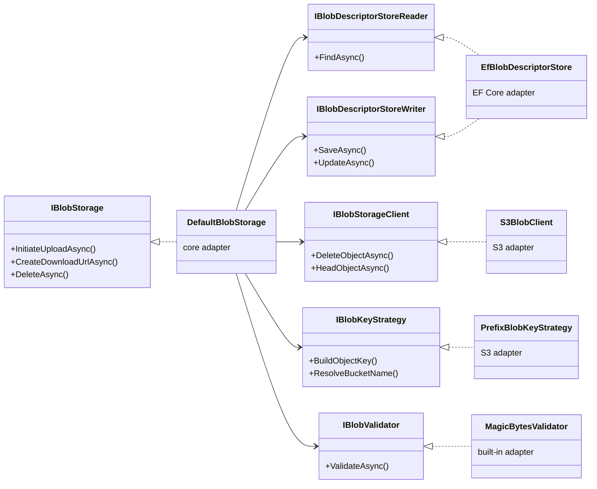

## Definition

Hexagonal architecture separates business logic (the "core") from
infrastructure details (databases, cloud services, frameworks) via **ports**
(interfaces) and **adapters** (interchangeable implementations). The core
only knows about ports; adapters are wired at composition time (DI).

In Granit, each functional module (BlobStorage, Features, BackgroundJobs,
Webhooks, Settings) follows this pattern: a "core" package defines the ports,
and separate packages (`*.EntityFrameworkCore`, `*.S3`) provide the adapters.

## Diagram



## Implementation in Granit

### BlobStorage (primary example)

| Port (interface) | File | Adapter(s) |
| ---------------- | ---- | ---------- |
| `IBlobStorage` | `src/Granit.BlobStorage/IBlobStorage.cs` | `DefaultBlobStorage` (orchestrator) |
| `IBlobDescriptorStoreReader` / `IBlobDescriptorStoreWriter` | `src/Granit.BlobStorage/` | `EfBlobDescriptorStore` in `Granit.BlobStorage.EntityFrameworkCore` |
| `IBlobStorageClient` | `src/Granit.BlobStorage/Internal/IBlobStorageClient.cs` | `S3BlobClient` in `Granit.BlobStorage.S3` |
| `IBlobKeyStrategy` | `src/Granit.BlobStorage/IBlobKeyStrategy.cs` | `PrefixBlobKeyStrategy` in `Granit.BlobStorage.S3` |
| `IBlobValidator` | `src/Granit.BlobStorage/IBlobValidator.cs` | `MagicBytesValidator`, `MaxSizeValidator` (built-in) + custom |

### Same pattern across other modules

| Module | Port | Adapters |
| ------ | ---- | -------- |
| Features | `IFeatureStoreReader` / `IFeatureStoreWriter` | `InMemoryFeatureStore`, `EfCoreFeatureStore` |
| BackgroundJobs | `IBackgroundJobStoreReader` / `IBackgroundJobStoreWriter` | `InMemoryBackgroundJobStore`, `EfBackgroundJobStore` |
| Webhooks | `IWebhookSubscriptionStoreReader` / `IWebhookSubscriptionStoreWriter` | `EfWebhookSubscriptionStore` |
| Settings | `ISettingStoreReader` / `ISettingStoreWriter` | `EfCoreSettingStore` |
| Caching | `IFusionCache` | FusionCache (via `Granit.Caching`) |
| Encryption | `IStringEncryptionProvider` | `AesStringEncryptionProvider` |

## Rationale

| Problem | Solution |
| ------- | -------- |
| Coupling to a cloud provider (S3, Azure Blob) | Ports allow swapping adapters without touching the core |
| Unit tests requiring a database | `InMemoryFeatureStore` and `InMemoryBackgroundJobStore` implement Reader/Writer interfaces, replacing EF Core in tests |
| ISO 27001 compliance -- ability to migrate from S3-compatible storage to a sovereign provider | Implementing `IBlobStorageClient` for the new provider is sufficient |
| Independent NuGet packages | The core (`Granit.BlobStorage`) has no dependency on EF Core or the AWS SDK |

## Usage example

```csharp
// Replacing S3 with MinIO -- only the adapter changes
services.AddSingleton<IBlobStorageClient, MinioBlobClient>();
services.AddSingleton<IBlobKeyStrategy, MinioBlobKeyStrategy>();

// The rest of the application code remains unchanged
IBlobStorage blobStorage = serviceProvider.GetRequiredService<IBlobStorage>();
PresignedUploadTicket ticket = await blobStorage.InitiateUploadAsync(
    "medical-documents",
    new BlobUploadRequest("mri-report.pdf", "application/pdf", MaxAllowedBytes: 50_000_000),
    cancellationToken);
```

## Further reading

- [Hexagonal Architecture -- Alistair Cockburn (original article, 2005)](https://alistair.cockburn.us/hexagonal-architecture/)
- [Architecture Styles -- DDD, Clean Architecture & Vertical Slices](/dotnet/architecture/architecture-styles/)
