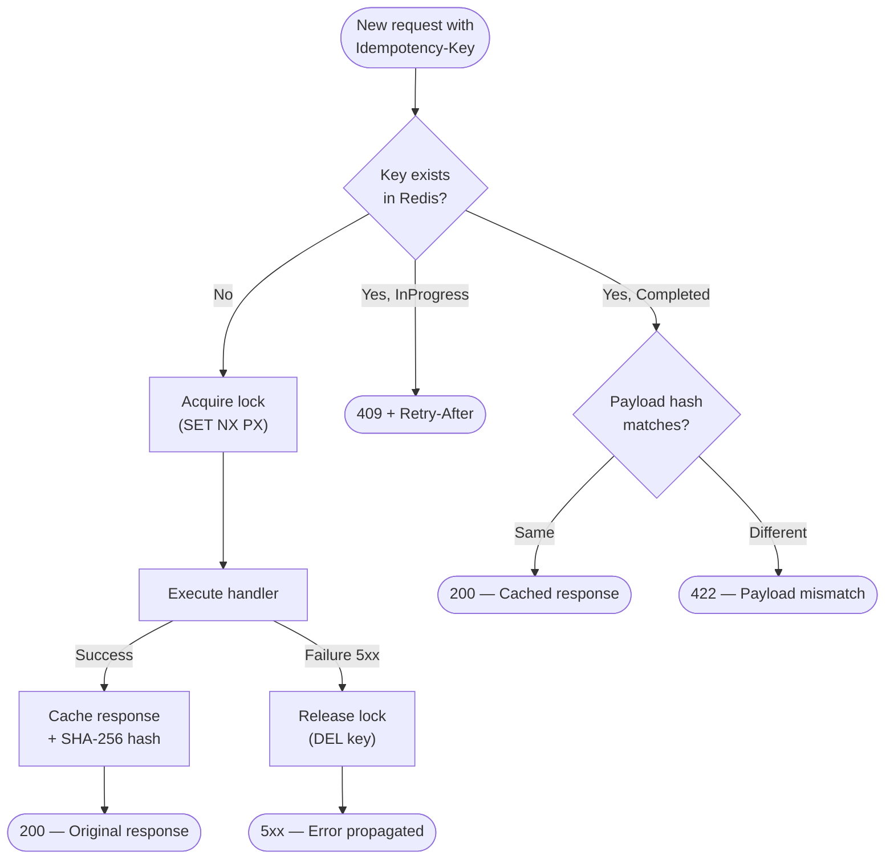

## Definition

Idempotency guarantees that the same HTTP request, replayed multiple times,
always produces the same result without additional side effects. The client
sends an `Idempotency-Key` header; the server associates this key with the
response and replays it on retry.

Granit implements a Stripe-inspired variant with a **state machine**
(Absent > InProgress > Completed), a SHA-256 payload hash to detect mutations,
and a multi-tenant Redis store.

## Diagram



## Implementation in Granit

| Component | File | Role |
|-----------|------|------|
| `IdempotencyMiddleware` | `src/Granit.Http.Idempotency/Internal/IdempotencyMiddleware.cs` | ASP.NET Core middleware -- full state machine |
| `IdempotencyState` | `src/Granit.Http.Idempotency/Models/IdempotencyState.cs` | Enum: `Absent`, `InProgress`, `Completed` |
| `[Idempotent]` | `src/Granit.Http.Idempotency/Attributes/IdempotentAttribute.cs` | Marker attribute on endpoints |
| `RedisIdempotencyStore` | `src/Granit.Http.Idempotency/Redis/RedisIdempotencyStore.cs` | Redis store with configurable TTL |
| `IIdempotencyMetadata` | `src/Granit.Http.Idempotency/Abstractions/IIdempotencyMetadata.cs` | Marker interface for endpoints |

### Detailed algorithm

1. Extract the `Idempotency-Key` header
2. Compute SHA-256 hash: `METHOD + route + key + body` (zero-allocation
   via `IncrementalHash` + `ArrayPool`)
3. Composite Redis key: `idempotency:{tenantId}:{userId}:{key}`
4. Check state:
   - **Absent** -- attempts `SET NX PX` (lock with TTL)
   - **InProgress** -- returns `409 Conflict` + `Retry-After` header
   - **Completed** + same hash -- replays the response (status + headers + body)
   - **Completed** + different hash -- returns `422 Unprocessable Entity`
5. After successful execution: stores the full response
6. After failure (5xx): releases the lock (allows retry)

### In-house variants

- **Multi-tenant composite key**: includes `tenantId` + `userId` for isolation
- **Zero-allocation hash**: `IncrementalHash.CreateHash(HashAlgorithmName.SHA256)`
  \+ `ArrayPool<byte>.Shared` for body streaming
- **Double-check locking**: checks the cache before AND after lock acquisition

## Rationale

| Problem | Solution |
|---------|----------|
| Network retry creates duplicates (double payment, double creation) | The idempotency key detects and replays already-processed requests |
| Concurrent requests with the same key | `InProgress` state returns 409 -- the client waits and retries |
| Payload mutation between two sends | The SHA-256 hash detects the difference and returns 422 |
| Performance: no lock on normal requests (without key) | The middleware short-circuits immediately if no header present |
| Multi-tenant: one tenant's key must not impact another | Redis key prefixed with `{tenantId}:{userId}` |

## Usage example

```csharp
// Mark an endpoint as idempotent
app.MapPost("/api/invoices", async (
    CreateInvoiceRequest request,
    InvoiceService service,
    CancellationToken cancellationToken) =>
{
    InvoiceDto invoice = await service.CreateAsync(request, ct);
    return Results.Created($"/api/invoices/{invoice.Id}", invoice);
})
.WithMetadata(new IdempotentAttribute());

// The client sends:
// POST /api/invoices
// Idempotency-Key: 550e8400-e29b-41d4-a716-446655440000
// Content-Type: application/json
// { "patientId": "...", "amount": 150.00 }

// First call -> 201 Created (result stored)
// Second call (same key, same body) -> 201 Created (replay)
// Second call (same key, modified body) -> 422 Unprocessable Entity
```

## Further reading

- [Idempotent Requests -- Stripe API Documentation](https://docs.stripe.com/api/idempotent_requests)
