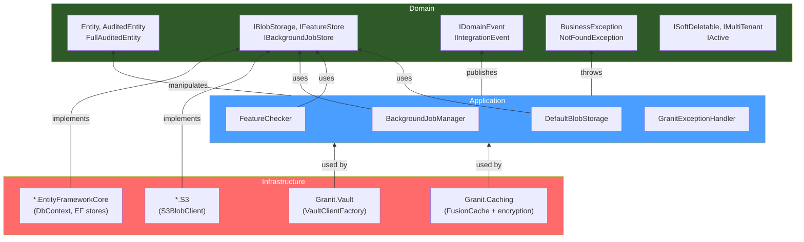

## Definition

Layered architecture organizes code into strictly hierarchical levels of
responsibility. Each layer depends only on the layer below it, never on the
layer above. In Granit, three main layers structure each module:

- **Domain**: entities, marker interfaces, events, business exceptions
- **Application**: orchestration services, checkers, managers
- **Infrastructure**: EF Core persistence, S3 clients, Vault, Redis cache

## Diagram



## Implementation in Granit

### Domain layer (`Granit`)

| Component | File |
| --------- | ---- |
| `Entity` > `CreationAuditedEntity` > `AuditedEntity` > `FullAuditedEntity` | `src/Granit/Domain/` |
| `ISoftDeletable`, `IMultiTenant`, `IActive` | `src/Granit/Domain/` |
| `IDomainEvent`, `IIntegrationEvent` | `src/Granit/Events/` |
| `BusinessException`, `NotFoundException`, `ConflictException` | `src/Granit/Exceptions/` |
| `ICurrentTenant`, `NullTenantContext` | `src/Granit/MultiTenancy/` |

### Application layer (functional packages)

| Service | File |
| ------- | ---- |
| `FeatureChecker` | `src/Granit.Features/Checker/FeatureChecker.cs` |
| `BackgroundJobManager` | `src/Granit.BackgroundJobs/Internal/BackgroundJobManager.cs` |
| `DefaultBlobStorage` | `src/Granit.BlobStorage/Internal/DefaultBlobStorage.cs` |
| `PermissionChecker` | `src/Granit.Authorization/Services/PermissionChecker.cs` |
| `GranitExceptionHandler` | `src/Granit.Http.ExceptionHandling/GranitExceptionHandler.cs` |

### Infrastructure layer (`*.EntityFrameworkCore`, `*.S3`, etc.)

| Component | File |
| --------- | ---- |
| `EfBlobDescriptorStore` | `src/Granit.BlobStorage.EntityFrameworkCore/Internal/EfBlobDescriptorStore.cs` |
| `EfCoreFeatureStore` | `src/Granit.Features.EntityFrameworkCore/Internal/EfCoreFeatureStore.cs` |
| `EfBackgroundJobStore` | `src/Granit.BackgroundJobs.EntityFrameworkCore/Internal/EfBackgroundJobStore.cs` |
| `S3BlobClient` | `src/Granit.BlobStorage.S3/Internal/S3BlobClient.cs` |
| `VaultClientFactory` | `src/Granit.Vault/Services/VaultClientFactory.cs` |

### Dependency rule

```text
Infrastructure --> Application --> Domain
         Never in the reverse direction
```

`*.EntityFrameworkCore` packages reference the core package (e.g.,
`Granit.BlobStorage`) but never the other way around. The core package
contains no dependency on EF Core or the AWS SDK.

## Rationale

| Problem | Solution |
| ------- | -------- |
| Coupling between business logic and database | The domain only knows about interfaces (ports) |
| Difficulty testing business logic in isolation | Application services are testable with mocks |
| Changing provider (S3 to another) impacts the entire codebase | Only the infrastructure layer changes |
| EF Core entities leaking into API DTOs | Strict separation prevents shortcuts |

## Usage example

```csharp
// Entity hierarchy -- Domain layer
public sealed class Patient : FullAuditedEntity, IMultiTenant
{
    public Guid? TenantId { get; set; }
    public string FirstName { get; set; } = string.Empty;
    public string LastName { get; set; } = string.Empty;
    public DateOnly BirthDate { get; set; }
}

// FullAuditedEntity automatically provides:
// - Id (Guid, sequential via IGuidGenerator)
// - CreatedAt, CreatedBy (ISO 27001 audit -- creation)
// - ModifiedAt, ModifiedBy (ISO 27001 audit -- modification)
// - IsDeleted, DeletedAt, DeletedBy (GDPR soft delete)
// - TenantId (multi-tenant isolation via IMultiTenant)
```

## Further reading

- [Presentation Domain Data Layering -- Martin Fowler](https://martinfowler.com/bliki/PresentationDomainDataLayering.html)
- [Architecture Styles -- DDD, Clean Architecture & Vertical Slices](/dotnet/architecture/architecture-styles/)
