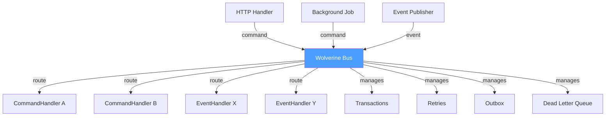

## Definition

The Mediator pattern centralizes interactions between components via an
intermediary object. Components do not communicate directly; they send
messages to the mediator, which routes them to the appropriate recipients.

In Granit, **Wolverine** is the central mediator: it routes commands, events,
and queries to handlers, manages transactions, retries, and the Outbox.

## Diagram



## Implementation in Granit

| Component | File | Role |
|-----------|------|------|
| `GranitWolverineModule` | `src/Granit.Wolverine/GranitWolverineModule.cs` | Mediator configuration |
| `AddGranitWolverine()` | `src/Granit.Wolverine/Extensions/WolverineHostApplicationBuilderExtensions.cs` | Registers policies (retry, validation, DLQ) |
| `WolverineMessagingOptions` | `src/Granit.Wolverine/WolverineMessagingOptions.cs` | Retry delays: 5s, 30s, 5min |

### Policies managed by the mediator

- **FluentValidation**: invalid messages go to DLQ immediately
- **Exponential retry**: `ValidationException` goes to DLQ, others retry at 5s/30s/5min
- **Outbox**: `IIntegrationEvent` messages persisted atomically
- **Local queue**: `IDomainEvent` messages processed in-process

## Rationale

Without a mediator, each handler would need to know which other handlers to
call and manage its own transactions and retries. Wolverine centralizes this
logic and keeps handlers pure and testable.

## Usage example

```csharp
// Handlers do not know each other -- Wolverine routes messages
public static class CreatePatientHandler
{
    public static IEnumerable<object> Handle(
        CreatePatientCommand cmd,
        AppDbContext db)
    {
        Patient patient = new() { /* ... */ };
        db.Patients.Add(patient);

        // Wolverine routes to the correct handler automatically
        yield return new PatientCreatedOccurred { PatientId = patient.Id };
        yield return new SendWelcomeEmailCommand { Email = cmd.Email };
    }
}
// PatientCreatedOccurred -> local queue -> domain handler (same tx)
// SendWelcomeEmailCommand -> Outbox -> background handler (after commit)
```

## Further reading

- [Mediator -- refactoring.guru](https://refactoring.guru/design-patterns/mediator)
