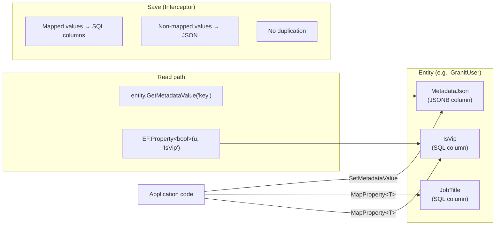

## Definition

The Metadata pattern adds a schema-free JSON property bag to any EF Core
entity, enabling applications to store custom key-value pairs without modifying
the framework's database schema. Properties that need SQL indexing or query
filtering can be **promoted** to real SQL columns at startup.

Also known as: **Property Bag**, **EAV** (legacy), **user_metadata** (Auth0),
**Custom Attributes** (Keycloak).

## Diagram



## Interface

```csharp
// Granit.Domain
public interface IHasMetadata
{
    string? MetadataJson { get; set; }
}
```

Any entity implementing `IHasMetadata` gets automatic JSON-backed
extensibility. The framework provides typed extension methods:

```csharp
// Read
string? dept = entity.GetMetadataValue("Department");
bool? isVip = entity.GetMetadataValue<bool>("IsVip");
bool exists = entity.HasMetadataValue("LicenseNumber");

// Write
entity.SetMetadataValue("Department", "Engineering");
entity.SetMetadataValue("LicenseNumber", null); // removes
```

## Granit implementation

### Level 1 — JSON bag (zero config)

Every `IHasMetadata` entity stores properties in a `jsonb` column
(PostgreSQL) or `nvarchar(max)` (SQL Server). No migrations needed — the column
is always present.

```csharp
// Any entity
public class ReferenceDataEntity : AuditedEntity, IHasMetadata
{
    public string? MetadataJson { get; set; }
}

// Usage
country.SetMetadataValue("Alpha3Code", "BEL");
country.SetMetadataValue("IsEuMember", "true");
```

### Level 2 — SQL column promotion (for indexing)

Properties that need SQL `WHERE` clauses, indexes, or `ORDER BY` can be promoted
to real EF Core Shadow Properties at startup:

```csharp
// In the host application's module (ConfigureServices)
services.AddMetadataMappings<GranitUser>(options =>
{
    options.MapProperty<string>("JobTitle", maxLength: 128);
    options.MapProperty<string>("Department", maxLength: 64);
    options.MapProperty<bool>("IsVip");
});
```

This adds real SQL columns on the entity's table. The application must then
regenerate EF Core migrations:

```bash
dotnet ef migrations add AddUserExtensions --context OpenIddictDbContext
```

### Level 3 — Sync interceptor (no duplication)

The `MetadataSyncInterceptor` in `Granit.Persistence` ensures that
promoted properties are **excluded** from the JSON bag at save time:

- **Mapped property set via JSON** → interceptor moves value to SQL column,
  removes from JSON
- **Mapped property set via Shadow Property** → stays in SQL column, not in JSON
- **Non-mapped property** → stays in JSON only

This prevents data duplication (source of truth = SQL column for promoted props,
JSON for the rest).

## Entities using this pattern

| Entity | Package | JSON column |
|--------|---------|-------------|
| `GranitUser` | `Granit.OpenIddict` | `CustomAttributesJson` |
| `UserCacheEntry` | `Granit.Identity.Federated.EntityFrameworkCore` | `MetadataJson` |
| `ReferenceDataEntity` | `Granit.ReferenceData.EntityFrameworkCore` | `MetadataJson` |

## When to use each strategy

| Need | Strategy | Example |
|------|----------|---------|
| Simple key-value, no SQL queries | JSON bag (Level 1) | User preferences, UI settings |
| SQL `WHERE`, `ORDER BY`, indexes | Promoted column (Level 2) | `IsVip`, `Department` filter |
| Complex domain data, relationships | Companion Entity | `Employee` with `Salary`, `HireDate` |

## Comparison with other frameworks

| Framework | Mechanism | SQL promotion | Schema-free |
|-----------|-----------|:---:|:---:|
| **Granit** | `IHasMetadata` + `MapProperty<T>` | Yes | Yes |
| **Auth0** | `user_metadata` / `app_metadata` | No | Yes |
| **Keycloak** | `attributes` dictionary | No | Yes |
| **Entra ID** | `extensionAttribute1-15` | Yes (fixed) | No (15 max) |
| **EAV** (Magento) | Attribute-Value pivot tables | Yes | Yes |

## Key files

| File | Purpose |
|------|---------|
| `src/Granit/Domain/IHasMetadata.cs` | Interface |
| `src/Granit/Domain/MetadataExtensions.cs` | Get/Set/Has extension methods |
| `src/Granit.Persistence/Metadata/MetadataMappingOptions.cs` | `MapProperty<T>()` config |
| `src/Granit.Persistence/Metadata/MetadataSyncInterceptor.cs` | Save-time sync (no duplication) |
| `src/Granit.Persistence/Metadata/MetadataModelBuilderExtensions.cs` | Applies Shadow Properties to ModelBuilder |
| `src/Granit.Persistence/Metadata/MetadataServiceCollectionExtensions.cs` | DI registration helpers |

## Anti-patterns

- **Don't store structured data in Metadata** — use a Companion Entity for
  complex types with relationships
- **Don't query JSON with EF Core** — promote to SQL column if you need `WHERE`
- **Don't use Metadata for security-sensitive data** — the JSON column is not
  encrypted (use `IStringEncryptionService` separately)
- **Don't duplicate** — if a property is promoted to SQL, it must NOT also be in JSON
  (the interceptor enforces this)
