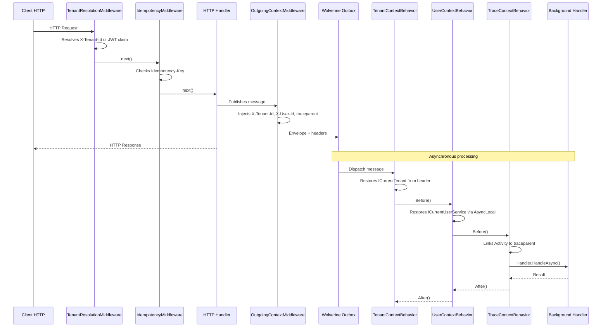

## Definition

The Middleware Pipeline pattern chains interceptor components around the main
processing of a request or message. Each middleware can execute logic before
and after the handler, short-circuit the chain, or enrich the context.

Granit implements a **dual pipeline**:

1. **ASP.NET Core Middleware**: for HTTP requests (tenant resolution,
   idempotency)
2. **Wolverine Behaviors/Middleware**: for asynchronous messages
   (tenant, user, and trace context propagation)

Both pipelines converge through `OutgoingContextMiddleware`, which injects
context headers into outgoing Wolverine envelopes.

## Diagram



## Implementation in Granit

### ASP.NET Core pipeline

| Middleware | File | Role |
|-----------|------|------|
| `TenantResolutionMiddleware` | `src/Granit.MultiTenancy/Middleware/TenantResolutionMiddleware.cs` | Resolves the tenant via `TenantResolverPipeline` (Header > JWT) |
| `IdempotencyMiddleware` | `src/Granit.Http.Idempotency/Internal/IdempotencyMiddleware.cs` | Stripe-style HTTP idempotency with state machine |

### Wolverine pipeline -- incoming behaviors

| Behavior | File | Role |
|----------|------|------|
| `TenantContextBehavior` | `src/Granit.Wolverine/Behaviors/TenantContextBehavior.cs` | Restores `ICurrentTenant` from `X-Tenant-Id` header |
| `UserContextBehavior` | `src/Granit.Wolverine/Behaviors/UserContextBehavior.cs` | Restores `ICurrentUserService` via `IWolverineUserContextSetter` |
| `TraceContextBehavior` | `src/Granit.Wolverine/Behaviors/TraceContextBehavior.cs` | Links the W3C `traceparent` to the handler's Activity |

### Wolverine pipeline -- outgoing middleware

| Middleware | File | Role |
|-----------|------|------|
| `OutgoingContextMiddleware` | `src/Granit.Wolverine/Middleware/OutgoingContextMiddleware.cs` | Injects `X-Tenant-Id`, `X-User-Id`, `traceparent` into outgoing envelopes |

### Global registration

All behaviors and middlewares are registered in
`src/Granit.Wolverine/Extensions/WolverineHostApplicationBuilderExtensions.cs` via
`opts.Policies.AddMiddleware<T>()`.

## Rationale

| Problem | Solution |
|---------|----------|
| The HTTP handler knows the tenant, but the background handler does not | `OutgoingContextMiddleware` > headers > `TenantContextBehavior` restores the context |
| The EF Core audit interceptor needs `ModifiedBy` in background | `UserContextBehavior` restores `ICurrentUserService` via `AsyncLocal` |
| OpenTelemetry traces are disjointed between HTTP and async | `TraceContextBehavior` links spans via `traceparent` (W3C Trace Context) |
| Cross-cutting concerns pollute handlers | Logic extracted into reusable, composable middlewares |

## Usage example

```csharp
// The handler has no awareness of middlewares --
// tenant/user/trace context is already restored when it executes

public static class SendInvoiceHandler
{
    // Wolverine discovers this handler automatically
    public static async Task Handle(
        SendInvoiceCommand command,
        ICurrentTenant currentTenant,      // restored by TenantContextBehavior
        ICurrentUserService currentUser,   // restored by UserContextBehavior
        InvoiceDbContext db,
        CancellationToken cancellationToken)
    {
        // currentTenant.Id is correct even in background
        // currentUser.UserId is correct for the audit trail
        Invoice invoice = await db.Invoices.FindAsync([command.InvoiceId], ct)
            ?? throw new EntityNotFoundException(typeof(Invoice), command.InvoiceId);

        invoice.MarkAsSent();
        await db.SaveChangesAsync(ct);
        // AuditedEntityInterceptor records ModifiedBy = currentUser.UserId
    }
}
```

## Further reading

- [Sidecar pattern -- Microsoft Cloud Design Patterns](https://learn.microsoft.com/en-us/azure/dotnet/architecture/patterns/sidecar)
