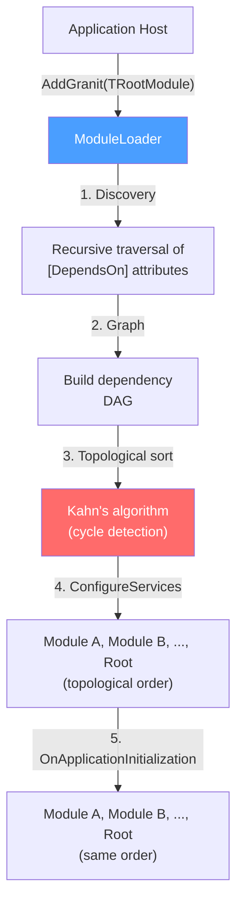

## Definition

The Module System pattern organizes an application into self-contained units (modules),
each owning its own service registration and initialization lifecycle. A central
loader resolves startup order through topological sorting of declared dependencies,
guaranteeing that a module never starts before its prerequisites.

Granit implements this pattern adapted for an ecosystem of independent NuGet packages.

## Diagram



## Implementation in Granit

| Component | File | Role |
|-----------|------|------|
| `GranitModule` | `src/Granit/Modularity/GranitModule.cs` | Abstract base class: `ConfigureServices()`, `ConfigureServicesAsync()`, `OnApplicationInitialization()`, `OnApplicationInitializationAsync()` |
| `DependsOnAttribute` | `src/Granit/Modularity/DependsOnAttribute.cs` | Declares module dependencies via `[DependsOn(typeof(...))]` |
| `ModuleLoader` | `src/Granit/Modularity/ModuleLoader.cs` | Topological sort (Kahn's algorithm) with circular dependency detection |
| `ModuleDescriptor` | `src/Granit/Modularity/ModuleDescriptor.cs` | Module metadata (type, instance, dependencies) |
| `GranitApplication` | `src/Granit/Modularity/GranitApplication.cs` | Full lifecycle coordinator |
| `AddGranit<TModule>()` | `src/Granit/Extensions/GranitHostBuilderExtensions.cs` | Entry point for the host application |

**In-house variant -- Dual Sync/Async**: the async hooks (`ConfigureServicesAsync`,
`OnApplicationInitializationAsync`) delegate to their sync counterpart by default.
A module can override either one without being required to implement both.

## Rationale

| Problem | Solution |
|---------|----------|
| Independent NuGet packages that need to self-configure | Each package exposes a `GranitModule` with its own `ConfigureServices()` |
| Unpredictable initialization order with native DI | Topological sort guarantees dependencies are registered first |
| Silent circular dependencies | Kahn's algorithm throws an explicit exception listing the involved modules |
| Code duplication in application `Program.cs` files | A single `builder.AddGranit<MyAppModule>()` call replaces dozens of lines |

## Usage example

```csharp
// Declaring an application module
[DependsOn(typeof(GranitPersistenceModule))]
[DependsOn(typeof(GranitWolverineModule))]
[DependsOn(typeof(GranitFeaturesModule))]
public sealed class MyAppHostModule : GranitModule
{
    public override void ConfigureServices(ServiceConfigurationContext context)
    {
        ServiceCollection services = context.Services;
        services.AddScoped<IPatientService, PatientService>();
    }

    public override void OnApplicationInitialization(ApplicationInitializationContext context)
    {
        WebApplication app = context.GetApplicationBuilder();
        app.MapHealthChecks("/healthz");
    }
}

// Entry point -- a single line
WebApplicationBuilder builder = WebApplication.CreateBuilder(args);
builder.AddGranit<MyAppHostModule>();

WebApplication app = builder.Build();
await app.UseGranitAsync();
app.Run();
```
