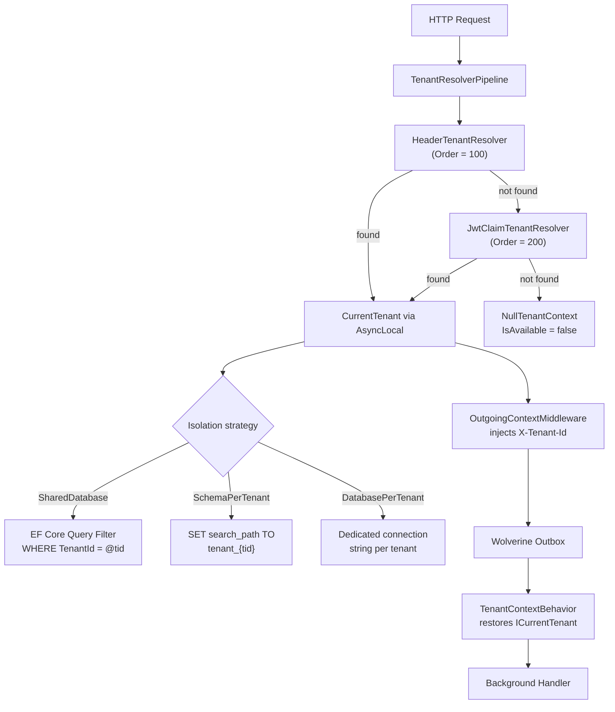

## Definition

Multi-tenancy allows a single application instance to serve multiple
organizations (tenants) with strict data isolation. Each request is associated
with a tenant through a resolution pipeline, and this information flows across
all layers -- including asynchronous Wolverine processing.

Granit implements three isolation strategies and a **soft dependency** mechanism:
`ICurrentTenant` is available in all modules without a direct dependency on
`Granit.MultiTenancy`.

## Diagram



## Implementation in Granit

### Soft dependency (`Granit`)

| Component | File | Role |
|-----------|------|------|
| `ICurrentTenant` | `src/Granit/MultiTenancy/ICurrentTenant.cs` | Minimal interface: `Id`, `IsAvailable`, `Change()` |
| `NullTenantContext` | `src/Granit/MultiTenancy/NullTenantContext.cs` | Null Object: `IsAvailable = false`, no-op operations |

All modules resolve `ICurrentTenant` via `Granit.MultiTenancy` --
no `[DependsOn(GranitMultiTenancyModule)]` required.

### Hard dependency (`Granit.MultiTenancy`)

| Component | File | Role |
|-----------|------|------|
| `CurrentTenant` | `src/Granit.MultiTenancy/CurrentTenant.cs` | `AsyncLocal<TenantInfo?>` implementation + `TenantScope` (IDisposable) |
| `TenantResolverPipeline` | `src/Granit.MultiTenancy/Pipeline/TenantResolverPipeline.cs` | Ordered chain of `ITenantResolver` |
| `HeaderTenantResolver` | `src/Granit.MultiTenancy/Resolvers/HeaderTenantResolver.cs` | Resolution via `X-Tenant-Id` (priority 100) |
| `JwtClaimTenantResolver` | `src/Granit.MultiTenancy/Resolvers/JwtClaimTenantResolver.cs` | Resolution via JWT claim (priority 200) |
| `TenantResolutionMiddleware` | `src/Granit.MultiTenancy/Middleware/TenantResolutionMiddleware.cs` | ASP.NET Core middleware |

### Isolation strategies (`Granit.Persistence`)

| Strategy | File | Mechanism |
|----------|------|-----------|
| `SharedDatabase` | `src/Granit.Persistence/MultiTenancy/SharedDatabaseDbContextFactory.cs` | EF Core query filters on `TenantId` |
| `SchemaPerTenant` | `src/Granit.Persistence/MultiTenancy/TenantPerSchemaDbContextFactory.cs` | `SET search_path TO tenant_{id}` (PostgreSQL) |
| `DatabasePerTenant` | `src/Granit.Persistence/MultiTenancy/TenantPerDatabaseDbContextFactory.cs` | Dedicated connection string per tenant |
| `TenantIsolationStrategy` | `src/Granit.Persistence/MultiTenancy/TenantIsolationStrategy.cs` | Selection enum |

### Tenant provisioning (`Granit.MultiTenancy.Provisioning`)

| Component | File | Role |
|-----------|------|------|
| `TenantProvisioningHandler` | `src/Granit.MultiTenancy.Provisioning/Handlers/TenantProvisioningHandler.cs` | Wolverine handler: `TenantCreatedEvent` → `ITenantProvisioner` |
| `ITenantProvisioner` | `src/Granit.Persistence.EntityFrameworkCore.Hosting/ITenantProvisioner.cs` | Interface for runtime tenant provisioning |
| `AutoTenantProvisioner` | `src/Granit.Persistence.EntityFrameworkCore.Hosting/Internal/AutoTenantProvisioner.cs` | Default: discovers `IsolatedDbContextMarker`s, creates schema, migrates, seeds |

### Async propagation (`Granit.Wolverine`)

| Component | File | Role |
|-----------|------|------|
| `OutgoingContextMiddleware` | `src/Granit.Wolverine/Middleware/OutgoingContextMiddleware.cs` | Injects `X-Tenant-Id` into outgoing Wolverine envelopes |
| `TenantContextBehavior` | `src/Granit.Wolverine/Behaviors/TenantContextBehavior.cs` | Restores `ICurrentTenant` in background handlers |

### The `IsAvailable` check rule

Any code accessing `ICurrentTenant.Id` **must** check `IsAvailable` first:

```csharp
// Correct pattern (src/Granit.Features/Checker/FeatureChecker.cs:46)
Guid? tenantId = currentTenant?.IsAvailable == true ? currentTenant.Id : null;
```

## Rationale

| Problem | Solution |
|---------|----------|
| GDPR/ISO 27001: strict data isolation per organization | 3 isolation strategies cover all cases (cost vs security) |
| Modules that read the tenant without depending on `Granit.MultiTenancy` | Soft dependency via `Granit.MultiTenancy` + `NullTenantContext` |
| Loss of tenant context in asynchronous processing | Propagation via Wolverine headers + restoration by behaviors |
| Need to temporarily switch tenant (cross-tenant admin) | `ICurrentTenant.Change()` returns an `IDisposable` scope |

## Usage example

```csharp
// Shared Database: query filters apply automatically
public sealed class PatientService(AppDbContext db, ICurrentTenant tenant)
{
    public async Task<List<Patient>> GetAllAsync(CancellationToken cancellationToken)
    {
        // EF Core automatically adds WHERE TenantId = @currentTenantId
        List<Patient> patients = await db.Patients.ToListAsync(ct);
        return patients;
    }
}

// Temporary tenant switch (admin operation)
public async Task MigrateTenantDataAsync(
    Guid sourceTenantId,
    Guid targetTenantId,
    ICurrentTenant currentTenant,
    CancellationToken cancellationToken)
{
    using (currentTenant.Change(sourceTenantId))
    {
        // Read in the source tenant context
        List<Patient> patients = await db.Patients.ToListAsync(ct);
    }
    // The previous tenant is automatically restored here
}
```

## Further reading

- [Architect Multitenant Solutions on Azure -- Microsoft Azure Architecture Center](https://learn.microsoft.com/en-us/azure/architecture/guide/multitenant/overview)
