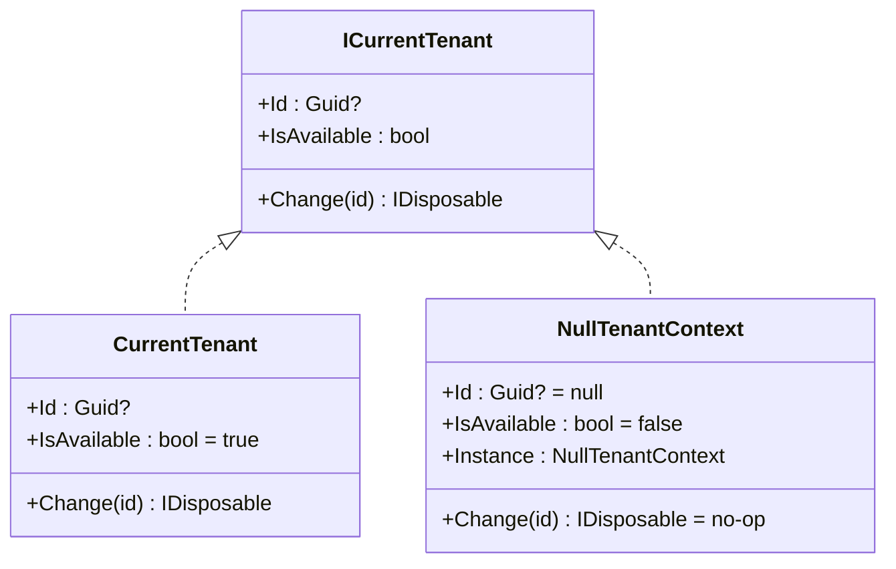

## Definition

The Null Object pattern replaces `null` checks with an object that implements
the expected interface with neutral (no-op) behavior. Calling code treats the
Null Object like any other implementation, eliminating conditional branches.

## Diagram



## Implementation in Granit

| Null Object | File | Interface | Behavior |
| --- | --- | --- | --- |
| `NullTenantContext` | `src/Granit/MultiTenancy/NullTenantContext.cs` | `ICurrentTenant` | `IsAvailable = false`, `Id = null`, `Change()` is a no-op |
| `NullCacheValueEncryptor` | `src/Granit.Caching/NullCacheValueEncryptor.cs` | `ICacheValueEncryptor` | Passes bytes through without encryption (dev) |
| `NullWebhookDeliveryStore` | `src/Granit.Webhooks/Internal/NullWebhookDeliveryStore.cs` | `IWebhookDeliveryStore` | No-op operations |

`NullTenantContext` is registered by default in the DI container. It is
replaced by `CurrentTenant` only when `Granit.MultiTenancy` is installed.
This is the **soft dependency**: all modules can inject `ICurrentTenant`
without depending on `Granit.MultiTenancy`.

## Rationale

Without the Null Object, every module would have to check whether
`ICurrentTenant` is `null` or whether multi-tenancy is installed. With
`NullTenantContext`, code simply checks `IsAvailable` -- never `null`.

## Usage example

```csharp
// Code works identically with or without multi-tenancy
public sealed class FeatureChecker(IServiceProvider sp)
{
    public async Task<string?> GetValueAsync(string featureName, CancellationToken cancellationToken)
    {
        ICurrentTenant? currentTenant = sp.GetService<ICurrentTenant>();

        // NullTenantContext: IsAvailable = false -> tenantId = null
        // CurrentTenant: IsAvailable = true -> tenantId = Guid
        Guid? tenantId = currentTenant?.IsAvailable == true
            ? currentTenant.Id
            : null;

        // The rest of the code is identical in both cases
        return await ResolveFeatureValueAsync(featureName, tenantId, ct);
    }
}
```

## Further reading

- [Null Object Design Pattern -- sourcemaking.com](https://sourcemaking.com/design_patterns/null_object)
