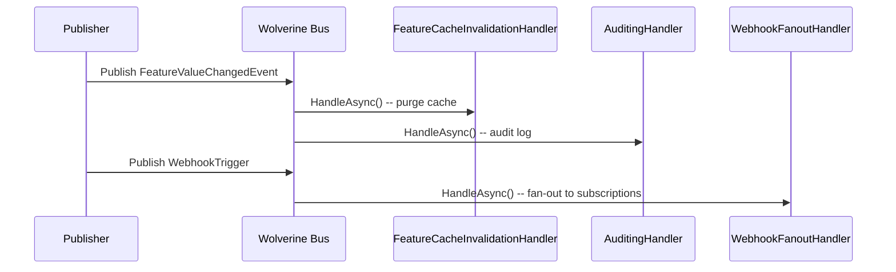

## Definition

The Observer pattern establishes a one-to-many relationship between objects:
when an object (subject) changes state, all its observers are notified
automatically. In Granit, Wolverine acts as the subscription mechanism --
handlers are discovered by convention and implicitly subscribe to the message
types they process.

## Diagram



## Implementation in Granit

### Implicit Wolverine subscription

Wolverine automatically discovers handlers by naming convention. A handler
that accepts a parameter of type `T` implicitly subscribes to all messages
of type `T`.

| Handler (observer) | Event (subject) | File |
|--------------------|-----------------|------|
| `FeatureCacheInvalidationHandler` | `FeatureValueChangedEvent` | `src/Granit.Features/Cache/FeatureCacheInvalidationHandler.cs` |
| `WebhookFanoutHandler` | `WebhookTrigger` | `src/Granit.Webhooks/Handlers/WebhookFanoutHandler.cs` |

### Sidecar pattern (implicit return)

Wolverine handlers can return events via `yield return` or
`IEnumerable<T>`. Wolverine automatically dispatches these events to
registered observers.

## Rationale

Implicit observation via Wolverine eliminates coupling between the publisher
and observers. The publisher does not know how many observers exist or what
they do. Adding a new observer requires no modification to the publisher.

## Usage example

```csharp
// Publisher -- knows no observers
public static class UpdateFeatureValueHandler
{
    public static IEnumerable<object> Handle(
        UpdateFeatureValueCommand command,
        IFeatureStore store)
    {
        store.SetAsync(command.TenantId, command.FeatureName, command.Value);

        // Wolverine dispatches this event to all registered handlers
        yield return new FeatureValueChangedEvent
        {
            TenantId = command.TenantId,
            FeatureName = command.FeatureName
        };
    }
}

// Observer 1 -- discovered automatically
public static class FeatureCacheInvalidationHandler
{
    public static async Task Handle(
        FeatureValueChangedEvent evt,
        IFusionCache cache)
    {
        string cacheKey = FeatureCacheKey.Build(evt.TenantId, evt.FeatureName);
        await cache.ExpireAsync(cacheKey);
    }
}

// Observer 2 -- added later, no modification to publisher
public static class FeatureAuditingHandler
{
    public static void Handle(FeatureValueChangedEvent evt, ILogger logger)
    {
        logger.LogInformation("[AUDIT] Feature {Feature} changed for tenant {Tenant}",
            evt.FeatureName, evt.TenantId);
    }
}
```

## Further reading

- [Observer -- refactoring.guru](https://refactoring.guru/design-patterns/observer)
- [Publisher-Subscriber -- Microsoft Cloud Design Patterns](https://learn.microsoft.com/en-us/azure/dotnet/architecture/patterns/publisher-subscriber)
