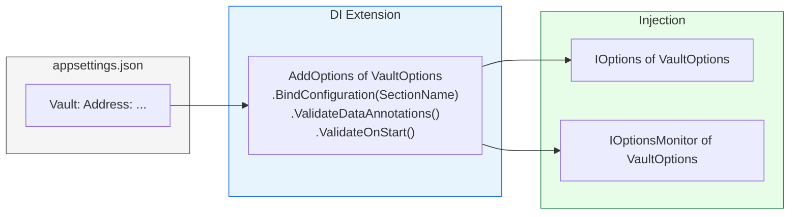

## Definition

The Options pattern structures application configuration as strongly-typed
classes validated at startup. Each Granit module exposes an `*Options` class
bound to an `appsettings.json` section via `BindConfiguration`, with validation
through `DataAnnotations` and `ValidateOnStart()`.

## Diagram



## Implementation in Granit

### Convention

Each Options class follows this template:

```csharp
public sealed class VaultOptions
{
    public const string SectionName = "Vault";

    [Required]
    public string Address { get; set; } = string.Empty;

    public string AuthMethod { get; set; } = "kubernetes";

    [Range(0.1, 1.0)]
    public double LeaseRenewalThreshold { get; set; } = 0.75;
}
```

Registration in the module's DI extension:

```csharp
services.AddOptions<VaultOptions>()
    .BindConfiguration(VaultOptions.SectionName)
    .ValidateDataAnnotations()
    .ValidateOnStart();
```

### Inventory (excerpt -- 93 options classes in the framework)

| Module | Class | Section | Notable validation |
| --- | --- | --- | --- |
| Vault | `VaultOptions` | `Vault` | `[Required]` Address |
| Caching | `CachingOptions` | `Cache` | KeyPrefix, EncryptValues |
| Observability | `ObservabilityOptions` | `Observability` | ServiceName, OtlpEndpoint |
| Identity.Keycloak | `KeycloakAdminOptions` | `KeycloakAdmin` | `[Required]` + `[Range]` + URL helpers |
| Auth.JwtBearer | `JwtBearerAuthOptions` | `Authentication` | Authority, Audience |
| BlobStorage.S3 | `S3BlobOptions` | inherits `BlobStorageOptions` | Custom `IValidateOptions<T>` |
| Webhooks | `WebhooksOptions` | `Webhooks` | `[Range(5, 120)]` timeout, `[Range(1, 100)]` parallelism |
| Notifications | `NotificationsOptions` | `Notifications` | MaxParallelDeliveries |
| Notifications.Brevo | `BrevoOptions` | `Notifications:Brevo` | `[Required]` ApiKey, `[Range(1, 300)]` timeout |
| MultiTenancy | `MultiTenancyOptions` | `MultiTenancy` | IsEnabled, TenantIdClaimType |

### Advanced validation (IValidateOptions)

Some modules require cross-property validation. They implement
`IValidateOptions<T>`:

```csharp
internal sealed class S3BlobOptionsValidator : IValidateOptions<S3BlobOptions>
{
    public ValidateOptionsResult Validate(string? name, S3BlobOptions options)
    {
        if (string.IsNullOrWhiteSpace(options.ServiceUrl))
            return ValidateOptionsResult.Fail("S3 ServiceUrl is required.");

        if (options.ForcePathStyle && options.ServiceUrl.Contains("amazonaws.com"))
            return ValidateOptionsResult.Fail("ForcePathStyle should not be used with AWS.");

        return ValidateOptionsResult.Success;
    }
}
```

### Reference files

| File | Role |
| --- | --- |
| `src/Granit.Vault/Options/VaultOptions.cs` | Canonical simple example |
| `src/Granit.Identity.Keycloak/Options/KeycloakAdminOptions.cs` | Complex options with helpers |
| `src/Granit.BlobStorage.S3/Options/S3BlobOptions.cs` | Custom `IValidateOptions<T>` |
| `src/Granit.Webhooks/Options/WebhooksOptions.cs` | `[Range]` validation |
| `src/Granit.Observability/Options/ObservabilityOptions.cs` | Observability options |

## Rationale

| Problem | Options pattern solution |
| --- | --- |
| Configuration read as untyped strings | Strongly-typed classes with IntelliSense |
| Config errors discovered at runtime | `ValidateOnStart()` -- fail-fast at startup |
| Misspelled JSON sections | `const string SectionName` = single source of truth |
| Cross-property validation impossible with annotations | `IValidateOptions<T>` for complex rules |
| Plaintext secrets in appsettings | Compatible with Vault, User Secrets, env vars |

## Usage example

```csharp
// --- Registration in the module's DI extension ---
public static IServiceCollection AddGranitWebhooks(
    this IServiceCollection services)
{
    services.AddOptions<WebhooksOptions>()
        .BindConfiguration(WebhooksOptions.SectionName)
        .ValidateDataAnnotations()
        .ValidateOnStart();

    services.AddSingleton<IValidateOptions<WebhooksOptions>, WebhooksOptionsValidator>();

    return services;
}

// --- Consumption in a service ---
public sealed class WebhookDeliveryService(
    IOptions<WebhooksOptions> options,
    IHttpClientFactory httpClientFactory)
{
    public async Task DeliverAsync(WebhookPayload payload, CancellationToken ct)
    {
        HttpClient client = httpClientFactory.CreateClient();
        client.Timeout = TimeSpan.FromSeconds(options.Value.HttpTimeoutSeconds);
        // ...
    }
}
```

## Further reading

- [Options pattern -- Microsoft .NET Documentation](https://learn.microsoft.com/en-us/dotnet/core/extensions/options)
