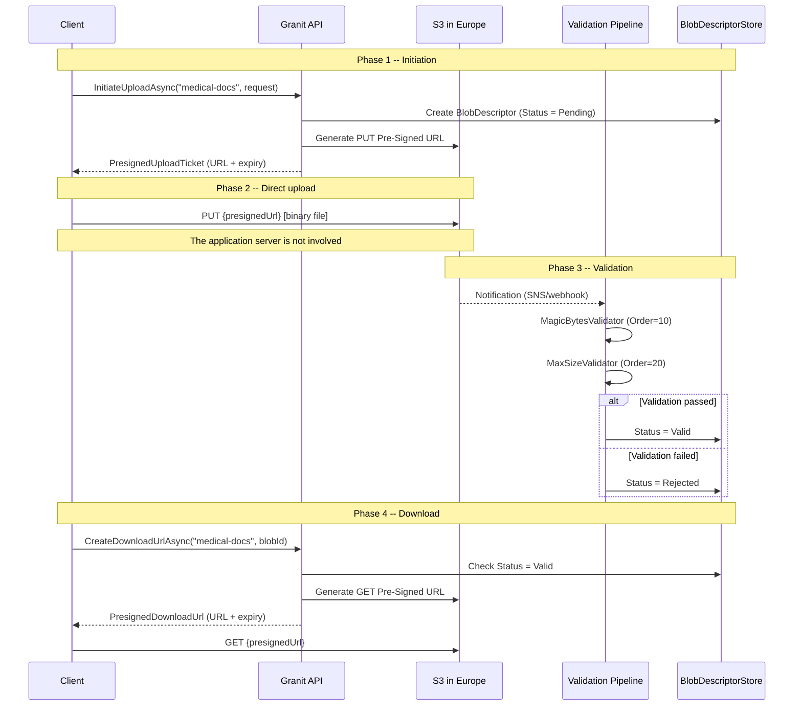

## Definition

The Pre-Signed URL pattern allows clients to upload or download files directly
to/from object storage (S3), without transiting through the application server.
The server generates a cryptographically signed temporary URL with constraints
(MIME type, max size, expiration).

In Granit, this pattern is at the core of `Granit.BlobStorage` with a
Direct-to-Cloud architecture, a post-upload validation pipeline, and a
GDPR-compliant crypto-shredding mechanism.

## Diagram



## Implementation in Granit

### Main components

| Component | File | Role |
|-----------|------|------|
| `IBlobStorage` | `src/Granit.BlobStorage/IBlobStorage.cs` | Public API: `InitiateUploadAsync`, `CreateDownloadUrlAsync`, `DeleteAsync` |
| `DefaultBlobStorage` | `src/Granit.BlobStorage/Internal/DefaultBlobStorage.cs` | Facade orchestrating all components |
| `BlobDescriptor` | `src/Granit.BlobStorage/BlobDescriptor.cs` | Entity: status, metadata, audit trail |
| `BlobStatus` | `src/Granit.BlobStorage/BlobStatus.cs` | State machine: Pending > Uploading > Valid/Rejected > Deleted |
| `PresignedUploadTicket` | `src/Granit.BlobStorage/PresignedUploadTicket.cs` | DTO: BlobId, URL, HttpMethod, Expiry, RequiredHeaders |
| `PresignedDownloadUrl` | `src/Granit.BlobStorage/PresignedDownloadUrl.cs` | DTO: URL + expiry |

### Multi-tenant S3 key

| Component | File | Role |
|-----------|------|------|
| `IBlobKeyStrategy` | `src/Granit.BlobStorage/IBlobKeyStrategy.cs` | Object key generation and parsing |
| `PrefixBlobKeyStrategy` | `src/Granit.BlobStorage.S3/Internal/PrefixBlobKeyStrategy.cs` | Format: `{tenantId}/{container}/{yyyy}/{MM}/{blobId}` |

### Post-upload validation

| Validator | File | Order | Role |
|-----------|------|-------|------|
| `MagicBytesValidator` | `src/Granit.BlobStorage/Validators/MagicBytesValidator.cs` | 10 | Verifies actual MIME type (magic bytes) |
| `MaxSizeValidator` | `src/Granit.BlobStorage/Validators/MaxSizeValidator.cs` | 20 | Verifies declared vs actual size |

### Crypto-shredding (GDPR Art. 17)

`DefaultBlobStorage.DeleteAsync()`:

1. **Physically deletes** the S3 object (`storageClient.DeleteObjectAsync`)
2. Marks the `BlobDescriptor` as `Deleted` (soft delete)
3. Retains the metadata in DB for the **ISO 27001 audit trail** (3 years)

## Rationale

| Problem | Solution |
|---------|----------|
| Large medical files (MRI, scans) saturate the server | Direct upload client to S3, server never sees the binary |
| Client-side MIME type validation is unreliable | Server-side post-upload validation via magic bytes |
| GDPR right to erasure + ISO 27001 audit trail (contradictory) | Crypto-shredding: binary destroyed, metadata retained in soft delete |
| Multi-tenant isolation in the S3 bucket | Key prefixed with `tenantId` + `TryExtractTenantId()` check |
| Security: the client must not have S3 credentials | Pre-signed URL with short expiration, MIME type constraints |

## Usage example

```csharp
// Upload a medical document
public sealed class UploadMedicalDocumentHandler
{
    public static async Task<PresignedUploadTicket> Handle(
        UploadDocumentCommand command,
        IBlobStorage blobStorage,
        CancellationToken cancellationToken)
    {
        PresignedUploadTicket ticket = await blobStorage.InitiateUploadAsync(
            containerName: "medical-documents",
            new BlobUploadRequest(
                FileName: command.FileName,
                ContentType: "application/pdf",
                MaxAllowedBytes: 50_000_000), // 50 MB
            ct);

        // The client uses ticket.UploadUrl to upload directly to S3
        return ticket;
    }
}

// GDPR-compliant deletion (crypto-shredding)
await blobStorage.DeleteAsync(
    containerName: "medical-documents",
    blobId: documentId,
    deletionReason: "GDPR Art. 17 -- patient request",
    cancellationToken);
// -> S3 object physically deleted
// -> BlobDescriptor retained in DB (IsDeleted=true, DeletedBy, DeletedAt, DeletionReason)
```

## Further reading

- [Valet Key pattern -- Microsoft Cloud Design Patterns](https://learn.microsoft.com/en-us/azure/dotnet/architecture/patterns/valet-key)
