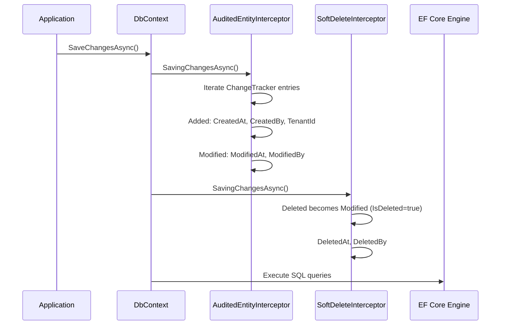

## Definition

The Proxy pattern provides a substitute or intermediary that controls access
to an object. The proxy intercepts calls to add behavior (audit, filtering,
validation) transparently.

In Granit, two Proxy variants are used: the **FilterProxy** for EF Core query
filters, and **EF Core Interceptors** that intercept `SaveChangesAsync()`.

## Diagram



## Implementation in Granit

### FilterProxy (property proxy for EF Core)

| Component | File | Role |
|-----------|------|------|
| `FilterProxy` | `src/Granit.Persistence/Extensions/ModelBuilderExtensions.cs` (lines 133-140) | Exposes boolean properties (`SoftDeleteEnabled`, `ActiveEnabled`, `MultiTenantEnabled`) so EF Core can extract them as query parameters |

EF Core cannot translate arbitrary method calls in query filters. The
`FilterProxy` works around this limitation by exposing simple properties that
EF Core treats as SQL parameters.

### EF Core Interceptors

| Interceptor | File | Role |
|-------------|------|------|
| `AuditedEntityInterceptor` | `src/Granit.Persistence/Interceptors/AuditedEntityInterceptor.cs` | Injects `CreatedAt/By`, `ModifiedAt/By`, `TenantId`, `Id` (sequential) |
| `SoftDeleteInterceptor` | `src/Granit.Persistence/Interceptors/SoftDeleteInterceptor.cs` | Converts `DELETE` to `UPDATE` with `IsDeleted=true`, `DeletedAt/By` |

## Rationale

EF Core interceptors apply cross-cutting rules (ISO 27001 audit, GDPR soft
delete) transparently without polluting application handlers. The
`FilterProxy` solves a technical EF Core limitation while keeping filters
dynamic.

## Usage example

```csharp
// The application never sees the interceptors -- they are transparent
Patient patient = new()
{
    FirstName = "Jean",
    LastName = "Dupont"
};

db.Patients.Add(patient);
await db.SaveChangesAsync(ct);

// AuditedEntityInterceptor has automatically populated:
// patient.Id = Sequential Guid (IGuidGenerator)
// patient.CreatedAt = DateTimeOffset.UtcNow (IClock)
// patient.CreatedBy = "user-123" (ICurrentUserService)
// patient.TenantId = Current tenant Guid (ICurrentTenant)

// Deletion is intercepted by SoftDeleteInterceptor:
db.Patients.Remove(patient);
await db.SaveChangesAsync(ct);
// -> UPDATE Patients SET IsDeleted=1, DeletedAt=..., DeletedBy=... WHERE Id=...
// -> No physical DELETE
```

## Further reading

- [Proxy -- refactoring.guru](https://refactoring.guru/design-patterns/proxy)
