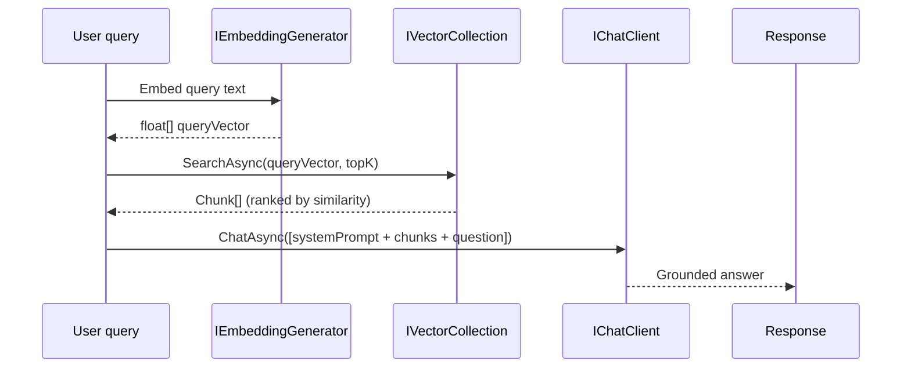

## Definition

**Retrieval-Augmented Generation (RAG)** is an AI architecture pattern that augments
a Large Language Model's prompt with relevant documents retrieved from a vector store
rather than relying solely on the model's parametric knowledge. This grounds the LLM's
response in factual, up-to-date, domain-specific content — reducing hallucinations and
enabling context-aware answers over private data.

The pattern combines three steps: **embed** a query into a dense vector, **retrieve**
semantically similar chunks from a store, **generate** a response conditioned on those
chunks.

## Diagram



## Implementation in Granit

`Granit.AI.VectorData` provides the abstractions; provider packages
(PgVector, Qdrant, Redis — see Epic #181) supply the store backends.

### Core interfaces

```csharp
// Granit.AI.VectorData
public interface IVectorCollection<TRecord>
{
    Task UpsertAsync(TRecord record, CancellationToken ct = default);
    Task<IReadOnlyList<VectorSearchResult<TRecord>>> SearchAsync(
        ReadOnlyMemory<float> vector,
        VectorSearchOptions? options = null,
        CancellationToken ct = default);
    Task DeleteAsync(string id, CancellationToken ct = default);
}

// Granit.AI
public interface IEmbeddingGenerator<TInput, TEmbedding>
    // re-export of Microsoft.Extensions.AI.IEmbeddingGenerator
```

### Typical RAG handler

```csharp
public class DocumentQueryHandler(
    IAIChatClientFactory factory,
    IVectorCollection<DocumentChunk> chunks)
{
    public async Task<string> AnswerAsync(
        string question, string workspaceId, CancellationToken ct)
    {
        // 1. Embed the question
        var workspace = await factory.CreateAsync(workspaceId, ct);
        var vector = await workspace.Embeddings.GenerateVectorAsync(question, ct);

        // 2. Retrieve top-K relevant chunks
        var results = await chunks.SearchAsync(vector,
            new VectorSearchOptions { Top = 5 }, ct);

        // 3. Build augmented prompt
        var context = string.Join("\n\n", results.Select(r => r.Record.Content));
        var messages = new[]
        {
            new ChatMessage(ChatRole.System,
                $"Answer only based on the following context:\n{context}"),
            new ChatMessage(ChatRole.User, question),
        };

        // 4. Generate grounded response
        var response = await workspace.Chat.CompleteAsync(messages, ct);
        return response.Message.Text ?? string.Empty;
    }
}
```

### Multi-tenant isolation

`IVectorCollection` is partitioned by tenant at the collection level — each
tenant's embeddings are stored in a separate namespace or table, enforced by
`Granit.AI.EntityFrameworkCore` conventions.

### Reference files

| File | Role |
|------|------|
| `src/Granit.AI.VectorData/IVectorCollection.cs` | Vector store abstraction |
| `src/Granit.AI.VectorData/VectorSearchOptions.cs` | Top-K, similarity threshold |
| `src/Granit.AI/IAIChatClientFactory.cs` | Workspace resolution |
| `src/Granit.AI.EntityFrameworkCore/` | Per-tenant collection partitioning |

## Rationale

| Problem | RAG solution |
|---------|-------------|
| LLM hallucinations on private data | Ground responses in retrieved facts |
| Model knowledge cutoff | Vector store is updated at write time |
| Privacy — private data in training set | Data never leaves the tenant's store |
| Cost — large context windows | Only the top-K relevant chunks are sent |

## Further reading

- [Granit.AI.VectorData — semantic search and vector storage](/dotnet/ai/semantic-search/)
- [AI Overview](/dotnet/ai/) — workspace, providers, cross-cutting AI packages
- [Lewis et al. (2020) — Retrieval-Augmented Generation for Knowledge-Intensive NLP Tasks](https://arxiv.org/abs/2005.11401)
