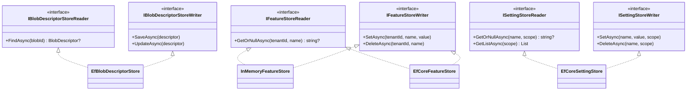

## Definition

The Repository pattern abstracts data access behind a collection-like interface,
isolating business logic from persistence details. In Granit, repositories are
named **Stores** and provide interchangeable implementations (InMemory, EF Core,
Redis).

## Diagram



## Implementation in Granit

| Store (port) | Location | Implementations |
| ----------- | -------- | --------------- |
| `IBlobDescriptorStoreReader` / `IBlobDescriptorStoreWriter` | `src/Granit.BlobStorage/` | `EfBlobDescriptorStore` |
| `IFeatureStoreReader` / `IFeatureStoreWriter` | `src/Granit.Features/Store/` | `InMemoryFeatureStore`, `EfCoreFeatureStore` |
| `IBackgroundJobStoreReader` / `IBackgroundJobStoreWriter` | `src/Granit.BackgroundJobs/Internal/` | `InMemoryBackgroundJobStore`, `EfBackgroundJobStore` |
| `ISettingStoreReader` / `ISettingStoreWriter` | `src/Granit.Settings/Values/` | `EfCoreSettingStore` |
| `IWebhookSubscriptionStoreReader` / `IWebhookSubscriptionStoreWriter` | `src/Granit.Webhooks/Abstractions/` | `EfWebhookSubscriptionStore` |

Each EF Core store uses an isolated `DbContext` (not the application DbContext)
via `IDbContextFactory<T>`.

## Rationale

The decoupling allows using `InMemoryFeatureStore` in development and
`EfCoreFeatureStore` in production without changing application code. The
Reader/Writer separation (CQRS) allows injecting only the required interface:
read handlers only access the Reader, write handlers access the Writer.
Unit tests use InMemory stores to avoid database dependencies.

## Usage example

```csharp
// Read -- inject the Reader
IFeatureStoreReader reader = serviceProvider.GetRequiredService<IFeatureStoreReader>();
string? value = await reader.GetOrNullAsync(tenantId, "MaxPatients", ct);

// Write -- inject the Writer
IFeatureStoreWriter writer = serviceProvider.GetRequiredService<IFeatureStoreWriter>();
await writer.SetAsync(tenantId, "MaxPatients", "500", ct);
```

## Further reading

- [Repository -- Martin Fowler (PoEAA)](https://martinfowler.com/eaaCatalog/repository.html)
