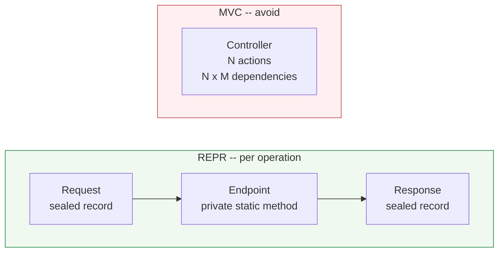
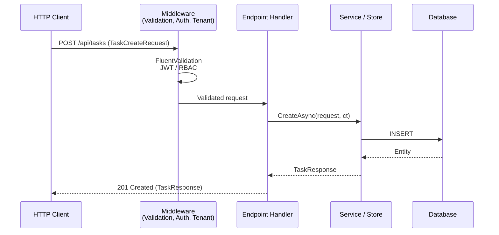

## Definition

The [REPR design pattern](https://deviq.com/design-patterns/repr-design-pattern)
formalizes the separation between three distinct responsibilities in an API:

1. **Request** -- a dedicated type modeling incoming data
2. **Endpoint** -- a single handler processing the request
3. **Response** -- a dedicated type modeling the output, decoupled from the domain model

This pattern opposes monolithic MVC controllers that group dozens of unrelated
actions, each with different dependencies.

## Diagram





## Implementation in Granit

Granit adopts REPR **principles** while adapting them to native .NET Minimal APIs,
without external dependencies (FastEndpoints, MediatR, Ardalis).

### Adaptation: grouping by feature

Strict REPR prescribes **one class per endpoint**. Granit groups handlers in a
**static extensions class on `RouteGroupBuilder`**, organized by feature (read,
admin, sync, etc.). This pragmatic choice reduces file count while preserving
the Request / Endpoint / Response separation.

| Characteristic | Strict REPR (FastEndpoints / Ardalis) | Granit |
| --- | --- | --- |
| Dedicated Request/Response per operation | Yes | **Yes** |
| No EF entity return | Yes | **Yes** |
| One file/class per endpoint | Yes | **No** -- grouped by feature |
| External dependency | Yes | **No** -- native Minimal API |
| Testability | Via base class / harness | **Pure static methods** |

### Typical Endpoints package structure

```text
src/Granit.{Module}.Endpoints/
-- Dtos/
   -- {Module}{Action}Request.cs      <- Request (input body / query)
   -- {Module}{Action}Response.cs     <- Response (output)
-- Endpoints/
   -- {Module}ReadEndpoints.cs        <- Endpoint (read handlers)
   -- {Module}AdminEndpoints.cs       <- Endpoint (admin handlers)
-- Extensions/
   -- {Module}EndpointRouteBuilderExtensions.cs  <- Public entry point
-- Granit{Module}EndpointsModule.cs
```

### Request pillar

A `sealed record` per write or search operation.

| Binding type | Convention |
| --- | --- |
| Body (POST/PUT) | `{Module}{Action}Request` -- positional record or with `required` |
| Query string | `{Module}ListRequest` with `[AsParameters]` |
| Route | Direct primitive parameters (`Guid id`, `string code`) |

Rules:

- **`Request` suffix** mandatory (never `Dto`)
- **Business prefix** mandatory: `WorkflowTransitionRequest`, not `TransitionRequest`
  (OpenAPI flattens namespaces, causing schema collisions)
- **Cross-cutting types exempt** from prefix: `PagedResult(T)`, `ProblemDetails`

### Endpoint pillar

A `private static` method in an `internal static` extensions class.

| Rule | Detail |
| --- | --- |
| Visibility | `private static` (handler), `internal static` (mapping method) |
| Async | `async Task(T)`, `ConfigureAwait(false)` in library code |
| Last parameter | `CancellationToken cancellationToken` |
| Return | `TypedResults.*` (never `Results.*` or `IResult`) |
| Metadata | `.WithName()`, `.WithSummary()`, `.WithTags()` required |
| Inline lambdas | **Forbidden** -- no type inference, unreadable |

### Response pillar

A `sealed record` distinct from the EF Core entity.

| Rule | Detail |
| --- | --- |
| Suffix | `Response` (never `Dto`) |
| Anonymous types | **Forbidden** -- unnamed OpenAPI schema |
| Direct EF entities | **Forbidden** -- coupling DB schema to API contract |
| Errors | `TypedResults.Problem()` (RFC 7807), never `BadRequest(string)` |
| Multi-status return | `Results(Ok(T), NotFound)`, `Results(Created(T), ProblemHttpResult)` |

### Reference files

| Module | File | Specificity |
| --- | --- | --- |
| Identity | `src/Granit.Identity.Endpoints/Endpoints/IdentityUserCacheReadEndpoints.cs` | Full CRUD, DTOs separated in `Dtos/` |
| Notifications | `src/Granit.Notifications.Endpoints/Endpoints/MobilePushTokenEndpoints.cs` | DTOs inline in the endpoint file |
| ReferenceData | `src/Granit.ReferenceData.Endpoints/Endpoints/ReferenceDataAdminEndpoints.cs` | Generic `(TEntity)` endpoints |
| DataExchange | `src/Granit.DataExchange.Endpoints/Endpoints/Import/ImportUploadEndpoints.cs` | `IFormFile` upload, complex validation |
| Authorization | `src/Granit.Authorization.Endpoints/Endpoints/MyPermissionsEndpoints.cs` | Response-only, no Request body |

## Rationale

| Problem | REPR solution |
| --- | --- |
| Monolithic MVC controllers with N injected dependencies | Each handler receives only its own dependencies via parameter DI |
| EF entity returned = coupling DB schema to API contract | Dedicated Response record, stable OpenAPI contract |
| Opaque or unnamed OpenAPI schema | `TypedResults` + typed records = deterministic schema |
| Third-party framework dependency (FastEndpoints, MediatR) | Native Minimal API, zero dependency for consumers |
| File explosion (one per endpoint x N modules) | Grouping by feature in `RouteGroupBuilder` extensions |

## Usage example

```csharp
// --- Dtos/TaskCreateRequest.cs ---

/// <summary>Request to create a new task.</summary>
public sealed record TaskCreateRequest(string Title, string? Description = null);

// --- Dtos/TaskResponse.cs ---

/// <summary>Represents a task returned by the API.</summary>
public sealed record TaskResponse(Guid Id, string Title, string? Description);

// --- Endpoints/TaskEndpoints.cs ---

internal static class TaskEndpoints
{
    internal static void MapTaskRoutes(this RouteGroupBuilder group)
    {
        group.MapGet("/{id:guid}", GetByIdAsync)
            .WithName("GetTask")
            .WithSummary("Returns a task by its unique identifier.");

        group.MapPost("/", CreateAsync)
            .WithName("CreateTask")
            .WithSummary("Creates a new task.");
    }

    private static async Task<Results<Ok<TaskResponse>, NotFound>> GetByIdAsync(
        Guid id,
        ITaskReader reader,
        CancellationToken cancellationToken)
    {
        TaskResponse? task = await reader.FindAsync(id, cancellationToken)
            .ConfigureAwait(false);
        return task is not null
            ? TypedResults.Ok(task)
            : TypedResults.NotFound();
    }

    private static async Task<Created<TaskResponse>> CreateAsync(
        TaskCreateRequest request,
        ITaskWriter writer,
        CancellationToken cancellationToken)
    {
        TaskResponse created = await writer.CreateAsync(request, cancellationToken)
            .ConfigureAwait(false);
        return TypedResults.Created($"/{created.Id}", created);
    }
}

// --- Extensions/TaskEndpointRouteBuilderExtensions.cs ---

public static class TaskEndpointRouteBuilderExtensions
{
    public static RouteGroupBuilder MapTaskEndpoints(
        this IEndpointRouteBuilder endpoints)
    {
        RouteGroupBuilder group = endpoints
            .MapGroup("/api/tasks")
            .WithTags("Tasks")
            .RequireAuthorization();

        group.MapTaskRoutes();
        return group;
    }
}
```

## Further reading

- [REPR Design Pattern -- deviq.com (Ardalis)](https://deviq.com/design-patterns/repr-design-pattern)
