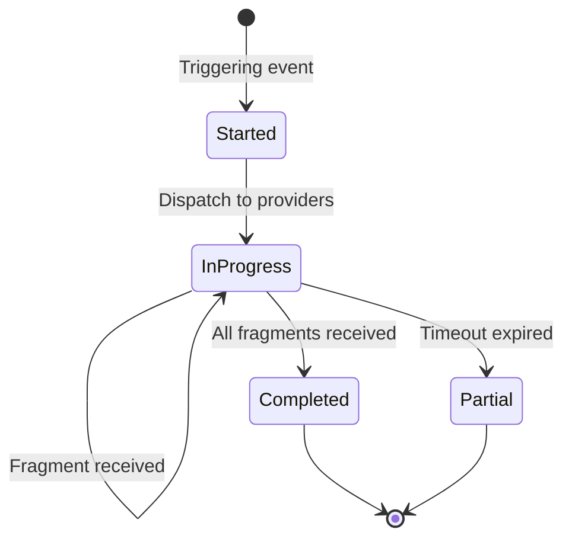
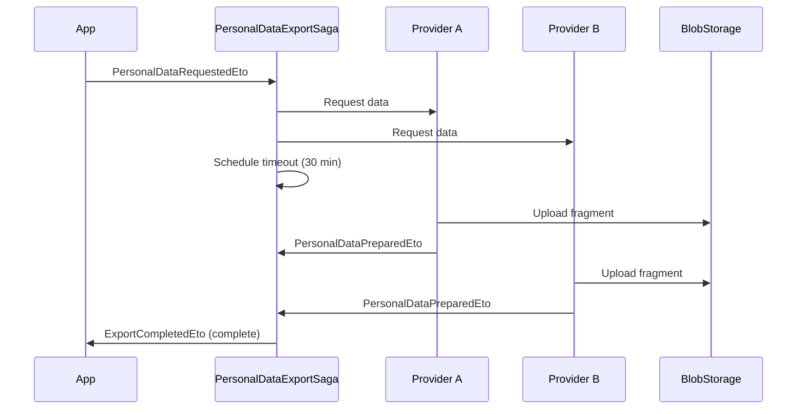

## Definition

The **Saga** (or Process Manager) orchestrates a business process composed of
multiple distributed steps, each of which can fail independently. Unlike a
classic ACID transaction, the saga maintains persistent intermediate state and
manages compensations or timeouts. Granit implements this pattern via Wolverine
Sagas (correlation + persistence) and custom orchestrators for import/export
pipelines.

## Diagram





## Implementation in Granit

Granit uses the Saga / Process Manager pattern in 4 distinct contexts:

### 1. PersonalDataExportSaga -- scatter-gather (Wolverine Saga)

GDPR Article 15/20 orchestration (right of access/portability). Collects
personal data fragments from multiple providers, with configurable timeout.

| Element | Detail |
| --- | --- |
| Class | `PersonalDataExportSaga` (extends `Saga`) |
| Package | `Granit.Privacy` |
| Persisted state | `ExpectedCount`, `ReceivedFragments`, `PendingProviders` |
| Correlation | `RequestId` (Guid) |
| Timeout | Wolverine scheduled message (`ExportTimedOutEvent`) |

```csharp
// Saga start -- dispatches to all registered providers
public async Task<ExportCompletedEto?> StartAsync(
    PersonalDataRequestedEto @event,
    IDataProviderRegistry registry,
    IOptions<GranitPrivacyOptions> options,
    IMessageContext context)
{
    Id = @event.RequestId;
    UserId = @event.UserId;
    ExpectedCount = registry.Count;

    // Schedule timeout -- in case not all providers respond
    await context.ScheduleAsync(
        new ExportTimedOutEvent(Id),
        TimeSpan.FromMinutes(options.Value.ExportTimeoutMinutes))
        .ConfigureAwait(false);

    return ExpectedCount == 0
        ? new ExportCompletedEto(Id, [], IsPartial: false)
        : null;
}
```

**ISO 27001 compliance**: only `BlobReferenceId` values are stored in the saga
state -- no raw personal data transits or persists.

### 2. EfImportOrchestrator -- processing pipeline

Import pipeline orchestration: Load > Parse > Map > Validate > Resolve
Identity > Execute. Uses `IAsyncEnumerable` for streaming and persists state
via `ImportJob` in the database.

| Element | Detail |
| --- | --- |
| Class | `EfImportOrchestrator` |
| Package | `Granit.DataExchange.EntityFrameworkCore` |
| Persisted state | `ImportJob` (Status, ReportJson) |
| Modes | Execute (commit) / DryRun (rollback) |

### 3. ExportOrchestrator -- async export

Export orchestration: definition resolution > data streaming > field projection
\> file writing > blob storage. The job is dispatched in background via
Wolverine.

| Element | Detail |
| --- | --- |
| Class | `ExportOrchestrator` |
| Package | `Granit.DataExchange` |
| Persisted state | `ExportJob` (Status, BlobReference, RowCount) |
| Dispatch | Wolverine background message |

### 4. WorkflowManager -- state machine with approval

Business workflow orchestration with transitions, permissions, and routing to a
`PendingReview` state when approval is required.

| Element | Detail |
| --- | --- |
| Class | `WorkflowManager(TState)` |
| Package | `Granit.Workflow` |
| State | Enum `TState` (finite state machine) |
| Outcomes | `Completed`, `ApprovalRequested`, `Denied`, `InvalidTransition` |

### Reference files

| File | Role |
| --- | --- |
| `src/Granit.Privacy/DataExport/PersonalDataExportSaga.cs` | GDPR scatter-gather saga |
| `src/Granit.Privacy/DataExport/PersonalDataExportSagaState.cs` | Saga state |
| `src/Granit.DataExchange.EntityFrameworkCore/Internal/Import/Pipeline/EfImportOrchestrator.cs` | Import pipeline |
| `src/Granit.DataExchange/Export/Internal/ExportOrchestrator.cs` | Export pipeline |
| `src/Granit.Workflow/WorkflowManager.cs` | FSM with approval |

## Rationale

| Problem | Solution |
| --- | --- |
| Multi-provider GDPR export -- some providers slow or down | Configurable timeout + partial result |
| 100k-row CSV import = memory pressure | `IAsyncEnumerable` streaming, no full load |
| Large export blocks the HTTP request | Background dispatch + polling by job ID |
| Workflow with approval -- logic scattered | Centralized FSM with automatic routing to PendingReview |
| Personal data in saga state | Only `BlobReferenceId` values persisted (ISO 27001) |

## Usage example

```csharp
// --- Trigger a GDPR export ---
await messageBus.PublishAsync(
    new PersonalDataRequestedEto(
        RequestId: Guid.NewGuid(),
        UserId: patient.Id),
    cancellationToken).ConfigureAwait(false);

// The PersonalDataExportSaga collects fragments from each provider.
// When all fragments are received (or timeout):
// -> ExportCompletedEto { BlobReferences, IsPartial }

// --- Trigger an import ---
Guid jobId = await importOrchestrator
    .ExecuteAsync(importJobId, cancellationToken)
    .ConfigureAwait(false);
// ImportJob.Status transitions from Executing -> Completed/Failed

// --- Workflow transition ---
TransitionResult<InvoiceStatus> result = await workflowManager
    .TransitionAsync(
        InvoiceStatus.Draft,
        InvoiceStatus.Approved,
        new TransitionContext("Accounting validation"),
        cancellationToken)
    .ConfigureAwait(false);
// result.Outcome = Completed | ApprovalRequested | Denied
```

## Further reading

- [Saga pattern -- Microsoft Cloud Design Patterns](https://learn.microsoft.com/en-us/azure/architecture/reference-architectures/saga/saga)
- [Process Manager -- Enterprise Integration Patterns](https://www.enterpriseintegrationpatterns.com/patterns/messaging/ProcessManager.html)
- [Wolverine Sagas](https://wolverine.netlify.app/guide/durability/sagas.html)
