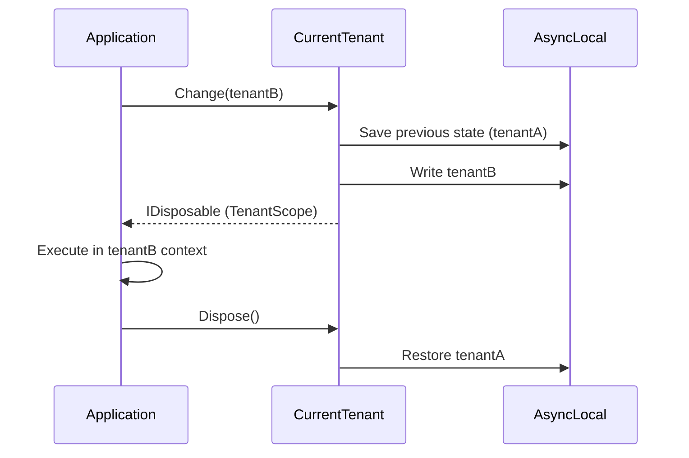

## Definition

The Scope Manager pattern encapsulates a context change in an `IDisposable`
object. The context is modified at scope creation and automatically restored
on `Dispose()`, guaranteeing a return to the previous state even when an
exception occurs.

## Diagram



## Implementation in Granit

| Scope | File | Managed context |
|-------|------|-----------------|
| `TenantScope` | `src/Granit.MultiTenancy/CurrentTenant.cs` | `ICurrentTenant.Change(tenantId)` -- restores previous tenant |
| `FilterScope` | `src/Granit/DataFiltering/DataFilter.cs` | `IDataFilter.Disable<T>()` -- re-enables the filter |
| Wolverine behaviors | `src/Granit.Wolverine/Behaviors/UserContextBehavior.cs` | `IWolverineUserContextSetter.Change()` -- restores user |

All scopes use `AsyncLocal<T>` for thread-safe propagation across
`async/await` boundaries.

## Rationale

The C# `using` pattern guarantees `Dispose()` even when an exception occurs,
eliminating the risk of context leaks (a tenant remaining active after an
error).

## Usage example

```csharp
// Temporary tenant change -- automatic restoration
using (currentTenant.Change(adminTenantId))
{
    // All queries in this scope target adminTenantId
    List<AuditEntry> logs = await db.AuditEntries.ToListAsync(ct);
} // Previous tenant is automatically restored

// Temporarily disable the soft delete filter
using (dataFilter.Disable<ISoftDeletable>())
{
    // Deleted records are visible
    List<Patient> allPatients = await db.Patients.ToListAsync(ct);
} // Filter is automatically re-enabled
```
