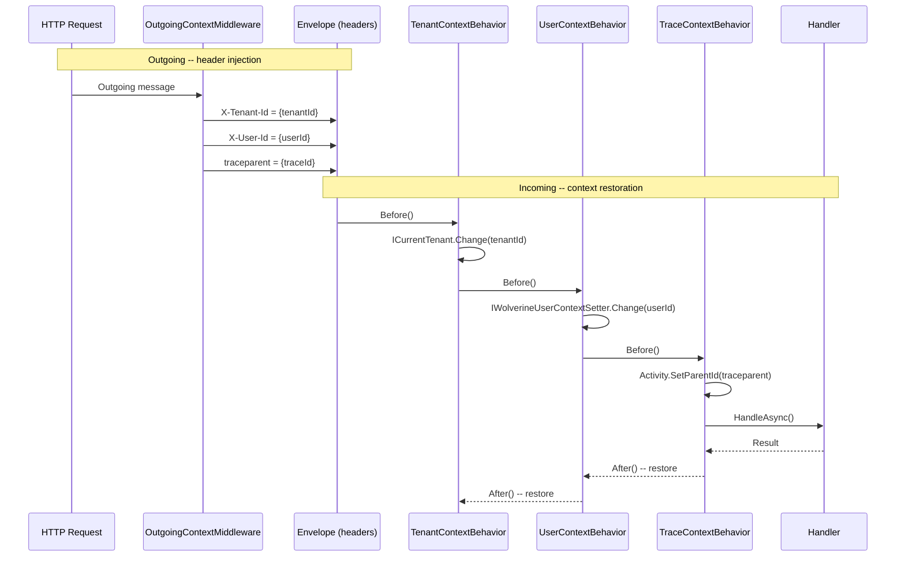

## Definition

The Sidecar pattern attaches cross-cutting responsibilities to a main component
without modifying its code. In the Wolverine context, **Behaviors** (Before/After)
execute around each message handler, restoring the context (tenant, user, trace)
lost during the transition from HTTP > Outbox > background thread.

Granit implements three incoming behaviors and one outgoing middleware, forming a
context bridge between HTTP requests and asynchronous processing.

## Diagram



## Implementation in Granit

### Outgoing middleware

| Component | File | Role |
|-----------|------|------|
| `OutgoingContextMiddleware` | `src/Granit.Wolverine/Middleware/OutgoingContextMiddleware.cs` | Injects `X-Tenant-Id`, `X-User-Id`, `traceparent` into outgoing Wolverine envelopes |

Injection conditions:

- `X-Tenant-Id`: only if `currentTenant.Id.HasValue`
- `X-User-Id`: only if `currentUserService.IsAuthenticated` and
  `UserId is { Length: > 0 }`
- `traceparent`: if an `Activity` is in progress

### Incoming behaviors

| Behavior | File | Lifecycle | Role |
|----------|------|-----------|------|
| `TenantContextBehavior` | `src/Granit.Wolverine/Behaviors/TenantContextBehavior.cs` | Before/After | Reads `X-Tenant-Id` > `ICurrentTenant.Change(tenantId)` |
| `UserContextBehavior` | `src/Granit.Wolverine/Behaviors/UserContextBehavior.cs` | Before/After | Reads `X-User-Id` > `IWolverineUserContextSetter.Change(userId)` |
| `TraceContextBehavior` | `src/Granit.Wolverine/Behaviors/TraceContextBehavior.cs` | Before/After | Reads `traceparent` > links the handler's `Activity` to the trace parent |

Each `Before()` returns an `IDisposable` scope. The `After()` disposes the
scope, restoring the previous context (important for chained handlers).

### Registration

In `src/Granit.Wolverine/Extensions/WolverineHostApplicationBuilderExtensions.cs`:

```csharp
opts.Policies.AddMiddleware<OutgoingContextMiddleware>();
// Behaviors are registered via Wolverine's handler chain discovery
```

### Internal interface

| Interface | File | Role |
|-----------|------|------|
| `IWolverineUserContextSetter` | `src/Granit.Wolverine/Internal/IWolverineUserContextSetter.cs` | Allows replacing the user context without HttpContext |
| `WolverineCurrentUserService` | `src/Granit.Wolverine/Internal/WolverineCurrentUserService.cs` | `AsyncLocal` implementation: override > HttpContext fallback |

## Rationale

| Problem | Solution |
|---------|----------|
| Background handlers have no `HttpContext` | Behaviors restore context from envelope headers |
| EF Core audit interceptor needs `ModifiedBy` in background | `UserContextBehavior` restores `ICurrentUserService` via `AsyncLocal` |
| OpenTelemetry traces are disjointed between HTTP and async | `TraceContextBehavior` links spans via W3C `traceparent` |
| Multi-tenant EF Core query filters do not work in background | `TenantContextBehavior` restores `ICurrentTenant` so filters apply |
| The handler must remain pure (no infrastructure code) | All context machinery is in the behaviors, invisible to the handler |

## Usage example

```csharp
// The handler is completely pure -- no awareness of behaviors
public static class ProcessMedicalReportHandler
{
    public static async Task Handle(
        ProcessMedicalReportCommand command,
        ICurrentTenant currentTenant,       // restored by TenantContextBehavior
        ICurrentUserService currentUser,    // restored by UserContextBehavior
        AppDbContext db,
        CancellationToken cancellationToken)
    {
        // currentTenant.Id is the same as the originating HTTP request
        // currentUser.UserId is the same as the user who initiated the operation

        MedicalReport report = await db.Reports.FindAsync([command.ReportId], ct)
            ?? throw new EntityNotFoundException(typeof(MedicalReport), command.ReportId);

        report.MarkAsProcessed();
        await db.SaveChangesAsync(ct);

        // AuditedEntityInterceptor records:
        // ModifiedBy = currentUser.UserId (not "system")
        // The OpenTelemetry Activity is linked to the HTTP trace parent
    }
}
```

## Further reading

- [Sidecar pattern -- Microsoft Cloud Design Patterns](https://learn.microsoft.com/en-us/azure/dotnet/architecture/patterns/sidecar)
