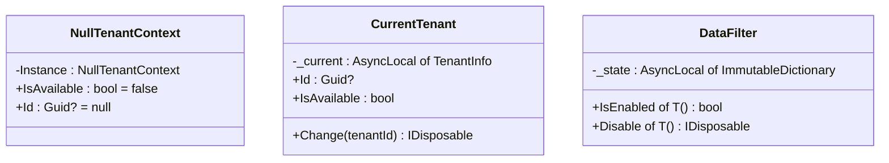

## Definition

The Singleton pattern ensures a class has only one instance and provides a
global access point to it. In Granit, the Singleton takes two forms: DI
singletons (managed by the container) and `AsyncLocal` singletons
(thread-safe state per async flow).

## Diagram



## Implementation in Granit

| Singleton | File | Type | Scope |
|-----------|------|------|-------|
| `NullTenantContext.Instance` | `src/Granit/MultiTenancy/NullTenantContext.cs` | `static readonly` | Global |
| `CurrentTenant._current` | `src/Granit.MultiTenancy/CurrentTenant.cs` | `AsyncLocal<TenantInfo?>` | Per async flow |
| `DataFilter._state` | `src/Granit/DataFiltering/DataFilter.cs` | `AsyncLocal<ImmutableDictionary>` | Per async flow |
| DI services | All modules | `AddSingleton<T>()` | DI container |

**Custom variant -- AsyncLocal Singleton**: a `static readonly AsyncLocal<T>`
field provides singleton state per `async/await` flow, thread-safe without
locks. Each `Task` inherits state from its parent, but modifications are
isolated per flow thanks to copy-on-write (`ImmutableDictionary`).

## Rationale

`NullTenantContext` eliminates `null` checks throughout the framework when
multi-tenancy is not installed. `AsyncLocal` singletons allow propagating
context (tenant, filters) across `async/await` boundaries without relying on
`HttpContext`.

## Usage example

```csharp
// NullTenantContext -- always available, never null
ICurrentTenant tenant = serviceProvider.GetRequiredService<ICurrentTenant>();
// If Granit.MultiTenancy is not installed: tenant.IsAvailable == false
// No NullReferenceException, no if (tenant != null) check

// AsyncLocal -- state isolated per async flow
using (currentTenant.Change(newTenantId))
{
    // This async flow sees newTenantId
    await Task.Run(async () =>
    {
        // This child flow inherits newTenantId
        Guid? id = currentTenant.Id; // == newTenantId
    });
}
// Here, the previous tenant is restored
```

## Further reading

- [Singleton -- refactoring.guru](https://refactoring.guru/design-patterns/singleton)
