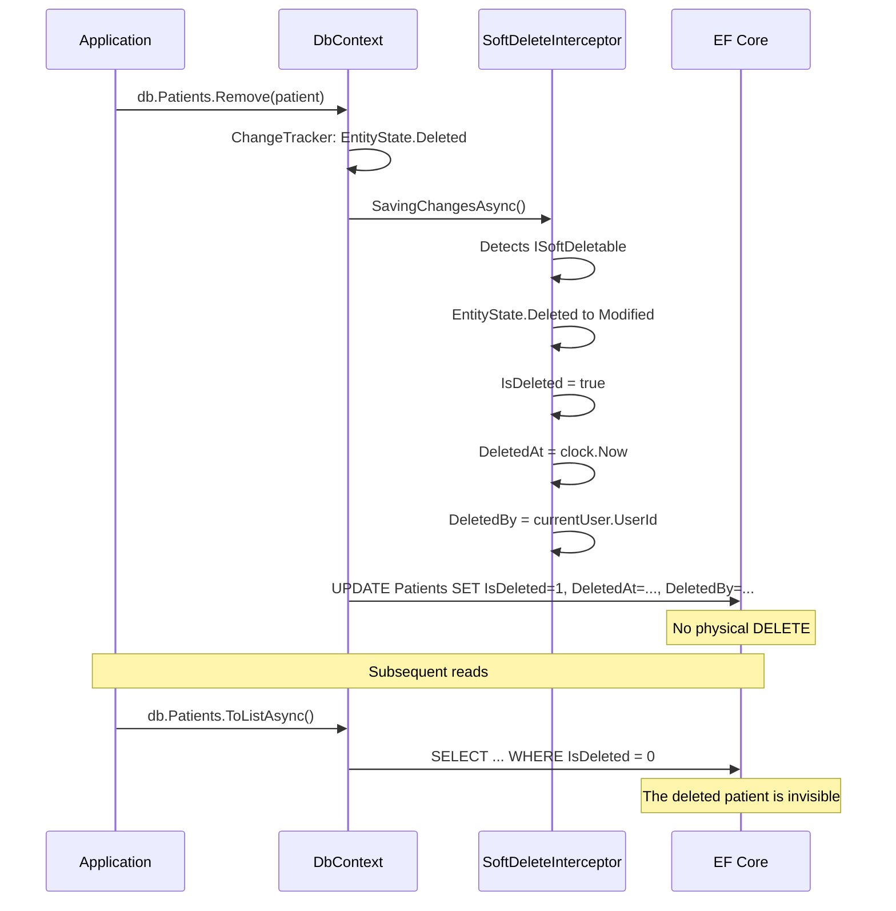

## Definition

The Soft Delete pattern replaces physical deletion with an `IsDeleted` flag
update. The record remains in the database but is hidden by query filters.
This pattern is **mandatory** in Granit for ISO 27001 compliance (3-year audit
trail) and GDPR (deletion traceability).

## Diagram



## Implementation in Granit

| Component | File | Role |
|-----------|------|------|
| `ISoftDeletable` | `src/Granit/Domain/ISoftDeletable.cs` | Marker interface: `IsDeleted`, `DeletedAt`, `DeletedBy` |
| `FullAuditedEntity` | `src/Granit/Domain/FullAuditedEntity.cs` | Implements `ISoftDeletable` |
| `SoftDeleteInterceptor` | `src/Granit.Persistence/Interceptors/SoftDeleteInterceptor.cs` | Converts `Deleted` to `Modified`, fills audit fields |
| `ApplyGranitConventions()` | `src/Granit.Persistence/Extensions/ModelBuilderExtensions.cs` | Applies query filter `WHERE IsDeleted = false` |
| `IDataFilter` | `src/Granit/DataFiltering/IDataFilter.cs` | Allows temporarily disabling the filter |

### Crypto-shredding (BlobStorage)

`BlobStorage` is a special case: deletion is **hybrid**:

1. **Physical deletion** of the S3 object (crypto-shredding, GDPR Art. 17)
2. **Soft delete** of the `BlobDescriptor` in DB (ISO 27001 audit trail)

```text
src/Granit.BlobStorage/Internal/DefaultBlobStorage.cs:
  -> storageClient.DeleteObjectAsync()  // physical S3 deletion
  -> descriptor.MarkAsDeleted()         // soft delete in DB
```

### Regulatory justification

| Regulatory requirement | Pattern response |
|------------------------|-----------------|
| ISO 27001 -- 3-year audit trail | `DeletedAt` + `DeletedBy` preserved in DB |
| GDPR Art. 17 -- right to erasure | Crypto-shredding: binary data destroyed, metadata preserved |
| GDPR Art. 15 -- right of access | Full history is available (who, when, what) |
| Internal audit -- traceability | `ICurrentUserService.UserId` captures the deletion actor |

## Usage example

```csharp
// Standard deletion -- intercepted automatically
db.Patients.Remove(patient);
await db.SaveChangesAsync(ct);
// -> UPDATE: IsDeleted=true, DeletedAt=now, DeletedBy=currentUser

// Admin read -- temporarily disable the filter
using (dataFilter.Disable<ISoftDeletable>())
{
    // Includes deleted patients (audit, compliance)
    List<Patient> allPatients = await db.Patients.ToListAsync(ct);
}
```
