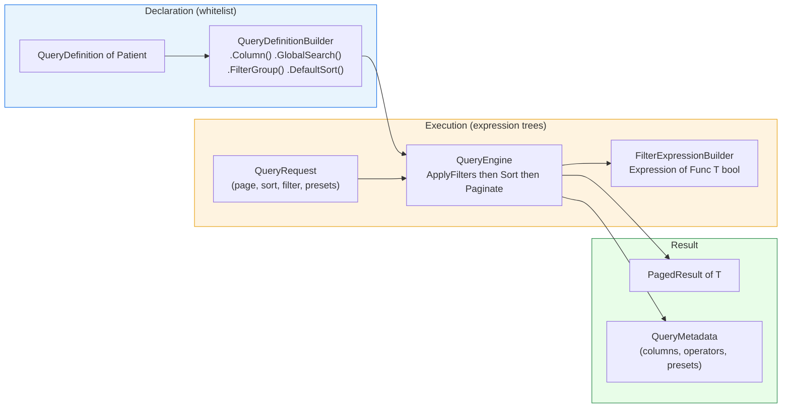

## Definition

The Specification pattern encapsulates a business rule in a reusable, composable
object. Granit implements it as a **declarative query DSL** (whitelist-first) that
builds `Expression<Func<TEntity, bool>>` from filtered, sorted, and paginated
criteria -- all translated to SQL by EF Core.

## Diagram



## Implementation in Granit

### Three packages

| Package | Role |
| --- | --- |
| `Granit.QueryEngine` | Interfaces, fluent builder, DTOs (`QueryRequest`, `PagedResult<T>`) |
| `Granit.QueryEngine.EntityFrameworkCore` | Execution engine: expression trees, dynamic sorting, pagination |
| `Granit.QueryEngine.AspNetCore` | REST binding (`filter[field.op]=value`), metadata + saved views endpoints |

### QueryDefinition -- the declarative specification

Each entity declares its query capabilities via a `QueryDefinition<TEntity>`
class. **Nothing is exposed by default** -- every filterable, sortable, or
groupable column must be explicitly whitelisted.

```csharp
public sealed class PatientQueryDefinition : QueryDefinition<Patient>
{
    public override string Name => "Acme.Patients";

    protected override void Configure(QueryDefinitionBuilder<Patient> builder) =>
        builder
            .Column(p => p.Niss, c => c.Label("NISS").Filterable().Sortable())
            .Column(p => p.Email, c => c.Label("Email").Filterable())
            .GlobalSearch(p => p.Niss, p => p.Email, p => p.LastName)
            .FilterGroup("Status", g => g
                .Preset("Active", p => p.Status == PatientStatus.Active, isDefault: true)
                .Preset("Inactive", p => p.Status == PatientStatus.Inactive))
            .DefaultSort("-LastName")
            .DefaultPageSize(25);
}
```

### Operators inferred by type

| C# type | Available operators |
| --- | --- |
| `string` | Eq, Contains, StartsWith, EndsWith, In |
| `int`, `decimal`, `double` | Eq, Gt, Gte, Lt, Lte, In, Between |
| `DateTime`, `DateTimeOffset` | Eq, Gt, Gte, Lt, Lte, Between |
| `bool` | Eq |
| `enum` | Eq, In |
| `Guid` | Eq, In |

### Execution pipeline

The `QueryEngine` applies filters in this order:

1. **Filters** (`filter[field.op]=value`) -- validated against the whitelist,
   compiled to `Expression<Func<T, bool>>` via `FilterExpressionBuilder`
2. **Presets** (`presets[group]=name1,name2`) -- OR within a group, AND between groups
3. **Quick filters** (`quickFilters=MyItems,Unread`) -- independent AND
4. **Global search** (`search=Alice`) -- OR across declared properties
5. **Dynamic sort** (`sort=-createdAt,lastName`) -- `OrderBy`/`ThenBy` via expressions
6. **Pagination** -- offset (`page`, `pageSize`) or keyset (`cursor`)

### Whitelist-first security

Fields not declared in the `QueryDefinition` are **silently ignored**. No SQL
injection is possible: all values pass through typed `Expression` objects, never
through string concatenation.

### Reference files

| File | Role |
| --- | --- |
| `src/Granit.QueryEngine/QueryDefinition.cs` | Abstract specification class |
| `src/Granit.QueryEngine/QueryDefinitionBuilder.cs` | Fluent builder (Column, FilterGroup, GlobalSearch) |
| `src/Granit.QueryEngine/Filtering/FilterCriteria.cs` | Record (Field, Operator, Value) |
| `src/Granit.QueryEngine/Filtering/FilterOperator.cs` | Operator enum |
| `src/Granit.QueryEngine/QueryRequest.cs` | Query DTO (page, sort, filter, presets) |
| `src/Granit.QueryEngine.EntityFrameworkCore/Internal/FilterExpressionBuilder.cs` | Filter to Expression compilation |
| `src/Granit.QueryEngine.EntityFrameworkCore/Internal/QueryableFilterExtensions.cs` | Filter application on IQueryable |
| `src/Granit.QueryEngine.EntityFrameworkCore/Internal/QueryableSortExtensions.cs` | Dynamic sorting via expressions |
| `src/Granit.QueryEngine.EntityFrameworkCore/Internal/QueryablePaginationExtensions.cs` | Offset + keyset pagination |
| `src/Granit.QueryEngine.AspNetCore/Binding/QueryRequestBinder.cs` | REST query string parsing |

## Rationale

| Problem | Specification solution |
| --- | --- |
| Exposing all fields for filtering (injection, perf) | Whitelist-first: only declared fields are filterable |
| Dynamic SQL construction via concatenation | Typed expression trees, translated by EF Core |
| Filtering logic duplicated in every endpoint | `QueryDefinition<T>` centralizes declaration per entity |
| Frontend does not know which filters are available | `/meta` endpoint returns columns, operators, and presets |
| Preset filters duplicated between frontend and backend | Presets declared server-side, exposed via metadata |

## Usage example

```csharp
// --- Declaration (once per entity) ---
public sealed class InvoiceQueryDefinition : QueryDefinition<Invoice>
{
    public override string Name => "Billing.Invoices";

    protected override void Configure(QueryDefinitionBuilder<Invoice> builder) =>
        builder
            .Column(i => i.Number, c => c.Label("Invoice #").Filterable().Sortable())
            .Column(i => i.Amount, c => c.Label("Amount").Filterable().Sortable())
            .Column(i => i.IssuedAt, c => c.Label("Issued").Sortable())
            .DateFilter(i => i.IssuedAt, DatePeriod.Last30Days)
            .FilterGroup("Status", g => g
                .Preset("Draft", i => i.Status == InvoiceStatus.Draft)
                .Preset("Sent", i => i.Status == InvoiceStatus.Sent, isDefault: true)
                .Preset("Paid", i => i.Status == InvoiceStatus.Paid))
            .GlobalSearch(i => i.Number, i => i.CustomerName)
            .DefaultSort("-IssuedAt")
            .SupportsCursorPagination(i => i.IssuedAt);
}

// --- Usage (endpoint) ---
// GET /api/invoices?filter[amount.gte]=1000&presets[status]=Sent,Paid&sort=-issuedAt&page=1
group.MapGranitQuery<Invoice>("/api/invoices",
    sp => sp.GetRequiredService<BillingDbContext>().Invoices.AsNoTracking());
```

## Further reading

- [Specification pattern -- deviq.com (Ardalis)](https://deviq.com/design-patterns/specification-pattern)
- [Query Object -- Martin Fowler (PoEAA)](https://martinfowler.com/eaaCatalog/queryObject.html)
