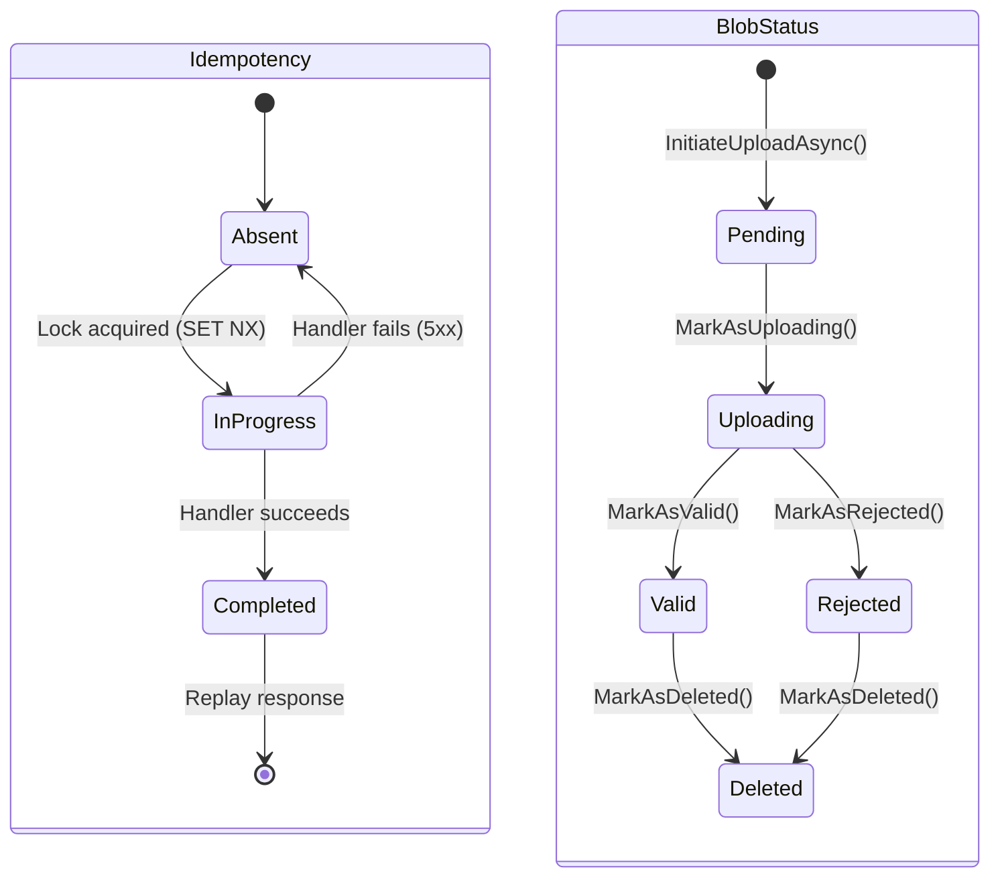

## Definition

The State Machine pattern models an object whose behavior changes based on
its internal state. Transitions between states are explicit and controlled,
preventing invalid states.

Granit uses two state machines: one for HTTP idempotency, the other for the
blob lifecycle.

## Diagram



## Implementation in Granit

### IdempotencyState

| Component | File |
|-----------|------|
| `IdempotencyState` | `src/Granit.Http.Idempotency/Models/IdempotencyState.cs` |
| `IdempotencyMiddleware` | `src/Granit.Http.Idempotency/Internal/IdempotencyMiddleware.cs` |

States: `Absent` -> `InProgress` -> `Completed`

### BlobStatus

| Component | File |
|-----------|------|
| `BlobStatus` | `src/Granit.BlobStorage/BlobStatus.cs` |
| `BlobDescriptor` | `src/Granit.BlobStorage/BlobDescriptor.cs` |

States: `Pending` -> `Uploading` -> `Valid`/`Rejected` -> `Deleted`

Transitions are encapsulated in methods on `BlobDescriptor`:
`MarkAsUploading()`, `MarkAsValid()`, `MarkAsRejected()`, `MarkAsDeleted()`.
Each method validates the current state before the transition.

## Rationale

State machines make transitions explicit and testable. A blob cannot go from
`Pending` to `Deleted` directly -- it must traverse intermediate states.
Idempotency uses states to manage concurrency (InProgress -> 409 Conflict).

## Usage example

```csharp
// Transitions are secured by typed methods
BlobDescriptor descriptor = new() { Status = BlobStatus.Pending };

descriptor.MarkAsUploading();  // Pending -> Uploading
descriptor.MarkAsValid();      // Uploading -> Valid
descriptor.MarkAsDeleted(clock.Now, "GDPR Art. 17"); // Valid -> Deleted

// Invalid transition -> exception
descriptor.MarkAsValid(); // Deleted -> Valid: InvalidOperationException
```

## Further reading

- [State -- refactoring.guru](https://refactoring.guru/design-patterns/state)
