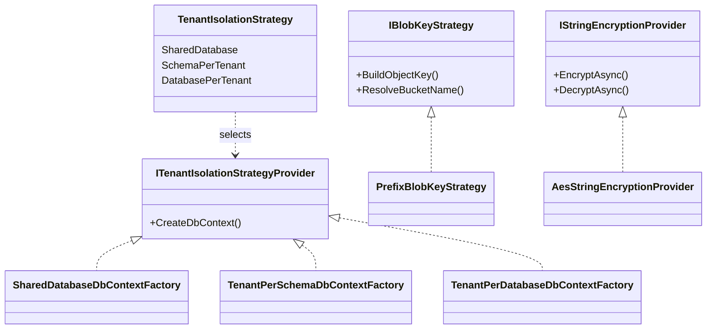

## Definition

The Strategy pattern defines a family of algorithms, encapsulates each one in
a separate class, and makes them interchangeable. Algorithm selection is
delegated to configuration or runtime.

## Diagram



## Implementation in Granit

| Strategy | Interface | File | Implementations |
|----------|-----------|------|-----------------|
| Tenant isolation | `ITenantIsolationStrategyProvider` | `src/Granit.Persistence/MultiTenancy/` | `SharedDatabase`, `TenantPerSchema`, `TenantPerDatabase` |
| S3 key | `IBlobKeyStrategy` | `src/Granit.BlobStorage/IBlobKeyStrategy.cs` | `PrefixBlobKeyStrategy` |
| Encryption | `IStringEncryptionProvider` | `src/Granit.Encryption/Providers/` | `AesStringEncryptionProvider` |
| Tenant resolution | `ITenantResolver` | `src/Granit.MultiTenancy/Resolvers/` | `HeaderTenantResolver`, `JwtClaimTenantResolver` |

**Custom variant -- Enum-based Selection**: `TenantIsolationStrategy` is an
enum used as a selection key. The factory picks the implementation via a
switch expression -- no reflection or complex configuration.

## Rationale

The choice between SharedDatabase, SchemaPerTenant, and DatabasePerTenant has
major implications on cost, performance, and security. The Strategy pattern
allows changing this decision without modifying application code.

## Usage example

```csharp
// The strategy is selected via appsettings.json (section "Persistence")
// { "Persistence": { "IsolationStrategy": "SchemaPerTenant" } }
services.AddGranitPersistence();

// Application code is identical regardless of the strategy
public sealed class PatientService(AppDbContext db)
{
    public async Task<Patient?> FindAsync(Guid id, CancellationToken cancellationToken)
        => await db.Patients.FindAsync([id], ct);
    // SharedDatabase -> WHERE Id = @id AND TenantId = @tid
    // SchemaPerTenant -> SET search_path TO tenant_xxx; SELECT ... WHERE Id = @id
    // DatabasePerTenant -> Connection to tenant_xxx_db; SELECT ... WHERE Id = @id
}
```

## Further reading

- [Strategy -- refactoring.guru](https://refactoring.guru/design-patterns/strategy)
