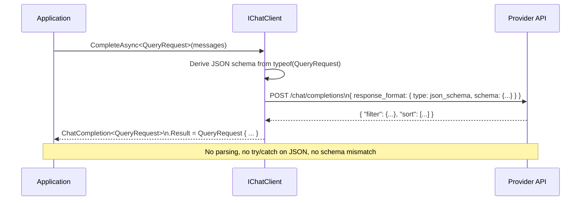

## Definition

**Structured Output** (also called JSON Mode or Function Calling) is a pattern for
constraining a Large Language Model's response to a specific JSON schema derived from
a C# type. Instead of parsing free-text, the caller receives a deserialized, strongly-
typed object. This eliminates an entire class of parsing failures and makes AI responses
as reliable as calling a regular API.

`Microsoft.Extensions.AI` exposes this via `IChatClient.CompleteAsync<T>()`, which
sends the schema to the provider's structured output API and deserializes the result.

## Diagram



## Implementation in Granit

All `*.AI` packages that need typed LLM output use `CompleteAsync<T>()` from
`Microsoft.Extensions.AI`. The C# type defines the schema; the runtime enforces it.

### QueryEngine.AI — QueryRequest from natural language

```csharp
// The target type drives the schema sent to the LLM
var response = await workspace.Chat.CompleteAsync<QueryRequest>(
[
    new ChatMessage(ChatRole.System, BuildSystemPrompt(definition)),
    new ChatMessage(ChatRole.User, phrase),
], cancellationToken: ct);

QueryRequest result = response.Result;
// result.Filters, result.Sort, result.Search are all populated and typed
```

The `QueryRequest` schema is derived automatically from the C# record definition.
`QueryDefinition<T>` metadata (available columns, filter operators, sort fields)
is injected into the system prompt to constrain valid field names.

### DataExchange.AI — column mapping with confidence scores

```csharp
public sealed record MappingSuggestion(
    string SourceColumn,
    string TargetField,
    double Confidence);       // 0.0 – 1.0

public sealed record MappingResponse(
    IReadOnlyList<MappingSuggestion> Mappings);

var response = await workspace.Chat.CompleteAsync<MappingResponse>(
[
    new ChatMessage(ChatRole.System, BuildMappingPrompt(headers, preview, schema)),
    new ChatMessage(ChatRole.User, "Map the source columns to target fields."),
], cancellationToken: ct);

// response.Result.Mappings is guaranteed to be non-null and typed
```

### Schema constraints via XML docs

The LLM receives richer schema context when properties have XML documentation:

```csharp
/// <summary>Confidence score for this mapping. 1.0 = certain, 0.0 = guess.</summary>
/// <remarks>Must be between 0.0 and 1.0 inclusive.</remarks>
public double Confidence { get; init; }
```

`Microsoft.Extensions.AI` includes XML doc summaries in the JSON schema sent to the
provider when `JsonSerializerOptions` is configured with schema generation.

### Provider compatibility

| Provider | Structured Output support | Notes |
|----------|--------------------------|-------|
| OpenAI (GPT-4o+) | `response_format: json_schema` | Strict mode available |
| Azure OpenAI | Same as OpenAI | EU-region deployments |
| Anthropic (Claude 3+) | Tool use / JSON mode | Via `Anthropic` SDK |
| Ollama | JSON mode | Model-dependent reliability |

`Microsoft.Extensions.AI` abstracts these differences — the same `CompleteAsync<T>()`
call works across all providers.

### Reference files

| File | Role |
|------|------|
| `src/Granit.QueryEngine.AI/AINaturalLanguageQueryTranslator.cs` | `CompleteAsync<QueryRequest>` |
| `src/Granit.DataExchange.AI/AIMappingSuggestionService.cs` | `CompleteAsync<MappingResponse>` |
| `src/Granit.AI.Extraction/AIDocumentExtractor.cs` | `CompleteAsync<TSchema>` generic extraction |

## Rationale

| Problem | Structured Output solution |
|---------|-----------------------------|
| LLM returns free text that must be parsed | Schema enforced by the provider API |
| JSON parsing failures at runtime | Deserialization happens inside `CompleteAsync<T>` |
| Schema drift between prompt and code | C# type is the single source of truth |
| Validation of LLM output | `[Required]`, ranges, and XML docs guide the model |
| Unit testing AI integration | Mock `IChatClient` returns typed `Result` directly |

## Further reading

- [Graceful AI Fallback](./ai-fallback/) — what to do when structured output fails
- [AI Workspace](./ai-workspace/) — provider and workspace configuration
- [Microsoft.Extensions.AI — Structured Output](https://devblogs.microsoft.com/dotnet/introducing-microsoft-extensions-ai-preview/)
- [OpenAI Structured Outputs](https://platform.openai.com/docs/guides/structured-outputs)
