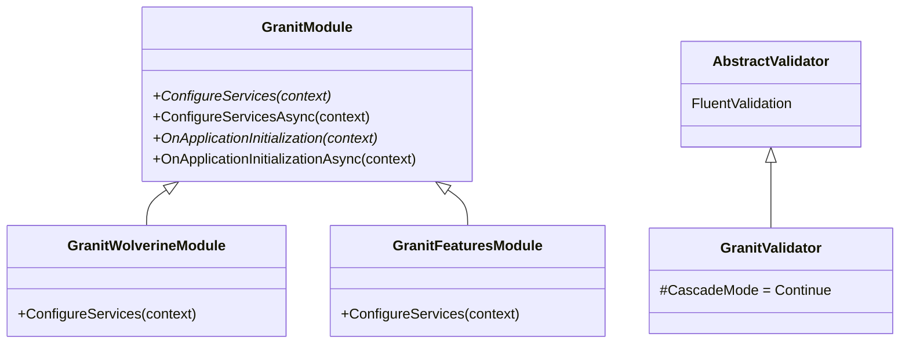

## Definition

The Template Method pattern defines the skeleton of an algorithm in a base
class, letting subclasses redefine certain steps without changing the overall
structure. The base class calls methods in a predefined order; subclasses
override the ones relevant to them.

## Diagram



## Implementation in Granit

| Base class | File | Hooks |
|------------|------|-------|
| `GranitModule` | `src/Granit/Modularity/GranitModule.cs` | `ConfigureServices()`, `ConfigureServicesAsync()`, `OnApplicationInitialization()`, `OnApplicationInitializationAsync()` |
| `GranitValidator<T>` | `src/Granit.Validation/GranitValidator.cs` | Inherits from `AbstractValidator<T>` with `CascadeMode.Continue` by default |

**Custom variant -- Dual Sync/Async**: `ConfigureServicesAsync()` delegates
to `ConfigureServices()` by default. A module can override only the sync
version or only the async version -- no obligation to implement both.

## Rationale

The module lifecycle (discovery -> configuration -> initialization) is fixed.
Only the content of each step varies between modules. The Template Method
guarantees that the order is always respected.

## Usage example

```csharp
[DependsOn(typeof(GranitPersistenceModule))]
public sealed class MyAppHostModule : GranitModule
{
    // Override only the necessary steps
    public override void ConfigureServices(ServiceConfigurationContext context)
    {
        context.Services.AddScoped<IPatientService, PatientService>();
    }

    public override void OnApplicationInitialization(ApplicationInitializationContext context)
    {
        WebApplication app = context.GetApplicationBuilder();
        app.MapControllers();
    }

    // ConfigureServicesAsync() and OnApplicationInitializationAsync()
    // are not overridden -- they delegate to the sync versions above
}
```

## Further reading

- [Template Method -- refactoring.guru](https://refactoring.guru/design-patterns/template-method)
