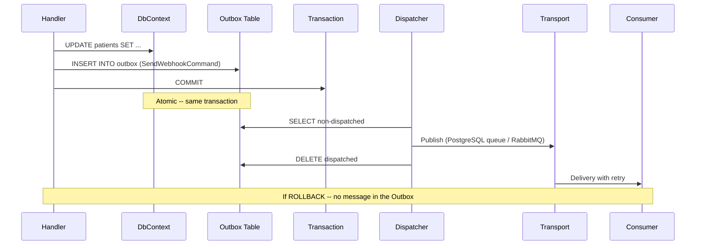

## Definition

The Transactional Outbox pattern guarantees reliable event publishing by
persisting events in the same transaction as business data. If the transaction
commits, events are guaranteed to be delivered. If it rolls back, events are
discarded along with the data -- no inconsistency possible.

Granit delegates the Outbox to Wolverine, which stores messages in a dedicated
table within the application database. A background dispatcher relays messages
to configured transports after commit.

## Diagram



## Implementation in Granit

### Wolverine configuration

The Outbox is activated by provider modules (PostgreSQL, SQL Server), not by
`Granit.Wolverine` itself (which remains transport-agnostic).

| Component | File | Role |
|-----------|------|------|
| `AddGranitWolverine()` | `src/Granit.Wolverine/Extensions/WolverineHostApplicationBuilderExtensions.cs` | Configures the bus, retries, behaviors -- **not the Outbox** |
| `GranitWolverinePostgresqlModule` | `src/Granit.Wolverine.Postgresql/GranitWolverinePostgresqlModule.cs` | Activates the PostgreSQL Outbox |

### Event routing

```csharp
// IDomainEvent -> local queue (NEVER the Outbox)
opts.PublishMessage<IDomainEvent>().ToLocalQueue("domain-events");

// IIntegrationEvent -> configured transport (with Outbox)
// Routing is configured by the provider module
```

### Fan-out pattern (native Wolverine)

Handlers returning `IEnumerable<T>` produce multiple Outbox messages within
the same transaction:

| Handler | File | Messages produced |
|---------|------|-------------------|
| `WebhookFanoutHandler` | `src/Granit.Webhooks/Handlers/WebhookFanoutHandler.cs` | N x `SendWebhookCommand` (one per active subscription) |

### Atomic rescheduling (BackgroundJobs)

| Component | File | Role |
|-----------|------|------|
| `RecurringJobSchedulingMiddleware` | `src/Granit.BackgroundJobs/Internal/RecurringJobSchedulingMiddleware.cs` | Inserts the next scheduled message into the Outbox **before** handler execution |

The `Before()` middleware writes the next scheduled message and updates
`NextExecutionAt` in DB. Everything is in the same Outbox transaction. If the
handler fails, the rollback also cancels the rescheduling -- no duplicates
or lost messages.

## Rationale

| Problem | Solution |
|---------|----------|
| "Fire and forget" after commit loses messages if the process crashes | The Outbox persists the message BEFORE commit, in the same transaction |
| Dual write (DB + message broker) creates inconsistencies | Single transaction eliminates the problem |
| Domain events must not cross service boundaries | `IDomainEvent` is explicitly routed locally, never to the Outbox |
| Background jobs must reschedule atomically | `RecurringJobSchedulingMiddleware` uses the Outbox for atomicity |
| Webhook fan-out: N notifications for 1 event | `IEnumerable<SendWebhookCommand>` produces N Outbox messages atomically |

## Usage example

```csharp
// The handler returns messages -- Wolverine persists them in the Outbox
public static class InvoiceCreatedHandler
{
    public static IEnumerable<object> Handle(
        CreateInvoiceCommand command,
        InvoiceDbContext db)
    {
        Invoice invoice = new()
        {
            PatientId = command.PatientId,
            Amount = command.Amount
        };

        db.Invoices.Add(invoice);
        // SaveChangesAsync is called by Wolverine (auto-transaction)

        // These messages are persisted in the Outbox, not sent immediately
        yield return new SendInvoiceEmailCommand { InvoiceId = invoice.Id };
        yield return new NotifyAccountingEvent { InvoiceId = invoice.Id, Amount = invoice.Amount };

        // If the transaction fails -- no message is sent
        // If the transaction succeeds -- both messages are guaranteed delivered
    }
}
```

## Further reading

- [Transactional Outbox -- microservices.io (Chris Richardson)](https://microservices.io/patterns/data/transactional-outbox.html)
