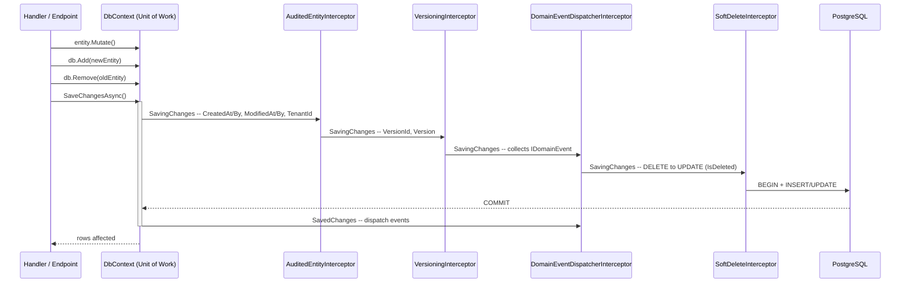

## Definition

The Unit of Work maintains a list of objects modified during a business
transaction and coordinates atomic persistence of those changes. In Granit,
`DbContext` is the Unit of Work: the `ChangeTracker` accumulates mutations,
and `SaveChangesAsync()` persists them in a single transaction.

## Diagram



## Implementation in Granit

Granit does not expose an explicit `IUnitOfWork` interface. The EF Core
`DbContext` fulfills this role, augmented by a **chain of interceptors** that
execute in a strictly defined order on each `SaveChangesAsync()`.

### Interceptor chain

Registered in `src/Granit.Persistence/Extensions/DbContextOptionsBuilderExtensions.cs`:

| Order | Interceptor | Role |
| --- | --- | --- |
| 1 | `AuditedEntityInterceptor` | ISO 27001 -- `CreatedAt/By`, `ModifiedAt/By`, `TenantId`, auto-`Id` |
| 2 | `VersioningInterceptor` | `VersionId` and `Version` on `IVersioned` entities |
| 3 | `DomainEventDispatcherInterceptor` | Collects `IDomainEvent` before save, dispatches after commit |
| 4 | `SoftDeleteInterceptor` | GDPR -- converts `DELETE` to `UPDATE` (`IsDeleted`, `DeletedAt/By`) |

**The order is critical**: `SoftDeleteInterceptor` is last because it changes
`EntityState.Deleted` to `Modified`, which would hide the original state from
preceding interceptors.

### DbContextFactory (Unit of Work boundary)

Each call to `CreateDbContextAsync()` returns a fresh `DbContext` instance --
a new Unit of Work. Interceptors are injected automatically by the factory.

```csharp
// Typical pattern: one UoW per operation
await using TContext db = await dbContextFactory
    .CreateDbContextAsync(cancellationToken).ConfigureAwait(false);
db.DeliveryAttempts.Add(attempt);
await db.SaveChangesAsync(cancellationToken).ConfigureAwait(false);
```

### Wolverine Outbox integration

`AutoApplyTransactions()` wraps each Wolverine handler in a DB transaction.
Outbox messages and domain changes are committed atomically in the same
`SaveChangesAsync()`.

### Roslyn Analyzer GR-EF001

`src/Granit.Analyzers/SynchronousSaveChangesAnalyzer.cs` emits a warning when
synchronous `SaveChanges()` is called instead of `SaveChangesAsync()`.

### Reference files

| File | Role |
| --- | --- |
| `src/Granit.Persistence/Interceptors/AuditedEntityInterceptor.cs` | ISO 27001 audit trail |
| `src/Granit.Persistence/Interceptors/SoftDeleteInterceptor.cs` | GDPR soft delete |
| `src/Granit.Persistence/Interceptors/VersioningInterceptor.cs` | Auto-versioning |
| `src/Granit.Persistence/Interceptors/DomainEventDispatcherInterceptor.cs` | Atomic domain events |
| `src/Granit.Persistence/Extensions/DbContextOptionsBuilderExtensions.cs` | Interceptor chain wiring |
| `src/Granit.Persistence/Extensions/PersistenceServiceCollectionExtensions.cs` | DI registration (all Scoped) |
| `src/Granit.Wolverine.Postgresql/Extensions/WolverinePostgresqlHostApplicationBuilderExtensions.cs` | Transactional outbox |
| `src/Granit.Analyzers/SynchronousSaveChangesAnalyzer.cs` | Analyzer GR-EF001 |

## Rationale

| Problem | Unit of Work solution |
| --- | --- |
| Partial writes on error | `SaveChangesAsync()` = atomic transaction |
| Audit trail scattered across each handler | Interceptors apply audit cross-cuttingly |
| Accidental hard-delete (GDPR) | `SoftDeleteInterceptor` intercepts before `DELETE` |
| Domain events dispatched before commit | `DomainEventDispatcherInterceptor` collects before, dispatches after |
| Synchronous `SaveChanges()` blocks the thread pool | Analyzer GR-EF001 detects and warns at compile-time |

## Usage example

```csharp
// The handler is unaware of interceptors -- they execute
// automatically on each SaveChangesAsync()

public static async Task Handle(
    ArchivePatientCommand command,
    PatientDbContext db,
    CancellationToken cancellationToken)
{
    Patient patient = await db.Patients.FindAsync([command.PatientId], cancellationToken)
        ?? throw new EntityNotFoundException(typeof(Patient), command.PatientId);

    patient.Archive();          // ModifiedAt/By filled by AuditedEntityInterceptor
    db.Remove(patient);         // SoftDeleteInterceptor -> IsDeleted = true
    // DomainEventDispatcherInterceptor collects PatientArchivedEvent

    await db.SaveChangesAsync(cancellationToken).ConfigureAwait(false);
    // 1 transaction: UPDATE (audit) + UPDATE (soft delete) + Outbox message
    // Then dispatch PatientArchivedEvent
}
```

## Further reading

- [Unit of Work -- Martin Fowler (PoEAA)](https://martinfowler.com/eaaCatalog/unitOfWork.html)
