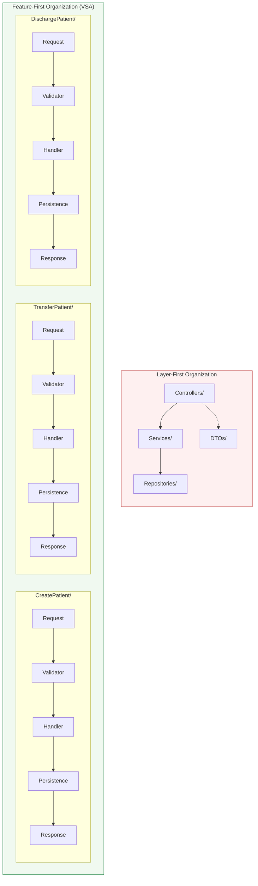

## Definition

Vertical Slice Architecture (VSA) organizes code by **feature** (or use case)
rather than by technical layer. Each slice contains everything needed to handle
a single operation: request type, validation, handler logic, data access, and
response type.

Slices share infrastructure (DI, middleware, database) but not business logic.
Cross-cutting concerns flow through the middleware pipeline, not through shared
service layers.

The key insight: most changes affect a single feature, not an entire layer.
When code is organized by feature, a change touches one folder instead of
scattering across Controllers, Services, Repositories, and DTOs directories.

## Diagram



## Implementation in Granit

Granit naturally supports VSA at multiple levels of granularity.

### Module level — coarse-grained slices

Each Granit module is already a coarse-grained vertical slice: it owns its
domain model, its isolated `DbContext`, its endpoints, and its DI registrations.
Modules communicate through domain events and integration events, not direct
method calls.

```text
src/Granit.BlobStorage/                  # Domain + application logic
src/Granit.BlobStorage.Endpoints/        # API surface (REPR)
src/Granit.BlobStorage.EntityFrameworkCore/  # Persistence
```

### Feature level — fine-grained slices

Within a module, the [REPR pattern](./repr/) already groups endpoints by
feature. Application developers building **on** Granit can take this further
by organizing their own modules as full vertical slices.

```text
src/App.PatientManagement/
├── Domain/
│   ├── Patient.cs                       # Shared aggregate root
│   └── ValueObjects/
│       └── MedicalRecordNumber.cs       # Shared value object
├── Features/
│   ├── CreatePatient/
│   │   ├── CreatePatientRequest.cs
│   │   ├── CreatePatientValidator.cs
│   │   ├── CreatePatientHandler.cs
│   │   └── CreatePatientResponse.cs
│   ├── TransferPatient/
│   │   ├── TransferPatientRequest.cs
│   │   ├── TransferPatientValidator.cs
│   │   └── TransferPatientHandler.cs
│   └── DischargePatient/
│       ├── DischargePatientRequest.cs
│       ├── DischargePatientValidator.cs
│       └── DischargePatientHandler.cs
├── Persistence/
│   └── PatientManagementDbContext.cs     # Isolated DbContext
└── PatientManagementModule.cs
```

### DDD inside vertical slices

DDD tactical patterns work naturally inside VSA:

- **Aggregate roots and value objects** live in a shared `Domain/` folder —
  they represent the ubiquitous language, not a feature
- **Handlers** within each slice use the aggregates and call domain methods
- **Domain events** cross slice boundaries without coupling
- **CQRS** applies per slice: each handler injects only the `IReader` or
  `IWriter` it needs

### Granit building blocks that support VSA

| Building block | VSA role |
| --- | --- |
| `MapGranitGroup()` | Auto-validation per feature group |
| `IReader` / `IWriter` | CQRS within each slice |
| `AggregateRoot` | Shared domain model across slices |
| `IDomainEvent` | Cross-slice communication without coupling |
| `GranitModule` + `[DependsOn]` | Module-level slice isolation |
| `FluentValidation` | Per-request validation in each slice |

## Rationale

| Problem | VSA solution |
| --- | --- |
| Change in one layer ripples across the entire codebase | Change is localized to a single feature folder |
| Premature abstractions (generic repositories, base services) | Each slice decides its own level of complexity |
| Tight coupling between unrelated features | Slices are independent, communicate via events |
| Large service classes with many injected dependencies | Each handler has minimal, focused dependencies |
| Merge conflicts when multiple developers touch the same layer | Developers work in isolated feature folders |

## Usage example

A complete vertical slice for creating a patient, using Granit building blocks:

```csharp
// --- Features/CreatePatient/CreatePatientRequest.cs ---

public sealed record PatientManagementCreatePatientRequest(
    string FirstName,
    string LastName,
    DateOnly BirthDate,
    string MedicalRecordNumber);

// --- Features/CreatePatient/CreatePatientValidator.cs ---

public sealed class PatientManagementCreatePatientRequestValidator
    : AbstractValidator<PatientManagementCreatePatientRequest>
{
    public PatientManagementCreatePatientRequestValidator()
    {
        RuleFor(x => x.FirstName).NotEmpty().MaximumLength(100);
        RuleFor(x => x.LastName).NotEmpty().MaximumLength(100);
        RuleFor(x => x.BirthDate).LessThanOrEqualTo(DateOnly.FromDateTime(DateTime.Today));
        RuleFor(x => x.MedicalRecordNumber).NotEmpty().MaximumLength(20);
    }
}

// --- Features/CreatePatient/CreatePatientHandler.cs ---

internal static class CreatePatientEndpoints
{
    internal static void MapCreatePatientRoutes(this RouteGroupBuilder group)
    {
        group.MapPost("/", CreateAsync)
            .WithName("CreatePatient")
            .WithSummary("Registers a new patient.");
    }

    private static async Task<Created<PatientManagementPatientResponse>> CreateAsync(
        PatientManagementCreatePatientRequest request,
        IPatientWriter writer,
        CancellationToken cancellationToken)
    {
        var patient = Patient.Create(
            request.FirstName,
            request.LastName,
            request.BirthDate,
            MedicalRecordNumber.From(request.MedicalRecordNumber));

        PatientManagementPatientResponse created = await writer
            .CreateAsync(patient, cancellationToken)
            .ConfigureAwait(false);

        return TypedResults.Created($"/{created.Id}", created);
    }
}

// --- Features/CreatePatient/CreatePatientResponse.cs ---

public sealed record PatientManagementPatientResponse(
    Guid Id,
    string FirstName,
    string LastName,
    DateOnly BirthDate,
    string MedicalRecordNumber);
```

## Further reading

- [Vertical Slice Architecture -- Jimmy Bogard](https://www.jimmybogard.com/vertical-slice-architecture/)
- [REPR pattern in Granit](./repr/)
- [CQRS -- Reader/Writer separation](./cqrs/)
- [Module System -- topological loading](./module-system/)
- [Architecture Styles -- DDD, Clean Architecture & Vertical Slices](/dotnet/architecture/architecture-styles/)
