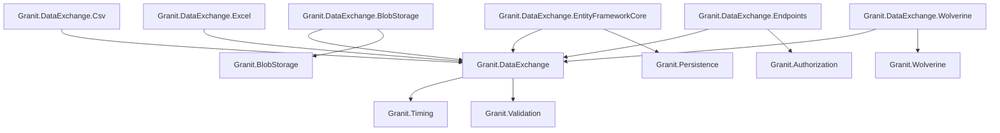
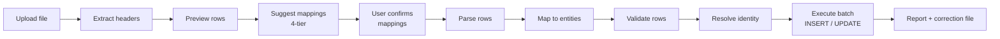
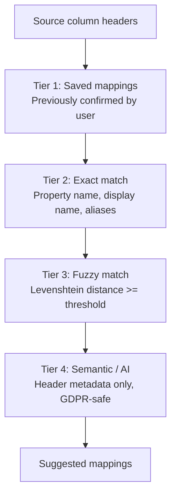
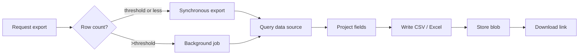

import { Tabs, TabItem, FileTree, Badge } from "@astrojs/starlight/components";

Granit.DataExchange provides a complete import/export pipeline for tabular data.
Imports follow a guided flow: upload a file, preview headers, receive intelligent
column mapping suggestions, confirm, then execute with batched persistence and
detailed error reporting. Exports use a whitelist-based field definition, optional
presets, and automatic background dispatch for large datasets. Both pipelines
integrate with Wolverine for durable outbox-backed execution when installed.

## Package structure

<FileTree>
- Granit.DataExchange/ Core: import/export pipelines, fluent definitions, mapping suggestion engine
  - Granit.DataExchange.BlobStorage Bridges IDataExchangeFileProvider to IBlobStoreProvider (S3, Azure, FileSystem)
  - Granit.DataExchange.Csv CSV parser (Sep SIMD) and writer (semicolon separator)
  - Granit.DataExchange.Excel Excel parser (Sylvan.Data.Excel) and writer (ClosedXML)
  - Granit.DataExchange.EntityFrameworkCore DataExchangeDbContext, EF executor, identity resolvers, stores
  - Granit.DataExchange.Endpoints REST endpoints for import/export operations
  - Granit.DataExchange.Wolverine Replaces Channel dispatchers with Wolverine outbox-backed dispatchers
  - Granit.DataExchange.Definitions Pre-built ExportDefinition for 39 framework entities
</FileTree>

| Package | Role | Depends on |
|---------|------|------------|
| `Granit.DataExchange` | Import/export pipelines, mapping suggestions, fluent definitions | `Granit.Timing`, `Granit.Validation` |
| `Granit.DataExchange.BlobStorage` | Bridges file operations to blob storage providers | `Granit.DataExchange`, `Granit.BlobStorage` |
| `Granit.DataExchange.Csv` | Sep-based CSV parser, semicolon CSV writer | `Granit.DataExchange` |
| `Granit.DataExchange.Excel` | Sylvan streaming Excel reader, ClosedXML writer | `Granit.DataExchange` |
| `Granit.DataExchange.EntityFrameworkCore` | DataExchangeDbContext, EF executor, identity resolvers | `Granit.DataExchange`, `Granit.Persistence` |
| `Granit.DataExchange.Endpoints` | 19 REST endpoints (import + export + metadata) | `Granit.DataExchange`, `Granit.Authorization` |
| `Granit.DataExchange.Wolverine` | Outbox-backed import/export dispatch | `Granit.DataExchange`, `Granit.Wolverine` |
| `Granit.DataExchange.Definitions` | Pre-built export definitions for 39 framework entities | `Granit.DataExchange`, all entity modules |

## Dependency graph



## Setup

<Tabs>
<TabItem label="Full stack (production)">

```csharp
[DependsOn(
    typeof(GranitDataExchangeEntityFrameworkCoreModule),
    typeof(GranitDataExchangeBlobStorageModule),
    typeof(GranitDataExchangeEndpointsModule),
    typeof(GranitDataExchangeCsvModule),
    typeof(GranitDataExchangeExcelModule),
    typeof(GranitDataExchangeWolverineModule))]
public class AppModule : GranitModule
{
    public override void ConfigureServices(ServiceConfigurationContext context)
    {
        // Register import definitions
        context.Services.AddImportDefinition<Patient, PatientImportDefinition>();

        // Register export definitions
        context.Services.AddExportDefinition<Patient, PatientExportDefinition>();
    }
}
```

```csharp
// Map endpoints in Program.cs
app.MapGranitDataExchange();

// Or with custom prefix and role
app.MapGranitDataExchange(opts =>
{
    opts.RoutePrefix = "admin/data-exchange";
    opts.RequiredRole = "ops-team";
});
```

</TabItem>
<TabItem label="Minimal (import only, no persistence)">

```csharp
[DependsOn(
    typeof(GranitDataExchangeCsvModule),
    typeof(GranitDataExchangeExcelModule))]
public class AppModule : GranitModule
{
    public override void ConfigureServices(ServiceConfigurationContext context)
    {
        context.Services.AddImportDefinition<Patient, PatientImportDefinition>();
    }
}
```

No EF Core, no endpoints. Useful for CLI tools or custom orchestration.

</TabItem>
</Tabs>

## Configuration

<Tabs>
<TabItem label="Import options">

```json
{
  "DataExchange": {
    "DefaultMaxFileSizeMb": 50,
    "DefaultBatchSize": 500,
    "FuzzyMatchThreshold": 0.8
  }
}
```

| Property | Default | Description |
|----------|---------|-------------|
| `DefaultMaxFileSizeMb` | `50` | Max upload size (overridable per definition) |
| `DefaultBatchSize` | `500` | Rows per `SaveChanges` batch |
| `FuzzyMatchThreshold` | `0.8` | Minimum Levenshtein similarity for fuzzy tier (0.0 - 1.0) |

</TabItem>
<TabItem label="Export options">

```json
{
  "DataExport": {
    "BackgroundThreshold": 1000
  }
}
```

| Property | Default | Description |
|----------|---------|-------------|
| `BackgroundThreshold` | `1000` | Row count above which export dispatches to a background job |

</TabItem>
</Tabs>

## File storage

Both import and export pipelines need to store files (uploaded CSV/Excel for import,
generated output for export). The `IDataExchangeFileProvider` interface abstracts
this concern with three operations: `OpenAsync`, `SaveAsync`, and `DeleteAsync`.

By default, an in-memory implementation is registered — suitable for tests, CLI
tools, and development. Data is lost on process restart. For production workloads,
register `Granit.DataExchange.BlobStorage` or a custom implementation.

### Using the BlobStorage adapter

The simplest approach is to add `Granit.DataExchange.BlobStorage`, which bridges
`IDataExchangeFileProvider` to the registered blob storage provider (S3, Azure Blob,
FileSystem, etc.):

```csharp
[DependsOn(typeof(GranitDataExchangeBlobStorageModule))]
public class AppModule : GranitModule { }
```

```json
{
  "Granit:DataExchange:BlobStorage": {
    "ContainerName": "data-exchange"
  }
}
```

| Property | Default | Description |
|----------|---------|-------------|
| `ContainerName` | `data-exchange` | Key-prefix segment in the object path (not a physical bucket) |
| `DefaultContentType` | `application/octet-stream` | MIME type for stored export files |

### Custom implementation

For scenarios where blob storage is not available (CLI tools, local file system,
in-memory testing), implement `IDataExchangeFileProvider` directly and register
it as a scoped service:

```csharp
services.Replace(ServiceDescriptor.Scoped<IDataExchangeFileProvider, MyFileProvider>());
```

## Import pipeline

### Pipeline overview



### Import definition

Each entity requires an `ImportDefinition<T>` that declares importable properties
using a fluent API. Only explicitly declared properties are available for column
mapping (whitelist pattern).

```csharp
public sealed class PatientImportDefinition : ImportDefinition<Patient>
{
    public override string Name => "Acme.PatientImport";

    protected override void Configure(ImportDefinitionBuilder<Patient> builder)
    {
        builder
            .HasBusinessKey(p => p.Niss)
            .Property(p => p.Niss, p => p.DisplayName("NISS").Required())
            .Property(p => p.LastName, p => p.DisplayName("Last name").Required())
            .Property(p => p.FirstName, p => p.DisplayName("First name").Required())
            .Property(p => p.Email, p => p
                .DisplayName("Email")
                .Aliases("Courriel", "E-mail", "Mail"))
            .Property(p => p.BirthDate, p => p
                .DisplayName("Date of birth")
                .Format("dd/MM/yyyy"))
            .ExcludeOnUpdate(p => p.Niss);
    }
}
```

**Property configuration options:**

| Method | Description |
|--------|-------------|
| `.DisplayName(string)` | User-facing label (used in preview UI and mapping suggestions) |
| `.Description(string)` | Sent to the AI mapping service as field metadata |
| `.Aliases(params string[])` | Alternative names for exact and fuzzy matching |
| `.Required(bool)` | Import-level required validation (independent of entity `[Required]`) |
| `.Format(string)` | Expected format for type conversion (e.g. `"dd/MM/yyyy"`) |

**Identity resolution:**

| Method | Description |
|--------|-------------|
| `.HasBusinessKey(p => p.Niss)` | Single natural key for INSERT vs UPDATE resolution |
| `.HasCompositeKey(p => p.Code, p => p.Year)` | Multi-column business key |
| `.HasExternalId()` | External ID column for cross-system identity mapping |

**Parent/child import:**

```csharp
builder
    .GroupBy("InvoiceNumber")
    .Property(p => p.InvoiceNumber, p => p.Required())
    .Property(p => p.CustomerName)
    .HasMany(p => p.Lines, child =>
    {
        child.Property(l => l.ProductCode, p => p.Required());
        child.Property(l => l.Quantity);
        child.Property(l => l.UnitPrice);
    });
```

### 4-tier mapping suggestions

When headers are extracted from the uploaded file, the mapping suggestion service
runs four tiers in order. Columns matched by a higher-confidence tier are excluded
from lower tiers:



| Tier | Confidence | Source |
|------|------------|--------|
| Saved | `MappingConfidence.Saved` | Previously confirmed mappings stored in database |
| Exact | `MappingConfidence.Exact` | Case-insensitive match on property name, display name, or aliases |
| Fuzzy | `MappingConfidence.Fuzzy` | Levenshtein similarity above `FuzzyMatchThreshold` |
| Semantic | `MappingConfidence.Semantic` | AI-backed service (opt-in, only header metadata sent) |

:::tip
The semantic tier uses `ISemanticMappingService`, which defaults to a no-op. To enable AI
mapping, register your implementation:
```csharp
services.AddSemanticMappingService<OpenAiMappingService>();
```
Only column header names and field metadata are sent to the AI provider — never row data (GDPR-safe).
:::

### Import job lifecycle

| Status | Description |
|--------|-------------|
| `Created` | File uploaded, job created |
| `Previewed` | Headers extracted, preview and mapping suggestions generated |
| `Mapped` | Column mappings confirmed by the user |
| `Executing` | Import running (background handler) |
| `Completed` | All rows imported successfully |
| `PartiallyCompleted` | Some rows failed, others succeeded |
| `Failed` | Import failed entirely |
| `Cancelled` | Cancelled by the user (only from Created, Previewed, or Mapped) |

State transitions are **guarded** — calling a transition from an invalid state throws
`InvalidOperationException`. The valid transition graph is:

```text
Created → Previewed → Mapped → Executing → Completed / PartiallyCompleted / Failed
                                    ↑
Created / Previewed / Mapped → Cancelled
```

### Execution options

```csharp
new ImportExecutionOptions
{
    BatchSize = 500,       // Rows per SaveChanges batch
    DryRun = true,         // Full pipeline with transaction rollback
    ErrorBehavior = ImportErrorBehavior.SkipErrors,
}
```

| Error behavior | Description |
|----------------|-------------|
| `FailFast` | Stop immediately on the first error |
| `SkipErrors` | Skip errored rows, continue processing (default) |
| `CollectAll` | Process all rows, collect all errors without stopping |

### Correction file

After an import with `SkipErrors` or `CollectAll`, a downloadable CSV correction file
is generated. It contains only the failed rows with an additional error message column.
Users can fix the rows and re-upload the corrected file.

## Export pipeline

### Pipeline overview



### Export definition

Each entity requires an `ExportDefinition<T>` with a field whitelist. Only declared
fields can appear in the output:

```csharp
public sealed class PatientExportDefinition : ExportDefinition<Patient>
{
    public override string Name => "Acme.PatientExport";
    public override string? QueryDefinitionName => "Acme.Patients";

    protected override void Configure(ExportDefinitionBuilder<Patient> builder)
    {
        builder
            .IncludeBusinessKey()
            .Field(p => p.LastName, f => f.Header("Last name"))
            .Field(p => p.FirstName, f => f.Header("First name"))
            .Field(p => p.Email)
            .Field(p => p.BirthDate, f => f
                .Header("Date of birth")
                .Format("dd/MM/yyyy"))
            .Field(p => p.Company, c => c.Name, f => f.Header("Company"));
    }
}
```

**Field configuration options:**

| Method | Description |
|--------|-------------|
| `.Header(string)` | Column header name in the exported file |
| `.Format(string)` | Display format (e.g. `"dd/MM/yyyy"`, `"#,##0.00"`) |
| `.Order(int)` | Column order (lower values first) |

**Definition-level options:**

| Method | Description |
|--------|-------------|
| `.IncludeId()` | Include entity `Id` column for roundtrip import compatibility |
| `.IncludeBusinessKey()` | Include business key columns from the matching import definition |
| `.IncludeMetadata()` | Append mapped extra properties (from `MapProperty<T>()`) as additional export fields at runtime |

**Navigation fields** use a two-argument `Field()` overload for dot-notation traversal.
The developer must ensure the corresponding `Include()` is present in the
`IExportDataSource<T>` implementation.

### Automatic fallback (reflection-based)

When no explicit `ExportDefinition<T>` is registered for an entity, the system
auto-generates one by introspecting the entity's public properties. This provides
immediate export coverage for all entities mapped in a `DbContext` — no code required.

Auto-generated definitions use the naming convention `Auto.{EntityTypeName}`
(e.g. `Auto.Tenant`, `Auto.BlobDescriptor`) and are discoverable via
`GET /metadata/definitions` alongside explicit definitions.

:::tip[Convention over configuration]
Explicit definitions **always take precedence**. When a module registers an
`ExportDefinition<T>`, the auto-generated fallback for that entity is automatically
replaced. This enables progressive adoption: start with the fallback, then add
explicit definitions for entities that need custom headers, formats, or navigation fields.
:::

**Property filtering rules** — the fallback reuses existing security attributes
(no dedicated `[ExportIgnore]` attribute):

| Condition | Action | Rationale |
|-----------|--------|-----------|
| `[SensitiveData]` (any level, any mode) | Excluded | GDPR Art. 25 — all PII excluded by default |
| `[AuditIgnore]` on property | Excluded | If not audited, not exported |
| `[Encrypted(KeyIsolation = true)]` | Excluded | Crypto-shredded data |
| Collection properties (`IEnumerable<T>`) | Excluded | Navigation collections |
| `byte[]`, `JsonDocument`, `JsonElement` | Excluded | Binary/JSON blobs |
| `ConcurrencyStamp`, `SecurityStamp` | Excluded | Infrastructure properties |

The API response includes an `IsAutoGenerated` boolean so the admin UI can
display a visual indicator (e.g. "default export — customize via ExportDefinition").

```json title="GET /metadata/definitions — response excerpt"
[
  {
    "name": "Acme.PatientExport",
    "entityType": "Patient",
    "supportedFormats": ["xlsx", "csv"],
    "isAutoGenerated": false
  },
  {
    "name": "Auto.Tenant",
    "entityType": "Tenant",
    "supportedFormats": ["xlsx", "csv"],
    "isAutoGenerated": true
  }
]
```

**Data source fallback** — `DbContextExportDataSource<T>` discovers the correct
`DbContext` at runtime by scanning Granit assemblies for `DbContext` subclasses.
The queryable uses `AsNoTracking()` for performance, except when the entity has
mapped extra properties (`IHasMetadata` with `MapProperty<T>()`) — in that
case tracking is enabled so shadow property values can be read, with periodic
`ChangeTracker.Clear()` to prevent memory bloat during bulk exports.
Navigation properties are NOT auto-included — for navigation fields, use an explicit
`ExportDefinition<T>` with a matching `IExportDataSource<T>`.

### Pre-built definitions (Granit.DataExchange.Definitions)

The `Granit.DataExchange.Definitions` package provides curated, security-audited
`ExportDefinition<T>` implementations for 39 framework entities across all modules.
Each definition uses a whitelist approach: only explicitly declared fields are exported,
with `[SensitiveData]` fields systematically excluded.

```csharp
[DependsOn(
    typeof(GranitDataExchangeDefinitionsModule),
    typeof(GranitDataExchangeEntityFrameworkCoreModule))]
public class AppModule : GranitModule { }
```

This registers export definitions for entities like `Tenant`, `Invoice`,
`PaymentTransaction`, `AuditEntry`, `BlobDescriptor`, and 34 others. Applications
can **override** any definition by registering their own `ExportDefinition<T>` for
the same entity type — explicit registrations always take precedence.

**Key design decisions:**

- **ISO 8601 dates** — all `DateTimeOffset` fields use `"O"` format (roundtrip, preserves offset)
- **Money formatting** — all `decimal` financial fields use `"#,##0.00"`
- **Extra properties** — `DynamicReferenceDataEntity` uses `.IncludeMetadata()` to export
  mapped extra properties (from `MapProperty<T>()`) as regular columns
- **Excluded entities** — `ApiKeyEntry`, `GranitOpenIddictToken`, `SigningKey`, and other
  security-sensitive entities are intentionally excluded (see issue #996 for the full list)
- **Internal entities** — `AIWorkspaceEntity`, `AIUsageRecordEntity`, `TenantFeatureOverride`
  are `internal` and use the reflection-based fallback within their own assemblies

### Export presets

Presets are named field selections that users can save and reuse. They are stored
in the database via `IExportPresetReader` / `IExportPresetWriter`. The REST API
exposes CRUD operations under `/metadata/presets/`.

### Export job lifecycle

| Status | Description |
|--------|-------------|
| `Queued` | Job created and queued for background execution |
| `Exporting` | Export currently being generated |
| `Completed` | File available for download |
| `Failed` | Export failed |

State transitions are **guarded**: `Queued → Exporting → Completed / Failed`.

### Query integration

When `QueryDefinitionName` is set on an export definition, the export pipeline
delegates filtering and sorting to `IQueryEngine<T>` from `Granit.QueryEngine`.
This reuses the same whitelist-based filtering pipeline as the grid view —
the user's active filters are applied to the export.

## File format support

| Format | Parser (import) | Writer (export) | Package |
|--------|-----------------|-----------------|---------|
| CSV | [Sep](https://github.com/nietras/Sep) (SIMD-accelerated) | Semicolon separator (EU locale) | `Granit.DataExchange.Csv` |
| Excel (.xlsx, .xls) | [Sylvan.Data.Excel](https://github.com/MarkPflug/Sylvan.Data.Excel) (streaming) | [ClosedXML](https://github.com/ClosedXML/ClosedXML) | `Granit.DataExchange.Excel` |

:::note[Macro-enabled Excel files not supported]
`.xlsb` (macro-enabled binary workbooks) are rejected at upload. This prevents
macro execution when exported files are re-served to users.
:::

:::caution
At least one parser package must be registered. The core module provides **no** file
parser by default. If neither CSV nor Excel is installed, upload will fail at runtime.
:::

## REST endpoints

All endpoints require authorization. Import endpoints use the
`DataExchange.Imports.Execute` permission, export endpoints use
`DataExchange.Exports.Execute`. Metadata endpoints require authentication
(any authenticated user).

### Import endpoints

| Method | Path | Description |
|--------|------|-------------|
| `GET` | `/jobs` | List import jobs |
| `POST` | `/` | Upload file (creates import job) |
| `POST` | `/{jobId}/preview` | Extract headers and generate mapping suggestions |
| `PUT` | `/{jobId}/mappings` | Confirm column mappings |
| `POST` | `/{jobId}/execute` | Execute the import |
| `POST` | `/{jobId}/dry-run` | Full pipeline with transaction rollback |
| `GET` | `/{jobId}` | Get import job status |
| `DELETE` | `/{jobId}` | Cancel import job |
| `GET` | `/{jobId}/report` | Get import report (success/error counts, row details) |
| `GET` | `/{jobId}/correction-file` | Download CSV with failed rows and error messages |

### Export endpoints

| Method | Path | Description |
|--------|------|-------------|
| `GET` | `/export/jobs` | List export jobs |
| `POST` | `/export/jobs` | Create and execute export |
| `GET` | `/export/jobs/{id}` | Get export job status |
| `GET` | `/export/jobs/{id}/download` | Download exported file |

### Metadata endpoints

| Method | Path | Description |
|--------|------|-------------|
| `GET` | `/metadata/definitions` | List registered export definitions |
| `GET` | `/metadata/definitions/{name}/fields` | List available fields for a definition |
| `GET` | `/metadata/presets/{definitionName}` | List saved presets for a definition |
| `POST` | `/metadata/presets` | Save a field selection preset |
| `DELETE` | `/metadata/presets/{definitionName}/{presetName}` | Delete a preset |

## EF Core persistence

`Granit.DataExchange.EntityFrameworkCore` provides:

- **`DataExchangeDbContext`** with entities for import jobs, export jobs, saved mappings,
  external ID mappings, and export presets. All entities implement `IMultiTenant` for
  automatic tenant query filtering via `ApplyGranitConventions`.
- **`EfImportExecutor`** — batched INSERT/UPDATE executor with `SaveChanges` per batch.
- **Identity resolvers**: `BusinessKeyResolver`, `CompositeKeyResolver` — query the database
  to determine whether each row is an INSERT or UPDATE.

| Entity | Purpose |
|--------|---------|
| `ImportJobEntity` | Tracks import job lifecycle and metadata |
| `ExportJobEntity` | Tracks export job lifecycle and file location |
| `SavedMappingEntity` | Persists confirmed column mappings for reuse (Tier 1) |
| `ExternalIdMappingEntity` | Maps external identifiers to internal entity IDs |
| `ExportPresetEntity` | Named field selection presets |

## Wolverine integration

Without Wolverine, import and export commands dispatch via bounded in-memory
`Channel<T>` (capacity: 100, back-pressure via `BoundedChannelFullMode.Wait`) —
messages are lost on crash. Adding `Granit.DataExchange.Wolverine` replaces both
dispatchers with Wolverine's `IMessageBus` for durable outbox-backed execution:

| Service | Without Wolverine | With Wolverine |
|---------|-------------------|----------------|
| `IImportCommandDispatcher` | `ChannelImportCommandDispatcher` | `WolverineImportCommandDispatcher` |
| `IExportCommandDispatcher` | `ChannelExportCommandDispatcher` | `WolverineExportCommandDispatcher` |
| `IDataExchangeEventPublisher` | No-op | `WolverineDataExchangeEventPublisher` |

## Public API summary

| Category | Key types | Package |
|----------|-----------|---------|
| Module | `GranitDataExchangeModule`, `GranitDataExchangeBlobStorageModule`, `GranitDataExchangeCsvModule`, `GranitDataExchangeExcelModule`, `GranitDataExchangeEntityFrameworkCoreModule`, `GranitDataExchangeEndpointsModule`, `GranitDataExchangeWolverineModule` | --- |
| Import pipeline | `IImportOrchestrator`, `IMappingSuggestionService`, `IFileParser`, `IDataMapper`, `IRowValidator`, `IImportExecutor` | `Granit.DataExchange` |
| Import definition | `ImportDefinition<T>`, `ImportDefinitionBuilder<T>`, `PropertyMappingBuilder` | `Granit.DataExchange` |
| Import identity | `IRecordIdentityResolver`, `RecordIdentity`, `RecordOperation` | `Granit.DataExchange` |
| Import reporting | `ImportReport`, `ImportProgress`, `ICorrectionFileGenerator` | `Granit.DataExchange` |
| Export pipeline | `IExportOrchestrator`, `IExportWriter`, `IExportDataSource<T>` | `Granit.DataExchange` |
| Export definition | `ExportDefinition<T>`, `ExportDefinitionBuilder<T>`, `ExportFieldBuilder` | `Granit.DataExchange` |
| Export fallback | `IExportDefinitionProvider`, `IAutoExportDefinitionSource`, `ExportPropertyFilter` | `Granit.DataExchange` |
| Export extra props | `IExtraExportFieldProvider`, `IExportExtraValueResolver` | `Granit.DataExchange` |
| Export presets | `IExportPresetReader`, `IExportPresetWriter` | `Granit.DataExchange` |
| Pre-built defs | `GranitDataExchangeDefinitionsModule`, `AddGranitExportDefinitions()` | `Granit.DataExchange.Definitions` |
| Mapping | `MappingConfidence`, `ImportColumnMapping`, `ISemanticMappingService` | `Granit.DataExchange` |
| File storage | `IDataExchangeFileProvider`, `DataExchangeBlobStorageOptions` | `Granit.DataExchange`, `Granit.DataExchange.BlobStorage` |
| Options | `ImportOptions`, `ExportOptions`, `ImportExecutionOptions` | `Granit.DataExchange` |
| Permissions | `DataExchangePermissions.Imports.{Read,Execute}`, `DataExchangePermissions.Exports.{Read,Execute}` | `Granit.DataExchange.Endpoints` |
| Extensions | `AddImportDefinition<T, TDef>()`, `AddExportDefinition<T, TDef>()`, `AddSemanticMappingService<T>()`, `MapGranitDataExchange()` | --- |

## Security

The DataExchange module includes several hardening measures:

- **Multi-tenancy isolation** — all entities (`ImportJob`, `ExportJob`, `SavedMappingEntity`,
  `ExternalIdMappingEntity`, `ExportPresetEntity`) implement `IMultiTenant`, activating
  automatic tenant query filters via `ApplyGranitConventions`.
- **Formula injection protection** — CSV and Excel writers neutralize cell values starting
  with `=`, `+`, `-`, `@`, `\t`, or `\r` to prevent spreadsheet formula injection (CWE-1236).
- **Upload validation** — filenames are sanitized via `Path.GetFileName()` to prevent path
  traversal. File extensions are cross-validated against allowed MIME types.
- **State machine guards** — `ImportJob` and `ExportJob` enforce valid state transitions.
  Calling a transition from an invalid state throws `InvalidOperationException`.
- **Error message sanitization** — exception messages stored in the database and published
  via integration events are truncated to 500 characters to prevent information disclosure.
- **Bounded channels** — in-memory command dispatch uses bounded channels (capacity 100)
  with back-pressure to prevent resource exhaustion.
- **AI output validation** — LLM mapping suggestions are validated against the known property
  whitelist and source headers. Confidence scores are clamped to `[0.0, 1.0]`. Preview row
  cell values and target field metadata are sanitized before prompt injection.
- **AI options validation** — `DataExchangeAIOptions` are validated at startup
  (`ValidateOnStart`) to catch misconfigurations (invalid score ranges, zero timeouts).

## See also

- [ADR-015: Sep](/dotnet/architecture/adr/015-sep-csv-parsing/) -- Why Sep was chosen for CSV parsing
- [ADR-016: Sylvan.Data.Excel](/dotnet/architecture/adr/016-sylvan-data-excel-parsing/) -- Why Sylvan was chosen for Excel reading
- [Core module](../core/module-system/) — Module system, domain types
- [Persistence module](./persistence/) — EF Core interceptors, `ApplyGranitConventions`
- [Wolverine module](./wolverine/) — Transactional outbox, context propagation
- [Background jobs module](./background-jobs/) — Scheduling integration
- [API Reference](/api/Granit.DataExchange.html) (auto-generated from XML docs)
