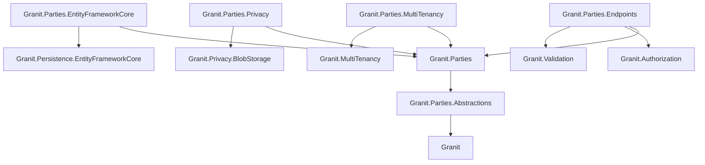

import { Tabs, TabItem, FileTree } from "@astrojs/starlight/components";

`Granit.Parties` is the central party-management aggregate for the framework,
modelled after Odoo's `res.partner`. A **Party** represents any natural person,
legal entity, or organisational unit the platform interacts with — customers,
suppliers, employees, leads — and can carry several roles simultaneously via the
`[Flags]` `PartyRoles` enum. It powers Invoicing, Subscriptions, Payments, Tax,
and CustomerBalance today, and is designed to absorb future Procurement / HR /
CRM modules without schema churn.

## Why this module exists

Before `Granit.Parties`, billing identity was duplicated across Invoicing,
Subscriptions, Payments, and CustomerBalance. Each module carried its own subset
of name / address / VAT number / external-provider identifiers, and downstream
consumers had to reconcile them. `Granit.Parties` consolidates the party
abstraction in one aggregate so:

- Tax / billing / payment data is captured once, referenced everywhere by `PartyId`.
- External provider identifiers (Stripe, Mollie, Odoo, Sage, NetSuite) live on the
  party rather than scattered across module-specific mapping tables.
- A single GDPR Article 17 erasure pseudonymises the party and lets
  downstream modules retain the row for accounting integrity.

## Package structure

<FileTree>
- Granit.Parties.Abstractions/ Value objects, enums, integration events (lightweight)
- Granit.Parties/ Aggregate root, domain events, query / export definitions
  - Granit.Parties.EntityFrameworkCore EF Core persistence — PartiesDbContext, EfPartyStore
  - Granit.Parties.Endpoints Admin REST API — CRUD, lifecycle, addresses / emails / phones, tax status, merge
  - Granit.Parties.Mergeable Merge adapter + Party-children rewriter (registers with Granit.Mergeable)
  - Granit.Parties.MultiTenancy Wolverine handler that seeds a host-scoped Party per tenant
  - Granit.Parties.Privacy GDPR Article 15/17 export + erasure (pseudonymisation)
</FileTree>

| Package | Role | Depends on |
|---------|------|------------|
| `Granit.Parties.Abstractions` | `PartyId`, `Address`, `BillingAddress`, enums, ETOs | `Granit` |
| `Granit.Parties` | `Party` aggregate, `IPartyReader`/`IPartyWriter`, query + export definitions | `Granit.Parties.Abstractions`, `Granit.QueryEngine.Abstractions`, `Granit.DataExchange.Abstractions` |
| `Granit.Parties.EntityFrameworkCore` | Isolated DbContext + child-graph reconciliation writer | `Granit.Parties`, `Granit.Persistence.EntityFrameworkCore` |
| `Granit.Parties.Endpoints` | Admin API (host + tenant scope) | `Granit.Parties`, `Granit.Authorization`, `Granit.Validation` |
| `Granit.Parties.Mergeable` | Merge adapter + Party-children / Party-parent reference rewriters | `Granit.Parties.EntityFrameworkCore`, `Granit.Mergeable.EntityFrameworkCore` |
| `Granit.Parties.MultiTenancy` | Tenant-creation seeder (creates host-scoped Party per tenant) | `Granit.Parties`, `Granit.MultiTenancy` |
| `Granit.Parties.Privacy` | Privacy export provider + Article 17 pseudonymisation handler | `Granit.Parties`, `Granit.Privacy.BlobStorage` |

## Dependency graph



---

## Core concepts

### Dual-use scope

`Party` is `IMultiTenant`. The multi-tenant filter is **always** active, even in
host scope:

- `TenantId == null` → **host-scoped** parties (the SaaS host's tenants-as-customers, vendors, internal staff).
- `TenantId == <tenant>` → **tenant-scoped** (a tenant's e-commerce / CRM / procurement parties).

Cross-scope reads must explicitly bypass the filter via
`IDataFilter.Disable<IMultiTenant>()` — leaking a tenant's parties into a host
admin browser would be a privacy regression.

### Multi-role flags

A single party may simultaneously hold any combination of `PartyRoles`:

```csharp
[Flags]
public enum PartyRoles
{
    None     = 0,
    Customer = 1 << 0,  // Invoicing, Subscriptions, Payments, Tax, CustomerBalance
    Supplier = 1 << 1,  // future Granit.Procurement
    Employee = 1 << 2,  // future Granit.Hr
    Lead     = 1 << 3,  // future Granit.Crm
}
```

Roles are added/removed individually via `Party.AddRole(...)` /
`Party.RemoveRole(...)`. Downstream modules typically push role flags via event
handlers (e.g., Invoicing adds `Customer` on first invoice).

### External mappings

Polyglot identity — at most one mapping per provider, enforced by a unique
`(PartyId, ProviderName)` index and defensively at the aggregate:

```csharp
party.AddExternalMapping(id, PartyExternalProviderNames.Stripe, "cus_NffrFeUfNV2Hib");
party.AddExternalMapping(id, PartyExternalProviderNames.Odoo,   "12345");

string? stripeId = party.FindExternalId(PartyExternalProviderNames.Stripe);
```

The reserved `"tenant"` provider name is used by `Granit.Parties.MultiTenancy` to
link a host-scoped party back to its tenant.

### Lifecycle

`Active` ⇄ `Suspended`; either may transition to terminal `Archived`. Archived
parties are immutable. Pseudonymisation (GDPR Article 17) bypasses the
mutability guard so erasure succeeds even on archived rows.

### Customer-specific tax classification

`TaxStatus` is an owned value object capturing whether the customer is VAT-exempt
(NGO, public body), under B2B intra-EU reverse charge, or standard. Read by
`Granit.Tax.ITaxRateProvider` when a `partyId` is supplied — exempt /
reverse-charge customers yield a 0% rate regardless of country defaults.

### Merging duplicates

`Party` implements `IMergeable<Party>` and participates in the generic
`Granit.Mergeable` framework. A merge folds a **loser** Party into a **survivor**:
loser is soft-archived with a tombstone (`MergedIntoId = survivor.Id`,
`MergedAt = now`), survivor absorbs the chosen scalar fields, and every aggregate
that persists a typed `PartyId` (Invoicing, Subscriptions, CustomerBalance, plus
Party self-references) has its FK rewritten in bulk SQL inside the same
`TransactionScope`.

Survivorship is decided **per merge call**, not declaratively. The admin previews
the merge, sees a side-by-side diff with a default recommendation per conflicting
field, picks `Survivor` or `Loser` per field, optionally writes a free-form reason,
and submits. The chosen map is persisted in the audit log as `ResolvedChoices`.

Hard invariants that fail the merge synchronously (no override possible):

- Same `TenantId`, same `Kind`, same `DefaultCurrency`.
- Survivor `Active`. Loser `Active` or `Suspended`. `Archived` rejected.
- Loser is not already merged (idempotent re-merge attempts return 409).

After a successful merge, the loser is hidden by the
`GranitFilterNames.MergeTombstone` query filter from every standard listing.
Bypass it explicitly when listing tombstones for audit (e.g. an admin
"merged-out" tab):

```csharp
using (dataFilter.Disable<IHasMergeTombstone>())
{
    var tombstoned = await db.Parties
        .Where(p => p.MergedIntoId != null)
        .ToListAsync(cancellationToken);
}
```

#### Tombstone follow-through

Bulk-SQL rewriters cover **persisted typed FK columns** only. A `PartyId` may also
live in JSON-serialized payloads that SQL cannot rewrite cleanly — Wolverine
messages in the outbox / inbox, scheduled background jobs, queued webhook
deliveries, queued notifications. Consumers that receive a `PartyId` must resolve
it through the tombstone before processing:

```csharp
PartyId resolved = await partyId.ResolveCurrentAsync(reader, dataFilter, ct);
```

Chain merges (`A→B`, then `B→C`) are collapsed at merge time
(`UPDATE parties SET MergedIntoId = C WHERE MergedIntoId = B`), so a single
`ResolveCurrentAsync` hop always reaches the final survivor — no recursion.

The audit log is intentionally **not** rewritten (immutable history); the query
layer joins on `parties.MergedIntoId` to render "Party X (merged into Y on …)".

See [ADR-037](/dotnet/architecture/adr/037-party-merge-framework/) for the
architecture rationale: override-at-merge-time vs MDM survivorship rules,
single-Postgres `TransactionScope` orchestration, two-layer idempotency
(HTTP + DB), tenant-wide advisory lock, and the tombstone follow-through pattern.

---

## Setup

<Tabs>
<TabItem label="Tenant-aware app">

```csharp
[DependsOn(
    typeof(GranitPartiesModule),
    typeof(GranitPartiesEndpointsModule),
    typeof(GranitPartiesMultiTenancyModule))]
public class AppModule : GranitModule { }
```

```csharp
builder.AddGranitPartiesEntityFrameworkCore(o =>
    o.UseNpgsql(builder.Configuration.GetConnectionString("Default")));
```

```csharp
app.MapGranitParties();
```

</TabItem>
<TabItem label="With privacy stack">

```csharp
[DependsOn(
    typeof(GranitPartiesModule),
    typeof(GranitPartiesEndpointsModule),
    typeof(GranitPartiesPrivacyModule))]
public class AppModule : GranitModule { }
```

```csharp
builder.Services.AddGranitPrivacy(p => p.AddGranitPartiesPrivacyProvider());
```

</TabItem>
</Tabs>

---

## API surface

`MapGranitParties()` exposes 19 endpoints under `/parties` (configurable via
`Parties:Endpoints:RoutePrefix`). All endpoints require either
`Parties.Parties.Read` or `Parties.Parties.Manage`.

| Method | Path | Permission |
|--------|------|-----------|
| `GET` | `/parties` | `Read` |
| `GET` | `/parties/{id}` | `Read` |
| `POST` | `/parties` | `Manage` |
| `PATCH` | `/parties/{id}` | `Manage` |
| `POST` | `/parties/{id}/{suspend\|activate\|archive}` | `Manage` |
| `POST` / `DELETE` | `/parties/{id}/addresses[/{addressId}]` | `Manage` |
| `POST` / `DELETE` | `/parties/{id}/emails[/{emailId}]` | `Manage` |
| `POST` / `DELETE` | `/parties/{id}/phones[/{phoneId}]` | `Manage` |
| `POST` / `DELETE` | `/parties/{id}/external-mappings[/{provider}]` | `Manage` |
| `POST` / `DELETE` | `/parties/{id}/roles[/{role}]` | `Manage` |
| `PUT` / `DELETE` | `/parties/{id}/tax-status` | `Manage` |
| `GET` | `/parties/{id}/merge/preview?loserId={guid}` | `Merge` |
| `POST` | `/parties/{id}/merge` | `Merge` |

`POST /parties/{id}/merge` accepts a standard `Idempotency-Key` header and a
`dryRun=true` flag to preview the conflict resolution and rewrite counts without
committing. Validation failures return 422; concurrency / already-merged
collisions return 409.

---

## Integration events

Published via the Wolverine outbox to `Granit.Parties.Abstractions`:

| Event | When |
|-------|------|
| `PartyCreatedEto` | Party aggregate created |
| `PartyUpdatedEto` | Identity / address / contact-info changed |
| `PartySuspendedEto` | Lifecycle → Suspended |
| `PartyActivatedEto` | Lifecycle → Active |
| `PartyArchivedEto` | Lifecycle → Archived (terminal) |
| `PartyExternalMappingAddedEto` | External provider id registered |
| `PartyMergedEto` | Party merged into a survivor — carries survivor id, loser id, resolved choices, rewrite counts |
| `PartyPersonalDataPseudonymizedEto` | GDPR Article 17 erasure ran |

---

## See also

- [Parties — external mappings guide](/dotnet/guides/parties-external-mappings/)
- [Parties — tenant seeding guide](/dotnet/guides/parties-tenant-seeding/)
- [Parties — role handler guide](/dotnet/guides/parties-role-handler/)
- [Privacy — data export and erasure](/dotnet/compliance/privacy/)
- [Multi-tenancy](/dotnet/concepts/multi-tenancy/)
- [ADR-037 — Party merge framework](/dotnet/architecture/adr/037-party-merge-framework/)
