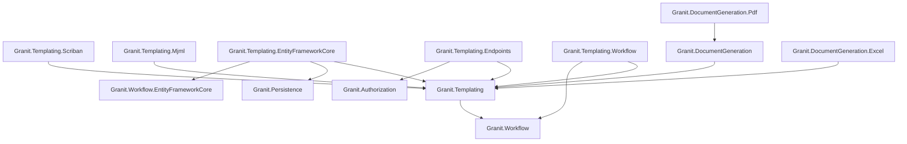

import { Tabs, TabItem, FileTree } from "@astrojs/starlight/components";

## Why a template engine?

Most applications start with hardcoded strings in email services — `$"Dear {name}, your
order {id} has shipped"`. This works until the business wants to change the wording
without a deployment, support multiple languages, or require approval before a customer
communication goes live. Suddenly you need a template store, a rendering engine, variable
injection, culture fallback, and an audit trail — all built in-house under pressure.

Granit.Templating provides this entire stack out of the box. Templates are versioned
entities with a full ISO 27001 lifecycle (Draft, PendingReview, Published, Archived) —
so business users can edit and preview templates while compliance teams approve changes
before they reach customers. The Scriban engine runs in a sandbox (no I/O, no reflection),
making it safe even with user-authored templates. Culture fallback, global context
injection, and CQRS store access are built into the pipeline, not bolted on after the
fact.

For binary document output (PDF, Excel), see
[Document Generation](/dotnet/business/document-generation/).

## Package structure

<FileTree>
- Granit.Templating/ Core pipeline: ITextTemplateRenderer, resolvers, engines, enrichers, global contexts, template store CQRS
  - Granit.Templating.Scriban Scriban engine (sandboxed, no I/O or reflection), template caching, built-in global contexts, include support
  - Granit.Templating.EntityFrameworkCore EF Core persistence (TemplatingDbContext), FusionCache-backed store, StoreTemplateResolver
  - Granit.Templating.Endpoints 17 admin endpoints (CRUD, preview, publish, categories, layouts, history, variables)
  - Granit.Templating.Mjml MJML email template compiler (Mjml.Net, zero Node.js)
  - Granit.Templating.Workflow Bridge to Granit.Workflow: FSM validation, approval routing, unified audit trail
</FileTree>

| Package | Role | Depends on |
| ------- | ---- | ---------- |
| `Granit.Templating` | Core pipeline: rendering, resolution, enrichment, layout registry, post-render transformer pipeline, store interfaces | `Granit.Workflow` |
| `Granit.Templating.Scriban` | Scriban template engine (sandboxed), `now.*`, `context.*` and `app.*` globals, `{{ include }}` support | `Granit.Templating` |
| `Granit.Templating.Mjml` | MJML-to-HTML compiler: table-based layout, inline CSS, MSO conditionals. Zero Node.js. | `Granit.Templating` |
| `Granit.Templating.EntityFrameworkCore` | EF Core store, `StoreTemplateResolver` (Priority=100), FusionCache, `WorkflowTransitionRecord` audit trail | `Granit.Templating`, `Granit.Persistence`, `Granit.Workflow.EntityFrameworkCore` |
| `Granit.Templating.Endpoints` | 17 admin Minimal API endpoints, `Templates.Manage` permission | `Granit.Templating`, `Granit.Authorization` |
| `Granit.Templating.Workflow` | Workflow bridge: FSM validation, approval routing | `Granit.Templating`, `Granit.Workflow` |

## Dependency graph



## Setup

<Tabs>
<TabItem label="Full stack (production)">

```csharp
[DependsOn(
    typeof(GranitTemplatingEndpointsModule),
    typeof(GranitTemplatingEntityFrameworkCoreModule),
    typeof(GranitTemplatingScribanModule))]
public class AppModule : GranitModule
{
    public override void ConfigureServices(ServiceConfigurationContext context)
    {
        context.Services.AddGranitTemplatingEntityFrameworkCore(options =>
            options.UseNpgsql(context.Configuration.GetConnectionString("Templating")));
    }
}
```

Map the admin endpoints in `Program.cs`:

```csharp
app.MapGranitTemplating(options =>
{
    options.RoutePrefix = "api/v1/templates";
    options.TagName = "Template Administration";
});
```

</TabItem>
<TabItem label="Minimal (embedded templates only)">

```csharp
[DependsOn(typeof(GranitTemplatingScribanModule))]
public class AppModule : GranitModule
{
    public override void ConfigureServices(ServiceConfigurationContext context)
    {
        // Register embedded HTML templates from the assembly
        context.Services.AddEmbeddedTemplates(typeof(AcmeTemplates).Assembly);
    }
}
```

No database, no admin UI. Templates are compiled into the assembly as embedded resources.

</TabItem>
<TabItem label="With Workflow approval">

```csharp
[DependsOn(
    typeof(GranitTemplatingScribanModule),
    typeof(GranitTemplatingEntityFrameworkCoreModule),
    typeof(GranitTemplatingWorkflowModule))]
public class AppModule : GranitModule { }
```

The Workflow bridge replaces `NullTemplateTransitionHook` with `WorkflowTemplateTransitionHook`,
enabling FSM-validated transitions and unified audit trail via `IWorkflowTransitionRecorder`.

</TabItem>
</Tabs>

## What's next

- [Rendering Pipeline](./rendering-pipeline/) -- the five-stage pipeline from enrichment to transformation
- [Scriban Engine](./scriban-engine/) -- sandboxing, global contexts, includes, and template examples
- [Layouts](./layouts/) -- two-pass rendering, tenant override, and safety guards
- [Lifecycle](./lifecycle/) -- Draft/PendingReview/Published/Archived states and admin API
- [Post-Render Transformers](./post-render-transformers/) -- extensible HTML processing pipeline
- [MJML Email Templates](./mjml-email-templates/) -- responsive email design without Node.js
- [Configuration & API Reference](./reference/) -- configuration options, public API summary, and common pitfalls
