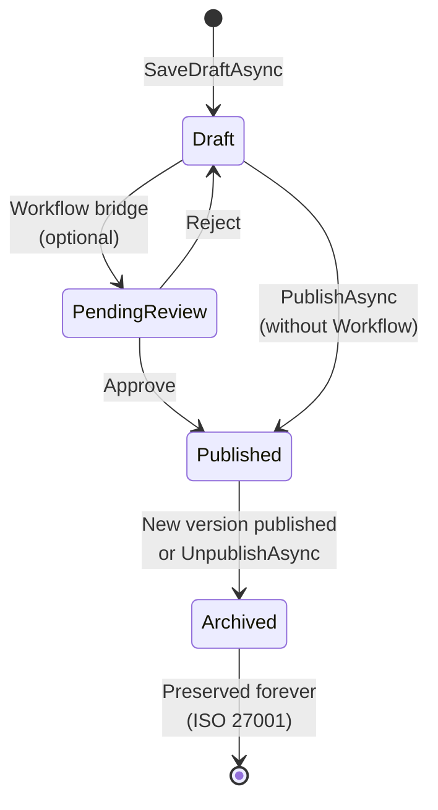

This page covers the template lifecycle state machine, lifecycle operations, the workflow bridge for approval routing, the resolver chain for template lookup, and the 17 admin endpoints provided by `Granit.Templating.Endpoints`.

## Template lifecycle

Templates stored in the EF Core store follow a strict lifecycle:



| Status | Description | Deletable? |
|--------|-------------|------------|
| `Draft` | Being edited. Not visible to the rendering pipeline. Only one draft per key. | Yes |
| `PendingReview` | Submitted for approval. Only with `Granit.Templating.Workflow`. | No |
| `Published` | Active version. Exactly one per `TemplateKey`. Resolved by `StoreTemplateResolver`. | No |
| `Archived` | Superseded by a newer publication. Preserved indefinitely for ISO 27001 audit trail. | No |

### Lifecycle operations

| Operation | Method | Effect |
|-----------|--------|--------|
| Save draft | `IDocumentTemplateStoreWriter.SaveDraftAsync` | Creates or replaces the draft for a key |
| Publish | `IDocumentTemplateStoreWriter.PublishAsync` | Promotes draft to Published, archives previous |
| Unpublish | `IDocumentTemplateStoreWriter.UnpublishAsync` | Archives the published revision |
| Delete draft | `IDocumentTemplateStoreWriter.DeleteDraftAsync` | Physically deletes the draft (drafts only) |

:::note[ISO 27001]
Published and archived revisions are **never** physically deleted. The `RevisionId`
is propagated through the entire rendering pipeline into the final document output
for full traceability. All lifecycle transitions are automatically recorded in
`WorkflowTransitionRecord` by the `WorkflowTransitionInterceptor`.
:::

### Workflow bridge

Without the `Granit.Templating.Workflow` package, transitions are direct
(Draft -> Published -> Archived) via `NullTemplateTransitionHook`. A warning is logged
at startup when this fallback is active, as it bypasses all permission checks.
Installing the Workflow bridge replaces this with `WorkflowTemplateTransitionHook`, which:

1. **Validates transitions** via `IWorkflowManager<WorkflowLifecycleStatus>.TransitionAsync` -- only `Completed` outcomes allow direct state changes; `ApprovalRequested` outcomes block direct publish
2. **Supports approval routing** (Draft -> PendingReview -> Published)

:::tip[Automatic audit trail]
Since `TemplateRevisionEntity` inherits from `VersionedWorkflowEntity`, all lifecycle
transitions are automatically recorded in `WorkflowTransitionRecord` by the
`WorkflowTransitionInterceptor` -- regardless of whether the Workflow bridge is installed.
The bridge only adds FSM validation and approval routing on top.
:::

## Resolver chain

Templates are resolved by trying resolvers in descending priority order:

| Priority | Resolver | Source | Package |
|----------|----------|--------|---------|
| 100 | `StoreTemplateResolver` | EF Core database (published revisions only) | `Granit.Templating.EntityFrameworkCore` |
| -100 | `EmbeddedTemplateResolver` | Assembly embedded resources | `Granit.Templating` |

**Culture fallback strategy** (per resolver):

1. `(Name, Culture)` -- e.g. `("Acme.Invoice", "fr-BE")`
2. `(Name, null)` -- culture-neutral fallback

**Tenant scoping** is handled inside each resolver. The store-backed resolver looks for
a tenant-scoped template first, then falls back to the host-level one.

### Embedded template resource naming

| Culture | Resource name |
|---------|---------------|
| Specific (`"fr"`) | `{AssemblyName}.Templates.{TemplateName}.fr.html` |
| Neutral (fallback) | `{AssemblyName}.Templates.{TemplateName}.html` |

Register embedded templates:

```csharp
services.AddEmbeddedTemplates(typeof(AcmeTemplates).Assembly);
```

## Admin endpoints

17 endpoints are registered via `MapGranitTemplating()`. All require the
`Templates.Manage` permission (or `Templates.Read` for GET endpoints).

### Template endpoints

| Method | Route | Name | Description |
|--------|-------|------|-------------|
| `GET` | `/` | `ListTemplates` | Paginated list with filters (status, culture, category, search) |
| `GET` | `/{name}` | `GetTemplateDetail` | Draft + published detail for a template |
| `POST` | `/` | `CreateTemplateDraft` | Create a new template draft |
| `PUT` | `/{name}` | `UpdateTemplateDraft` | Update an existing draft |
| `DELETE` | `/{name}/draft` | `DeleteTemplateDraft` | Delete draft only (published/archived preserved) |
| `POST` | `/{name}/publish` | `PublishTemplate` | Publish the current draft |
| `POST` | `/{name}/unpublish` | `UnpublishTemplate` | Archive the published revision |
| `GET` | `/{name}/lifecycle` | `GetTemplateLifecycle` | Lifecycle status + available transitions |
| `POST` | `/{name}/preview` | `PreviewTemplate` | Render draft with test data, returns HTML |
| `GET` | `/{name}/variables` | `GetTemplateVariables` | Available variables for autocompletion |
| `GET` | `/{name}/history` | `GetTemplateHistory` | Paginated revision history (summaries) |
| `GET` | `/{name}/history/{revisionId}` | `GetTemplateRevisionDetail` | Full detail of a specific revision |

### Layout endpoints

| Method | Route | Name | Description |
|--------|-------|------|-------------|
| `GET` | `/layouts` | `ListAvailableLayouts` | Deduplicated list of layout names (code registry + DB) |

### Category endpoints

| Method | Route | Name | Description |
|--------|-------|------|-------------|
| `GET` | `/categories` | `ListTemplateCategories` | All categories ordered by sort order |
| `POST` | `/categories` | `CreateTemplateCategory` | Create a new category |
| `PUT` | `/categories/{id}` | `UpdateTemplateCategory` | Update a category |
| `DELETE` | `/categories/{id}` | `DeleteTemplateCategory` | Delete a category (409 if templates associated) |

:::tip
If `IDocumentTemplateStoreReader`/`IDocumentTemplateStoreWriter` is not registered
(no EF Core module loaded), all endpoints return `501 Not Implemented`.
:::
