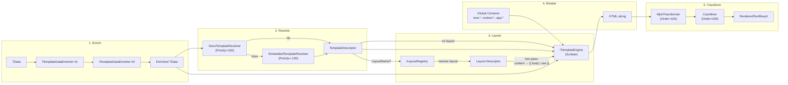

This page describes the five sequential stages that `ITextTemplateRenderer` executes when rendering a template, from data enrichment through to the final transformed output.

## Template rendering pipeline

The text rendering pipeline executes five stages in sequence:



**Stage 1 -- Enrichment.** `ITemplateDataEnricher<TData>` instances run in ascending `Order`.
Each enricher returns a new immutable copy (record `with` expression) -- the original data
is never mutated. Use enrichers to inject computed values (QR codes, aggregated totals,
remote blob URLs) without coupling that logic to the domain layer.

**Stage 2 -- Resolution.** `ITemplateResolver` implementations are tried by descending `Priority`.
The resolver chain applies culture fallback: first `(Name, "fr-BE")`, then `(Name, null)`.
Tenant scoping is the resolver's responsibility.

| Resolver | Priority | Source |
|----------|----------|--------|
| `StoreTemplateResolver` | 100 | EF Core database (published revisions, FusionCache) |
| `EmbeddedTemplateResolver` | -100 | Assembly embedded resources (code-level fallback) |

**Stage 3 -- Layout wrapping.** If a layout is configured (via `TemplateDescriptor.LayoutName`
from the database, or via `ILayoutRegistry` code-level defaults), the renderer performs
two-pass rendering: content first, then the layout with `{{ body | raw }}` = rendered content.
See [Layouts](./layouts/) for details.

**Stage 4 -- Engine rendering.** `ITemplateEngine` selects itself via `CanRender(descriptor)`
based on MIME type. Scriban handles `text/html` and `text/plain`. Global contexts are injected
under their `ContextName` namespace.

**Stage 5 -- Post-render transformation.** `IRenderedContentTransformer` instances run in
ascending `Order` as a mutation chain: each transformer receives the previous output and
returns modified HTML. Binary content (`BinaryRenderedContent`) skips this stage entirely.
The pipeline is opt-in -- with no transformers registered, the stage is a no-op.

| Transformer | Order | Package | Effect |
|-------------|-------|---------|--------|
| `MjmlTransformer` | 100 | `Granit.Templating.Mjml` | MJML markup to table-based HTML + inline CSS + MSO |
| Custom | 200+ | Application | CSS inlining, minification, branding injection |

## Declaring template types

```csharp
// Text template (email, SMS, push)
public static class AcmeTemplates
{
    public static readonly TextTemplateType<AppointmentReminderData> AppointmentReminder =
        new AppointmentReminderTemplateType();

    private sealed class AppointmentReminderTemplateType
        : TextTemplateType<AppointmentReminderData>
    {
        public override string Name => "Acme.AppointmentReminder";
    }
}

public sealed record AppointmentReminderData(
    string PatientName,
    DateTimeOffset AppointmentDate,
    string DoctorName,
    string ClinicAddress);
```

## Rendering a text template

```csharp
public sealed class AppointmentReminderService(
    ITextTemplateRenderer renderer,
    IEmailSender emailSender)
{
    public async Task SendReminderAsync(
        Patient patient,
        Appointment appointment,
        CancellationToken cancellationToken)
    {
        var data = new AppointmentReminderData(
            PatientName: patient.FullName,
            AppointmentDate: appointment.ScheduledAt,
            DoctorName: appointment.Doctor.FullName,
            ClinicAddress: appointment.Location.Address);

        RenderedTextResult result = await renderer
            .RenderAsync(AcmeTemplates.AppointmentReminder, data, cancellationToken)
            .ConfigureAwait(false);

        await emailSender
            .SendAsync(patient.Email, subject: "Appointment reminder", html: result.Html, cancellationToken)
            .ConfigureAwait(false);
    }
}
```

## Data enrichment

```csharp
public sealed class PaymentQrCodeEnricher
    : ITemplateDataEnricher<InvoiceDocumentData>
{
    public int Order => 10;

    public Task<InvoiceDocumentData> EnrichAsync(
        InvoiceDocumentData data,
        CancellationToken cancellationToken = default)
    {
        using QRCodeGenerator generator = new();
        QRCodeData qrData = generator.CreateQrCode(
            data.PaymentUrl, QRCodeGenerator.ECCLevel.M);
        SvgQRCode svg = new(qrData);

        return Task.FromResult(data with { PaymentQrCodeSvg = svg.GetGraphic(5) });
    }
}
```

Register enrichers in the DI container:

```csharp
services.AddTransient<ITemplateDataEnricher<InvoiceDocumentData>,
    PaymentQrCodeEnricher>();
```

:::caution[AI enricher security (GDPR / OWASP LLM)]
`AITemplateDataEnricher<TData>` from `Granit.Templating.AI` sends business data to
an external LLM provider. Subclass implementations of `BuildPrompt()` **must not**
include PII (names, emails, addresses, financial data) unless the provider has a
Data Processing Agreement covering the tenant's jurisdiction. Use `PromptBuilder`
from `Granit.AI` to sanitize user-controlled input (prompt injection defense).
:::
