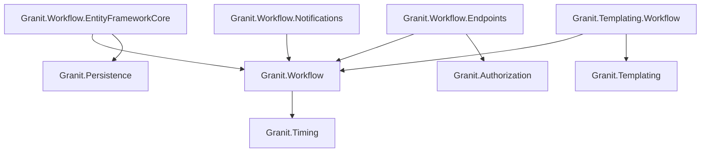
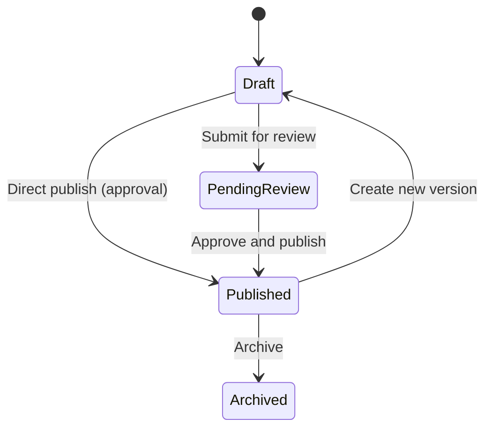
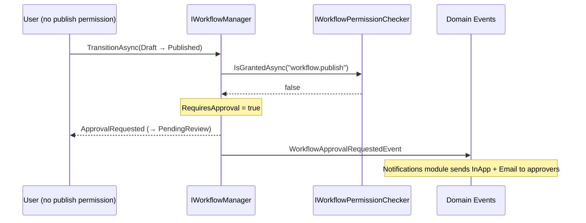

import { Tabs, TabItem, FileTree, Badge } from "@astrojs/starlight/components";

Granit.Workflow provides a type-safe finite state machine (FSM) engine for managing
entity lifecycles. Workflow definitions are built via a fluent API, validated at build
time (no duplicate transitions, no unreachable states), and stored as immutable
singletons. Transitions support permission checking, Odoo-style approval routing, and
an INSERT-only audit trail for ISO 27001 compliance.

## Package structure

<FileTree>
- Granit.Workflow/ Core FSM engine, fluent builder, domain events
  - Granit.Workflow.EntityFrameworkCore EF Core interceptor, audit trail persistence
  - Granit.Workflow.Endpoints Minimal API for transition history
  - Granit.Workflow.Notifications Approval and state change notifications
  - Granit.Templating.Workflow Bridge: template lifecycle via Workflow FSM
</FileTree>

| Package | Role | Depends on |
|---------|------|------------|
| `Granit.Workflow` | FSM definitions, `IWorkflowManager<TState>`, domain events | `Granit.Timing` |
| `Granit.Workflow.EntityFrameworkCore` | `WorkflowTransitionInterceptor`, `IWorkflowHistoryQuery`, `IWorkflowTransitionRecorder` | `Granit.Workflow`, `Granit.Persistence` |
| `Granit.Workflow.Endpoints` | `GET /{entityType}/{entityId}/history` (paginated audit trail) | `Granit.Workflow`, `Granit.Authorization` |
| `Granit.Workflow.Notifications` | Approval notifications (InApp + Email), state change notifications (InApp + SignalR) | `Granit.Workflow` |
| `Granit.Templating.Workflow` | Replaces `NullTemplateTransitionHook` with `WorkflowTemplateTransitionHook` | `Granit.Templating`, `Granit.Workflow` |

## Dependency graph



## Setup

<Tabs>
<TabItem label="Full stack (production)">

```csharp
[DependsOn(typeof(GranitWorkflowEntityFrameworkCoreModule))]
[DependsOn(typeof(GranitWorkflowEndpointsModule))]
[DependsOn(typeof(GranitWorkflowNotificationsModule))]
public class AppModule : GranitModule
{
    public override void ConfigureServices(ServiceConfigurationContext context)
    {
        context.Services.AddGranitWorkflowEntityFrameworkCore<AppDbContext>();
        context.Services.AddGranitWorkflowEndpoints();
        context.Services.AddGranitWorkflowNotifications();
    }
}
```

```csharp
// Program.cs
app.MapGranitWorkflow();
```

</TabItem>
<TabItem label="Core only (no persistence)">

```csharp
[DependsOn(typeof(GranitWorkflowModule))]
public class AppModule : GranitModule { }
```

Use this when you only need the FSM engine and domain events without EF Core
persistence or HTTP endpoints.

</TabItem>
</Tabs>

## Defining a workflow

Workflow definitions are generic over an `enum` state type. The fluent builder
validates the graph at build time: initial state must be set, at least one transition
must exist, no duplicate `From+To` pairs, and all states must be reachable from the
initial state via BFS.

```csharp
public enum InvoiceStatus
{
    Draft,
    PendingApproval,
    Approved,
    Rejected,
    Paid,
}

public static class InvoiceWorkflow
{
    public static WorkflowDefinition<InvoiceStatus> Default { get; } =
        WorkflowDefinition<InvoiceStatus>.Create(builder => builder
            .InitialState(InvoiceStatus.Draft)
            .Transition(InvoiceStatus.Draft, InvoiceStatus.PendingApproval, t => t
                .Named("Submit for approval")
                .RequiresPermission("invoice.submit"))
            .Transition(InvoiceStatus.PendingApproval, InvoiceStatus.Approved, t => t
                .Named("Approve")
                .RequiresPermission("invoice.approve")
                .RequiresApproval())
            .Transition(InvoiceStatus.PendingApproval, InvoiceStatus.Rejected, t => t
                .Named("Reject")
                .RequiresPermission("invoice.approve"))
            .Transition(InvoiceStatus.Approved, InvoiceStatus.Paid, t => t
                .Named("Mark as paid")
                .RequiresPermission("invoice.pay")));
}
```

Register the definition as a singleton:

```csharp
services.AddSingleton<IWorkflowDefinition<InvoiceStatus>>(InvoiceWorkflow.Default);
services.AddScoped<IWorkflowManager<InvoiceStatus>, WorkflowManager<InvoiceStatus>>();
```

## Built-in publication workflow

Granit ships a pre-built `PublicationWorkflow.Default` for the standard publication
lifecycle. It uses `WorkflowLifecycleStatus` as the state enum:



| State | Description |
|-------|-------------|
| `Draft` | Being edited. Filtered by `IPublishable` (not visible in standard queries). |
| `PendingReview` | Awaiting approval from a user with the required permission. |
| `Published` | Active published version. Exactly one per `VersionId` (unique filtered index). |
| `Archived` | Former version, preserved for ISO 27001 audit trail (3-year retention). |

```csharp
// Use the built-in definition directly
services.AddSingleton<IWorkflowDefinition<WorkflowLifecycleStatus>>(
    PublicationWorkflow.Default);
```

## Transitioning state

`IWorkflowManager<TState>` orchestrates transitions with permission checking and
approval routing:

```csharp
public static class ApproveInvoiceHandler
{
    public static async Task<IResult> Handle(
        Guid invoiceId,
        InvoiceDbContext db,
        IWorkflowManager<InvoiceStatus> workflowManager,
        CancellationToken cancellationToken)
    {
        Invoice invoice = await db.Invoices.FindAsync([invoiceId], cancellationToken)
            ?? throw new EntityNotFoundException(typeof(Invoice), invoiceId);

        TransitionResult<InvoiceStatus> result = await workflowManager.TransitionAsync(
            invoice.Status,
            InvoiceStatus.Approved,
            new TransitionContext { Comment = "Approved per department policy" },
            cancellationToken).ConfigureAwait(false);

        return result.Outcome switch
        {
            TransitionOutcome.Completed => TypedResults.Ok(),
            TransitionOutcome.ApprovalRequested => TypedResults.Accepted(
                value: "Routed to approval"),
            TransitionOutcome.Denied => TypedResults.Problem(
                detail: "Insufficient permissions", statusCode: 403),
            TransitionOutcome.InvalidTransition => TypedResults.Problem(
                detail: "Invalid transition", statusCode: 422),
            _ => TypedResults.Problem(detail: "Unexpected outcome", statusCode: 500),
        };
    }
}
```

### Transition outcomes

| Outcome | `Succeeded` | Description |
|---------|-------------|-------------|
| `Completed` | `true` | Entity moved to the requested target state. |
| `ApprovalRequested` | `true` | Entity routed to `PendingReview` — approvers notified. |
| `Denied` | `false` | User lacks permission, no approval routing available. |
| `InvalidTransition` | `false` | No transition defined from current state to target. |

## Approval routing

When a user triggers a transition that requires a permission they lack, and the
transition has `RequiresApproval()` enabled, the workflow manager routes the entity to
a pending review state and publishes a `WorkflowApprovalRequestedEvent` domain event:



### Permission checker bridge

`IWorkflowPermissionChecker` decouples the core engine from
`Granit.Authorization`. Two implementations exist:

| Implementation | When | Behavior |
|----------------|------|----------|
| `NullWorkflowPermissionChecker` | `Granit.Workflow` alone (tests, no auth) | Always grants — all transitions succeed |
| `AuthorizationWorkflowPermissionChecker` | `Granit.Workflow.Endpoints` loaded | Delegates to `IPermissionChecker` from `Granit.Authorization` |

When `GranitWorkflowEndpointsModule` is registered, `AddGranitWorkflowEndpoints()`
automatically replaces the null object with the real bridge. No manual registration
needed.

:::caution[Core-only usage without Granit.Authorization]
If you use `Granit.Workflow` without the Endpoints module, the default
`NullWorkflowPermissionChecker` allows all transitions. Register your own
`IWorkflowPermissionChecker` implementation to enforce domain-level permission
checks.
:::

### Approver resolution

The `IApproverResolver` interface determines who receives the notification:

| Implementation | Behavior |
|----------------|----------|
| `NullApproverResolver` (default) | Returns empty list — no notifications sent. |
| `IdentityApproverResolver` | Queries users who hold the required permission via `Granit.Identity`. |
| Custom | Register your own for department-based, hierarchy-based, or delegation logic. |

```csharp
// Register a custom approver resolver
services.AddWorkflowApproverResolver<DepartmentApproverResolver>();
```

## IWorkflowStateful marker

Entities implementing `IWorkflowStateful` get automatic audit trail recording via the
`WorkflowTransitionInterceptor`. The interface uses C# 11+ static abstract members to
avoid instance-level overhead:

```csharp
public class Invoice : AuditedEntity, IWorkflowStateful
{
    public InvoiceStatus Status { get; set; }
    public decimal Amount { get; set; }

    // Static abstract members — resolved via reflection by the interceptor
    static string IWorkflowStateful.StatusPropertyName => nameof(Status);
    static string IWorkflowStateful.WorkflowEntityType => "Invoice";

    public string GetWorkflowEntityId() => Id.ToString();
}
```

For entities that combine versioning with workflow (Odoo-style documents), inherit from
`VersionedWorkflowEntity`:

```csharp
public class DocumentRevision : VersionedWorkflowEntity
{
    public string Title { get; set; } = string.Empty;
    public string Content { get; set; } = string.Empty;

    // Only need to provide the entity type name
    static string IWorkflowStateful.WorkflowEntityType => "Document";
}
```

`VersionedWorkflowEntity` provides `VersionId`, `Version`, `LifecycleStatus`, and
`IsPublished` — the interceptor keeps `IsPublished` in sync with the lifecycle status.

## ISO 27001 audit trail

### WorkflowTransitionRecord

Every state change produces an INSERT-only `WorkflowTransitionRecord`. These records
are never modified or deleted (soft-delete is explicitly prohibited).
`WorkflowTransitionRecord` implements `IMultiTenant` — the standard tenant query
filter applied by `ApplyGranitConventions` ensures records are scoped to the
current tenant automatically:

| Column | Type | Description |
|--------|------|-------------|
| `Id` | `Guid` | Sequential GUID (clustered index). |
| `EntityType` | `string` | Logical entity type (e.g. `"Invoice"`, `"Document"`). |
| `EntityId` | `string` | Entity identifier (string for polymorphism). |
| `PreviousState` | `string` | State before transition. |
| `NewState` | `string` | State after transition. |
| `TransitionedAt` | `DateTimeOffset` | UTC timestamp from `IClock.Now`. |
| `TransitionedBy` | `string` | User ID or `"system"` for automated transitions. |
| `Comment` | `string?` | Optional regulatory justification. |
| `TenantId` | `Guid?` | Tenant context (null when multi-tenancy inactive). |

### WorkflowTransitionInterceptor

The interceptor hooks into EF Core `SaveChanges` and detects state changes by comparing
`OriginalValues` vs `CurrentValues` on the property identified by
`IWorkflowStateful.StatusPropertyName`. When a difference is detected, a new
`WorkflowTransitionRecord` is added to the same transaction.

The interceptor also synchronizes `IPublishable.IsPublished` for entities implementing
both `IPublishable` and `IWorkflowStateful` — set to `true` only when the status is
`WorkflowLifecycleStatus.Published`.

### AsyncLocal comment propagation

Attach a regulatory comment to the current transition via `WorkflowTransitionContext`:

```csharp
using (WorkflowTransitionContext.SetComment("Validated by medical director per ISO 27001"))
{
    invoice.Status = InvoiceStatus.Approved;
    await dbContext.SaveChangesAsync(cancellationToken);
}
// Comment is automatically cleared when the scope disposes
```

The interceptor reads `WorkflowTransitionContext.Current?.Comment` and stores it in
the transition record.

## EF Core integration

The host application's `DbContext` must implement `IWorkflowDbContext` and call the
model configuration extension:

```csharp
public class AppDbContext : DbContext, IWorkflowDbContext
{
    public DbSet<WorkflowTransitionRecord> WorkflowTransitionRecords => Set<WorkflowTransitionRecord>();

    protected override void OnModelCreating(ModelBuilder modelBuilder)
    {
        base.OnModelCreating(modelBuilder);
        modelBuilder.ConfigureWorkflowModule();
        modelBuilder.ApplyGranitConventions(currentTenant, dataFilter);
    }
}
```

Register the EF Core services:

```csharp
services.AddGranitWorkflowEntityFrameworkCore<AppDbContext>();
```

This registers:
- `WorkflowTransitionInterceptor` (Scoped, ordered after `AuditedEntityInterceptor`)
- `IWorkflowTransitionRecorder` → `EfWorkflowTransitionRecorder`
- `IWorkflowHistoryQuery` → `DefaultWorkflowHistoryQuery`

## Endpoints

`Granit.Workflow.Endpoints` exposes a single read endpoint:

| Method | Route | Permission | Description |
|--------|-------|------------|-------------|
| `GET` | `/{entityType}/{entityId}/history` | `Workflow.History.Read` | Paginated ISO 27001 audit trail |

```csharp
// Program.cs
app.MapGranitWorkflow();
```

Query parameters: `page` (default 1), `pageSize` (default 20, max 100).

## Notifications

`Granit.Workflow.Notifications` provides two notification types:

| Notification type | Severity | Default channels | Trigger |
|-------------------|----------|------------------|---------|
| `WorkflowApprovalNotificationType` | Warning | InApp + Email | `WorkflowApprovalRequestedEvent` domain event |
| `WorkflowStateChangedNotificationType` | Info | InApp + SignalR | `WorkflowStateChangedEvent` domain event |

Wolverine handlers consume the domain events and dispatch notifications via the
`Granit.Notifications` engine.

## Domain events

| Event | Published when | Payload |
|-------|----------------|---------|
| `WorkflowTransitionedEvent<TState>` | Transition completes (generic, app-level) | `EntityType`, `EntityId`, `PreviousState`, `NewState`, `TransitionedBy` |
| `WorkflowStateChangedEvent` | Transition completes (non-generic, framework-level) | `EntityType`, `EntityId`, `PreviousState`, `NewState`, `TransitionedBy` |
| `WorkflowApprovalRequestedEvent` | Transition routed to approval | `EntityType`, `EntityId`, `RequestedBy`, `TargetState`, `RequiredPermission` |

:::tip
`WorkflowTransitionedEvent<TState>` is generic and type-safe — use it in application
handlers. `WorkflowStateChangedEvent` uses string states for framework-level
consumption (notifications, timeline).
:::

## Public API summary

| Category | Key types | Package |
|----------|-----------|---------|
| Module | `GranitWorkflowModule`, `GranitWorkflowEntityFrameworkCoreModule`, `GranitWorkflowEndpointsModule`, `GranitWorkflowNotificationsModule`, `GranitTemplatingWorkflowModule` | -- |
| Definition | `WorkflowDefinition<TState>`, `WorkflowDefinitionBuilder<TState>`, `IWorkflowDefinition<TState>` | `Granit.Workflow` |
| Transition | `WorkflowTransition<TState>`, `TransitionBuilder<TState>`, `TransitionResult<TState>`, `TransitionOutcome` | `Granit.Workflow` |
| Manager | `IWorkflowManager<TState>`, `WorkflowManager<TState>` | `Granit.Workflow` |
| Marker | `IWorkflowStateful`, `VersionedWorkflowEntity` | `Granit.Workflow` |
| Context | `WorkflowTransitionContext`, `TransitionContext` | `Granit.Workflow` |
| Permission | `IWorkflowPermissionChecker`, `AuthorizationWorkflowPermissionChecker` | `Granit.Workflow` / `.Endpoints` |
| Audit | `WorkflowTransitionRecord`, `IWorkflowTransitionRecorder`, `IWorkflowHistoryQuery` | `Granit.Workflow` / `.EntityFrameworkCore` |
| Domain | `WorkflowLifecycleStatus`, `PublicationWorkflow` | `Granit.Workflow` |
| Events | `WorkflowTransitionedEvent<TState>`, `WorkflowStateChangedEvent`, `WorkflowApprovalRequestedEvent` | `Granit.Workflow` |
| EF Core | `IWorkflowDbContext`, `WorkflowTransitionInterceptor` | `Granit.Workflow.EntityFrameworkCore` |
| Notifications | `IApproverResolver`, `WorkflowApprovalNotificationType`, `WorkflowStateChangedNotificationType` | `Granit.Workflow.Notifications` |
| Extensions | `AddGranitWorkflow()`, `AddGranitWorkflowEntityFrameworkCore<T>()`, `AddGranitWorkflowEndpoints()`, `AddGranitWorkflowNotifications()`, `MapGranitWorkflow()` | -- |

## When to use — and when not to

Use Granit.Workflow when:

- An entity has **multiple states with business rules** governing transitions (approvals, rejections, escalations)
- You need an **audit trail** of who changed what and when (ISO 27001, regulatory)
- Transitions require **permission checks** or **multi-step approval** chains
- Business users need to **visualize** the lifecycle in admin UIs

Skip it when:

- Your entity has a simple linear lifecycle (Draft → Published) with no branching — a `Status` enum property with a setter guard is enough
- State changes are purely technical (e.g., background job status) — Wolverine's built-in saga state is simpler
- You have fewer than 3 states with no conditional transitions

## Common pitfalls

:::caution[Forgetting to register the workflow definition]
`IWorkflowDefinition<TState>` must be registered in DI. If you define a workflow but
forget to call `AddGranitWorkflow()` with the definition, `IWorkflowManager<TState>`
will throw at runtime. Always verify your module has `[DependsOn(typeof(GranitWorkflowModule))]`.
:::

:::caution[Mutating entity state directly]
Never set the `Status` property directly — always go through `IWorkflowManager.TransitionAsync()`.
Direct mutations bypass validation, permission checks, and the audit trail.
:::

:::caution[Circular transitions]
The workflow engine does not prevent cycles (A → B → A). This is intentional for
review loops, but if unintended, your entity can get stuck in an infinite loop of
event handlers. Always diagram your FSM before implementing.
:::

## Testing workflows

Test workflow definitions in isolation without a database:

```csharp
[Fact]
public async Task Should_transition_from_Draft_to_PendingApproval()
{
    // Arrange
    var definition = new InvoiceWorkflowDefinition();
    var invoice = new Invoice { Status = InvoiceStatus.Draft };
    var manager = new WorkflowManager<InvoiceStatus>(
        definition,
        NullWorkflowTransitionRecorder.Instance,
        NullPermissionChecker.Instance);

    // Act
    var result = await manager.TransitionAsync(
        invoice, InvoiceStatus.PendingApproval);

    // Assert
    result.Outcome.ShouldBe(TransitionOutcome.Completed);
    invoice.Status.ShouldBe(InvoiceStatus.PendingApproval);
}
```

For integration tests with EF Core and audit trail, use a `WebApplicationFactory`
with Testcontainers (PostgreSQL) to verify that `WorkflowTransitionRecord` rows
are persisted correctly.

## See also

- [Implement a workflow guide](/dotnet/guides/implement-workflow/) — step-by-step FSM implementation
- [Core module](../core/module-system/) -- `IDomainEvent`, module system, `IPublishable`
- [Persistence module](./persistence/) -- `AuditedEntityInterceptor`, `ApplyGranitConventions`
- [Security module](./authentication/) -- `ICurrentUserService`, permission checking
- [Notifications module](./notifications/) -- Notification engine, channels
- [Wolverine module](./wolverine/) -- Domain event routing, transactional outbox
- [API Reference](/api/Granit.Workflow.html) (auto-generated from XML docs)
