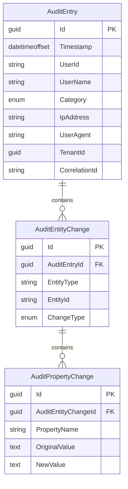

import { Tabs, TabItem, FileTree, Badge } from "@astrojs/starlight/components";

Granit.Auditing provides a turnkey audit trail solution for ISO 27001 A.12.4 compliance.
It automatically captures entity changes from EF Core's ChangeTracker and persists them
in a hierarchical model: **AuditEntry → AuditEntityChange → AuditPropertyChange**.

## Package structure

<FileTree>
- Granit.Auditing/ Abstractions, domain types, interfaces, options
  - Granit.Auditing.ConfigurationChanges/ Setting & feature flag change audit handlers
  - Granit.Auditing.EntityFrameworkCore/ Isolated DbContext, interceptor, persistence, cleanup
  - Granit.Auditing.Endpoints/ Read-only Minimal API endpoints
</FileTree>

| Package | Role | Depends on |
| ------- | ---- | ---------- |
| `Granit.Auditing` | Domain types, enums, `IAuditingReader`, `IAuditingWriter`, options | `Granit`, `Granit.QueryEngine` |
| `Granit.Auditing.ConfigurationChanges` | Audit handlers for `SettingChangedEvent` and `FeatureOverrideChangedEvent` | `Granit.Auditing`, `Granit.Settings`, `Granit.Features` |
| `Granit.Auditing.EntityFrameworkCore` | `AuditingDbContext`, interceptor, Channel persistence, cleanup worker | `Granit.Auditing`, `Granit.Persistence` |
| `Granit.Auditing.Endpoints` | `GET /audit-log` endpoints (read-only, authorized) | `Granit.Auditing`, `Granit.Http.ApiDocumentation` |

## Quick start

### 1. Install packages

```bash
dotnet add package Granit.Auditing.EntityFrameworkCore
dotnet add package Granit.Auditing.Endpoints   # optional — admin API
```

### 2. Register services

```csharp
// Program.cs
builder.AddGranitAuditingEntityFrameworkCore(options =>
    options.UseNpgsql(builder.Configuration.GetConnectionString("Auditing")));
```

### 3. Map endpoints (optional)

```csharp
app.MapGranitAuditing();
```

That's it. `AddGranitAuditingEntityFrameworkCore` registers the `AuditingChangeTrackingInterceptor`
as an `IGranitAutoInterceptor`. All DbContexts created via `AddGranitDbContext<T>` (or
multi-tenant factories) pick it up automatically through `UseGranitInterceptors` —
no additional wiring needed.

:::note[Manual wiring (advanced)]
If your DbContext does **not** use `AddGranitDbContext<T>` (e.g. a hand-wired
`AddDbContextFactory` call), add the interceptor explicitly:

```csharp
services.AddDbContextFactory<AppDbContext>((sp, options) =>
{
    options.UseNpgsql(connectionString);
    options.UseGranitInterceptors(sp);  // includes IGranitAutoInterceptor instances
}, ServiceLifetime.Scoped);
```

`UseGranitInterceptors` resolves both the 6 standard interceptors **and** any
module interceptors registered via `IGranitAutoInterceptor`.
:::

## Domain model

The hierarchical model captures **who** did **what**, **when**, on **which entities**,
down to **individual property changes**.



## Audit log categories

Inspired by Google Cloud Audit Logs, entries are classified into categories
with different retention defaults:

| Category | Description | Default retention | Always logged? |
| -------- | ----------- | ----------------- | -------------- |
| `DataMutation` | Entity Create / Update / Delete / SoftDelete | 365 days | Yes |
| `ConfigurationChange` | Settings, feature flags | ~7 years | Yes |
| `DataAccess` | Read operations | 90 days | Opt-in |
| `AccessDenied` | Authorization failures | ~7 years | Opt-in |

## Persistence modes

<Tabs>
  <TabItem label="Async (default)">
    Entries are published to an in-memory `Channel<T>` and persisted by a background
    worker. **Zero latency impact** on `SaveChanges`, but entries may be lost on crash.
    Transient database failures are retried automatically (3 attempts with exponential
    backoff). If all attempts fail, the entry is dropped and a `Critical`-level log is
    emitted for alerting.

    ```json
    { "Auditing": { "PersistenceMode": "Async" } }
    ```

    :::caution
    In Async mode, audit entries are buffered in-memory. A process crash loses all
    buffered entries. Use `Strict` mode for ISO 27001 strict compliance in production.
    :::
  </TabItem>
  <TabItem label="Strict">
    Entries are persisted synchronously within the interceptor's `SavedChangesAsync`
    callback. **Guaranteed durability** at the cost of added latency.
    Required for ISO 27001 strict compliance (banking, HDS).

    ```json
    { "Auditing": { "PersistenceMode": "Strict" } }
    ```
  </TabItem>
</Tabs>

## Controlling what gets audited

### Skip an entity or property

```csharp
[AuditIgnore]
public class CacheEntry : Entity { ... }

public class Patient : AuditedEntity
{
    public string Name { get; set; }

    [AuditIgnore]
    public byte[] ProfilePhoto { get; set; }  // Large binary, not audited
}
```

### Protect sensitive values

Use the cross-cutting `[SensitiveData]` attribute from `Granit.DataProtection`.
It is consumed by the auditing module, AI/MCP output sanitization, and logging.

```csharp
public class Patient : AuditedEntity
{
    [SensitiveData]                              // Default (Mask) → stored as "***"
    public string NationalId { get; set; }

    [SensitiveData(Mode = SensitiveDataMode.Omit)]   // Removed entirely from audit trail
    public string? PasswordHash { get; set; }

    [SensitiveData(Mode = SensitiveDataMode.Hash)]   // SHA-256 hash for correlation
    public string? ExternalUserId { get; set; }
}
```

| Mode | Audit trail value | Use case |
| ---- | ----------------- | -------- |
| `Mask` (default) | `***` | PII that must be recorded but not revealed |
| `Omit` | `null` | Secrets that must never appear in audit trail |
| `Hash` | `sha256:a1b2c3...` | Values needing cross-reference without exposure |

## Querying the audit trail

### Via `IAuditingReader` (code)

```csharp
public class MyService(IAuditingReader auditingReader)
{
    public async Task<PagedResult<AuditEntry>> GetPatientHistoryAsync(
        string patientId, CancellationToken ct) =>
        await auditingReader.GetByEntityAsync("Patient", patientId, cancellationToken: ct);
}
```

### Via admin endpoints

| Method | Route | Description |
| ------ | ----- | ----------- |
| `GET` | `/audit-log` | Paginated list with filters (category, date, user, entity) |
| `GET` | `/audit-log/{id}` | Single entry with full entity + property change hierarchy |
| `GET` | `/audit-log/entity/{type}/{id}` | Audit trail for a specific entity (GDPR SAR) |

All endpoints require the `Auditing.AuditEntries.Read` authorization policy (configurable).

## Retention and cleanup

The `AuditingCleanupWorker` runs periodically and deletes expired entries
by category. Retention periods are configurable:

```json
{
  "Auditing": {
    "ConfigurationChangeRetention": "2555.00:00:00",
    "DataMutationRetention": "365.00:00:00",
    "DataAccessRetention": "90.00:00:00",
    "AccessDeniedRetention": "2555.00:00:00",
    "CleanupInterval": "1.00:00:00",
    "CleanupBatchSize": 10000
  }
}
```

Deletes use `ExecuteDeleteAsync` in batches to avoid long-running transactions.
Cascade deletes automatically remove child `AuditEntityChange` and
`AuditPropertyChange` rows.

## Observability

| Signal | Name | Description |
| ------ | ---- | ----------- |
| Tracing | `Granit.Auditing` | ActivitySource for capture, persist, cleanup spans |
| Metric | `granit.auditing.entries.persisted` | Counter — entries successfully persisted |
| Metric | `granit.auditing.entries.purged` | Counter — entries purged by cleanup (by category) |
| Metric | `granit.auditing.capture.errors` | Counter — errors during change tracking capture |

## Configuration reference

| Key | Type | Default | Description |
| --- | ---- | ------- | ----------- |
| `PersistenceMode` | `Async` / `Strict` | `Async` | How entries are persisted |
| `EnablePropertyTracking` | `bool` | `true` | Capture property-level old/new values |
| `ConfigurationChangeRetention` | `TimeSpan` | `2555d` | Retention for config changes |
| `DataMutationRetention` | `TimeSpan` | `365d` | Retention for entity CRUD |
| `DataAccessRetention` | `TimeSpan` | `90d` | Retention for read operations |
| `AccessDeniedRetention` | `TimeSpan` | `2555d` | Retention for auth failures |
| `CleanupInterval` | `TimeSpan` | `24h` | Interval between cleanup runs |
| `CleanupBatchSize` | `int` | `10000` | Max entries deleted per batch |
| `ChannelCapacity` | `int` | `10000` | Max buffered batches in Async mode (backpressure) |
| `CacheEntryTtl` | `TimeSpan` | `30m` | Cache duration for individual audit entries |
| `CacheEntityQueryTtl` | `TimeSpan` | `2m` | Cache duration for entity-scoped queries |

## Notifications

`Granit.Auditing.Notifications` ships notifications surfacing high-signal events
that an SOC or compliance officer should know about — typically anomalies in the
audit stream itself (e.g. spikes in access-denied events, configuration changes
outside business hours).

| Notification | Trigger | Channels | Severity |
| ------------ | ------- | -------- | :------: |
| `auditing.anomaly_detected` | `AuditEntryPersistedEto` (filtered by anomaly heuristics) | Email, InApp | Warning |

Email templates ship in EN + FR; additional cultures are produced via the
[translation script](/dotnet/business/templating/) (US #1311).

## See also

- [Persistence](/dotnet/data/persistence/) — `AuditedEntityInterceptor` and entity base classes
- [Privacy](/dotnet/compliance/privacy/) — GDPR data subject access requests
- [Security](/dotnet/security/security-overview/) — `ICurrentUserService` and actor resolution
