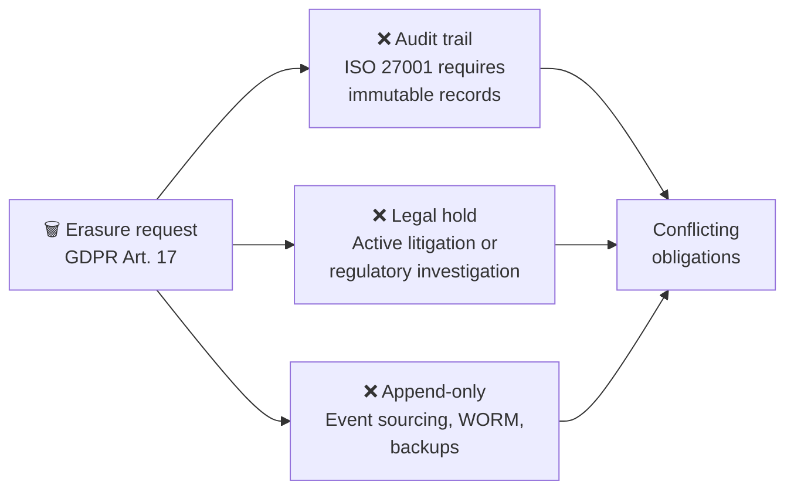
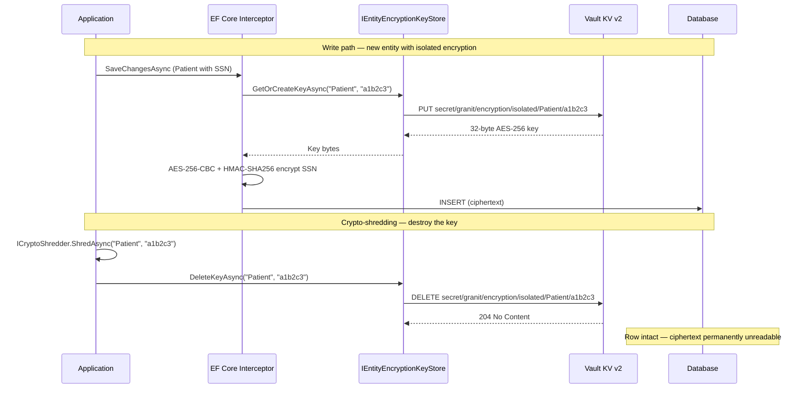
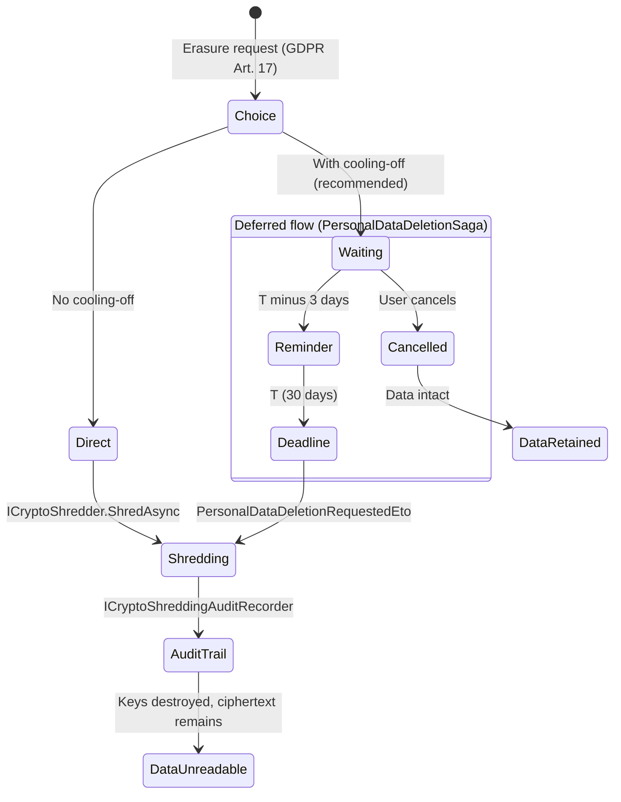

import { Tabs, TabItem, FileTree, Steps, Badge } from "@astrojs/starlight/components";

## The problem: GDPR says delete, but you can't

GDPR Article 17 grants every data subject the **right to erasure** — their personal
data must be irreversibly deleted upon request. Failure to comply costs up to
**€20 million or 4% of global annual turnover**, whichever is higher (Art. 83(5)(b)).
Under the Belgian DPA, fines apply even for *delayed* compliance with an erasure
request.

In theory, deletion is simple: `DELETE FROM patients WHERE id = @id`. In practice,
it is anything but.

### Three reasons physical deletion fails



1. **Audit trails break.** ISO 27001 (A.8.15) requires an immutable audit trail. The
   moment you `DELETE` a row, you destroy evidence of *what* happened, *when*, and
   *to whom*. A regulator auditing your data processing activities will find gaps
   where records used to be — which looks worse than the original data retention.

2. **Legal holds conflict.** Active litigation, tax audits, or regulatory
   investigations may *legally require* you to retain data — even when a GDPR
   erasure request arrives. Deleting data under legal hold is spoliation of evidence
   in most EU jurisdictions.

3. **Append-only architectures resist deletion.** Event sourcing, WORM (Write Once
   Read Many) storage, Kafka topics, and database backups cannot physically erase
   individual records. You would need to rewrite entire log segments or restore-and-filter
   backups — a multi-day, error-prone operation with no guarantee of completeness.

The core tension: **GDPR demands erasure, but other regulations and architectures
demand retention.** You need to satisfy both at the same time.

### The solution: destroy the key, not the data

Crypto-shredding resolves this tension with a simple insight: if data is encrypted
and you permanently destroy the encryption key, the ciphertext is mathematically
equivalent to random noise. The data is *still there* structurally — row counts,
join relationships, audit timestamps all remain intact — but the personal information
is **irreversibly unreadable**. No key, no data.

This is not a creative interpretation of the law. The **European Data Protection
Board** (Guidelines 5/2019), the **UK ICO**, and the **French CNIL** all explicitly
recognize cryptographic erasure as a valid implementation of the right to be forgotten,
provided that:

- The encryption algorithm is strong (AES-256 qualifies)
- The key destruction is **irreversible** (no backup key, no recovery path)
- The destruction is **auditable** (you can prove *when* the key was destroyed)

### Erasure strategies compared

| Strategy | Data gone? | Audit trail intact? | Works with backups? | Reversible? |
|----------|-----------|--------------------|--------------------|------------|
| Physical deletion (`DELETE`) | Yes | No — row is gone | No — backup still has it | No |
| Soft delete (`IsDeleted = true`) | No — still readable by admin | Yes | Yes | Yes — that's the problem |
| Anonymization (replace PII) | Depends on quality | Yes | No — backup has original | No |
| **Crypto-shredding** | **Yes — mathematically** | **Yes — row stays** | **Yes — backup ciphertext is useless** | **No — key is gone** |

Crypto-shredding is the only strategy that satisfies all four requirements
simultaneously. It is particularly valuable when you need **granular erasure** — erase
one patient's data without touching any other row in the same table.

## How Granit implements it

The Granit crypto-shredding feature builds on the existing
[field-level encryption](/dotnet/data/encryption/) infrastructure. Properties
marked with `[Encrypted(KeyIsolation = true)]` get their own encryption key per
entity instance, stored in HashiCorp Vault KV v2. When the DPO triggers erasure,
`ICryptoShredder.ShredAsync()` deletes the key from Vault — one API call, and the
data is gone forever.

The key insight: standard `[Encrypted]` properties share a single key ring across all
entities. Destroying that shared key would make *every* record unreadable — that is
catastrophic data loss, not controlled erasure. **Per-entity key isolation** is what
makes selective crypto-shredding possible.

## Package structure

<FileTree>

- Granit.Encryption/ IEntityEncryptionKeyStore, ICryptoShredder, ICryptoShreddingAuditRecorder
  - Granit.Encryption.EntityFrameworkCore/ [Encrypted(KeyIsolation = true)], isolation interceptors
- Granit.Vault.HashiCorp/ HashiCorpEntityEncryptionKeyStore (Vault KV v2)
- Granit.Privacy/ DeletionAction.CryptoShredding (integration point)

</FileTree>

| Package | Role | Depends on |
|---------|------|------------|
| `Granit.Encryption` | `IEntityEncryptionKeyStore`, `ICryptoShredder`, `DefaultCryptoShredder`, `ICryptoShreddingAuditRecorder` | `Granit` |
| `Granit.Encryption.EntityFrameworkCore` | `[Encrypted(KeyIsolation = true)]`, `EncryptionIsolationSaveChangesInterceptor`, `EncryptionIsolationMaterializationInterceptor` | `Granit.Encryption`, `Granit.Persistence` |
| `Granit.Vault.HashiCorp` | `HashiCorpEntityEncryptionKeyStore` — Vault KV v2 implementation with in-memory cache | `Granit.Vault` |
| `Granit.Privacy` | `DeletionAction.CryptoShredding` — integration with GDPR erasure workflow | `Granit` |

## Encryption and shredding lifecycle

Each entity instance gets its own 32-byte AES-256 key, stored in Vault KV v2. The
lifecycle has three phases: key creation (first write), normal operation (reads and
updates), and shredding (key destruction).



After shredding, reading the entity returns `null` for isolated encrypted properties.
The row stays in the database — audit queries, join counts, and aggregations continue
to work. Only the PII is gone.

## Setup

<Steps>

1. **Add the NuGet packages**

   ```bash
   dotnet add package Granit.Encryption.EntityFrameworkCore
   dotnet add package Granit.Vault.HashiCorp
   ```

2. **Register the modules**

   ```csharp
   [DependsOn(
       typeof(GranitEncryptionEntityFrameworkCoreModule),
       typeof(GranitVaultHashiCorpModule))]
   public sealed class AppModule : GranitModule { }
   ```

   `GranitVaultHashiCorpModule` automatically registers `HashiCorpEntityEncryptionKeyStore`
   as `IEntityEncryptionKeyStore`. `GranitEncryptionEntityFrameworkCoreModule` registers
   the isolation interceptors.

3. **Configure Vault KV**

   ```json
   {
     "Vault": {
       "Address": "https://vault.example.com",
       "AuthMethod": "Kubernetes",
       "KvMountPoint": "secret",
       "TransitMountPoint": "transit"
     }
   }
   ```

   The `KvMountPoint` setting controls which Vault KV v2 engine stores per-entity keys.
   Default: `"secret"`.

4. **Wire interceptors in your DbContext**

   The encryption isolation interceptors must run **after** `UseGranitInterceptors`
   (which assigns entity IDs via `AuditedEntityInterceptor`):

   ```csharp
   using Granit.Encryption.EntityFrameworkCore.Extensions;
   using Granit.Persistence.Extensions;

   builder.Services.AddDbContextFactory<AppDbContext>((sp, options) =>
   {
       options.UseNpgsql(connectionString);
       options.UseGranitInterceptors(sp);
       options.UseGranitEncryptionInterceptors(sp); // must be after UseGranitInterceptors
   }, ServiceLifetime.Scoped);
   ```

</Steps>

## Marking properties for key isolation

Add `[Encrypted(KeyIsolation = true)]` to properties that must support crypto-shredding.
Non-isolated `[Encrypted]` properties continue to use the shared key ring:

```csharp
using Granit.Encryption.EntityFrameworkCore;

namespace MyApp.Domain;

public sealed class Patient : AuditedAggregateRoot
{
    public string LastName { get; private set; } = string.Empty;

    [Encrypted]
    public string NationalId { get; private set; } = string.Empty;       // shared key ring

    [Encrypted(KeyIsolation = true)]
    public string MedicalNotes { get; private set; } = string.Empty;     // per-entity key

    [Encrypted(KeyIsolation = true)]
    public string? DiagnosisCode { get; private set; }                   // per-entity key
}
```

In this example, `NationalId` uses shared encryption (the same key encrypts all
patients' national IDs). `MedicalNotes` and `DiagnosisCode` use isolated keys — when
patient "abc-123" is shredded, only *their* medical notes and diagnosis code become
unreadable. Other patients are unaffected.

:::tip
Use key isolation only for properties that require **individual erasure**. Shared
encryption is simpler, faster, and supports key rotation via `IReEncryptionJob`.
Key isolation is heavier — one Vault KV secret per entity instance.
:::

## Wiring ApplyEncryptionConventions

The `ApplyEncryptionConventions` method handles both encryption modes automatically:

```csharp
protected override void OnModelCreating(ModelBuilder modelBuilder)
{
    base.OnModelCreating(modelBuilder);
    modelBuilder.ApplyGranitConventions(currentTenant, dataFilter);
    modelBuilder.ApplyEncryptionConventions(encryptionService);
}
```

Internally, `ApplyEncryptionConventions`:

- Applies `EncryptedStringConverter` to `[Encrypted]` properties (shared key)
- **Skips** the converter for `[Encrypted(KeyIsolation = true)]` properties and annotates
  them with `"Granit:EncryptionIsolated"` — these are handled by the interceptors instead

No code changes in `OnModelCreating` are needed to support key isolation.

## Performing crypto-shredding

### Single entity

Inject `ICryptoShredder` and call `ShredAsync`:

```csharp
public sealed class PatientDeletionHandler(ICryptoShredder shredder)
{
    public async Task HandleAsync(
        PersonalDataDeletionRequestedEto request,
        AppDbContext db,
        CancellationToken cancellationToken)
    {
        // Find all patient records for this user
        List<Guid> patientIds = await db.Patients
            .Where(p => p.CreatedBy == request.UserId.ToString())
            .Select(p => p.Id)
            .ToListAsync(cancellationToken)
            .ConfigureAwait(false);

        // Shred each patient's encryption keys
        foreach (var id in patientIds)
        {
            await shredder.ShredAsync("Patient", id.ToString(), cancellationToken)
                .ConfigureAwait(false);
        }
    }
}
```

### Batch shredding

For bulk operations, use `ShredBatchAsync`:

```csharp
await shredder.ShredBatchAsync(
    "Patient",
    patientIds.Select(id => id.ToString()),
    cancellationToken).ConfigureAwait(false);
```

### What happens after shredding

When you read a shredded entity, the materialization interceptor detects that the key
is gone and clears the isolated properties:

```csharp
var patient = await db.Patients.FindAsync([id], cancellationToken);

patient.MedicalNotes;   // null (was non-nullable string — now cleared)
patient.DiagnosisCode;  // null (nullable string)
patient.NationalId;     // still readable — uses shared key, not shredded
patient.LastName;       // still readable — not encrypted at all
```

:::caution
Crypto-shredding is **irreversible**. There is no key recovery path. Once
`ICryptoShredder.ShredAsync` completes, the data is permanently gone. Make sure
your GDPR deletion workflow includes a cooling-off period before calling the shredder.
See [Privacy module — deletion saga](/dotnet/compliance/privacy/data-deletion/).
:::

## Integration with Granit.Privacy

The Privacy module supports two erasure flows: **immediate** (the application calls
`ICryptoShredder` directly) and **deferred** (a cooling-off saga delays destruction
to give the user time to cancel). Both flows end the same way — per-entity keys are
destroyed and `DeletionAction.CryptoShredding` is reported.



**Immediate flow** — the application calls `ICryptoShredder` directly, for example
from an admin endpoint or a background job. Use this when no cooling-off period is
required (e.g., internal data cleanup, test data, or when the DPO has already
validated the request).

**Deferred flow** — the recommended approach for end-user erasure requests.
`PersonalDataDeletionSaga` enforces a configurable cooling-off period (default: 30 days,
max: 90 days per CNIL guidance). The user can cancel during this period. When the
deadline expires, the saga publishes `PersonalDataDeletionRequestedEto` — your data
provider handler catches it and calls `ICryptoShredder`.

Report the action back using `DeletionAction.CryptoShredding`:

```csharp
public sealed class PatientDataProvider(ICryptoShredder shredder)
{
    // Wolverine handler for PersonalDataDeletionRequestedEto
    public async Task<PersonalDataDeletedEto> HandleAsync(
        PersonalDataDeletionRequestedEto request,
        AppDbContext db,
        CancellationToken cancellationToken)
    {
        List<string> entityIds = await db.Patients
            .Where(p => p.CreatedBy == request.UserId.ToString())
            .Select(p => p.Id.ToString())
            .ToListAsync(cancellationToken)
            .ConfigureAwait(false);

        await shredder.ShredBatchAsync("Patient", entityIds, cancellationToken)
            .ConfigureAwait(false);

        return new PersonalDataDeletedEto(
            request.RequestId,
            "PatientModule",
            DeletionAction.CryptoShredding,
            entityIds.Count,
            DateTimeOffset.UtcNow);
    }
}
```

## Audit trail (ISO 27001)

Every crypto-shredding operation should be recorded in an immutable audit trail
(ISO 27001 A.10.1.2 — key destruction traceability). `DefaultCryptoShredder`
automatically calls all registered `ICryptoShreddingAuditRecorder` implementations
after each successful key deletion.

To record shredding events in the Timeline module:

```csharp
using Granit.Encryption.CryptoShredding;
using Granit.Timeline.Abstractions;
using Granit.Timeline.Domain;

public sealed class TimelineCryptoShreddingRecorder(
    ITimelineWriter writer) : ICryptoShreddingAuditRecorder
{
    public async Task RecordAsync(
        string entityType,
        string entityId,
        DateTimeOffset shreddedAt,
        CancellationToken cancellationToken = default)
    {
        string body = $"""
            **Encryption key destroyed** (crypto-shredding)
            - Entity: `{entityType}/{entityId}`
            - Timestamp: {shreddedAt:O}
            - Action: Per-entity AES-256 key permanently deleted from Vault KV
            - Effect: All `[Encrypted(KeyIsolation = true)]` fields are permanently unreadable
            """;

        await writer.PostEntryAsync(
            entityType,
            entityId,
            TimelineEntryType.SystemLog,  // immutable — cannot be deleted
            body,
            cancellationToken: cancellationToken).ConfigureAwait(false);
    }
}
```

Register it in DI:

```csharp
builder.Services.AddScoped<ICryptoShreddingAuditRecorder, TimelineCryptoShreddingRecorder>();
```

:::note
`TimelineEntryType.SystemLog` entries are **immutable** — the Timeline module rejects
deletion attempts on system log entries. This guarantees the audit trail survives even
if an administrator tries to cover tracks (ISO 27001 compliance).
:::

## Observability

### Metrics

`EncryptionMetrics` (meter: `Granit.Encryption`) exposes three counters:

| Metric | Description |
|--------|-------------|
| `granit.encryption.key.created` | Per-entity key generated in Vault KV |
| `granit.encryption.key.shredded` | Per-entity key permanently destroyed |
| `granit.encryption.shredding.errors` | Shredding operations that failed |

All metrics include `tenant_id` and `entity_type` tags.

### Tracing

`EncryptionActivitySource` (source: `Granit.Encryption`) records spans for:
`encryption.key-create`, `encryption.key-retrieve`, `encryption.key-delete`,
`encryption.shred`, `encryption.shred-batch`.

## API reference

### `[Encrypted(KeyIsolation = true)]`

```csharp
[AttributeUsage(AttributeTargets.Property)]
public sealed class EncryptedAttribute : Attribute
{
    public bool KeyIsolation { get; set; }
}
```

When `KeyIsolation` is `true`, each entity instance gets its own AES-256 key stored
in Vault KV. Default: `false` (shared key ring).

### `IEntityEncryptionKeyStore`

```csharp
public interface IEntityEncryptionKeyStore
{
    Task<byte[]> GetOrCreateKeyAsync(string entityType, string entityId, CancellationToken ct = default);
    Task<byte[]?> GetKeyAsync(string entityType, string entityId, CancellationToken ct = default);
    Task DeleteKeyAsync(string entityType, string entityId, CancellationToken ct = default);
    Task<bool> KeyExistsAsync(string entityType, string entityId, CancellationToken ct = default);
}
```

Provider-agnostic abstraction. Implemented by `HashiCorpEntityEncryptionKeyStore`
(Vault KV v2, path: `granit/encryption/isolated/{entityType}/{entityId}`).

### `ICryptoShredder`

```csharp
public interface ICryptoShredder
{
    Task ShredAsync(string entityType, string entityId, CancellationToken ct = default);
    Task ShredBatchAsync(string entityType, IEnumerable<string> entityIds, CancellationToken ct = default);
}
```

Permanently destroys per-entity encryption keys. `DefaultCryptoShredder` delegates
to `IEntityEncryptionKeyStore.DeleteKeyAsync` and calls all registered
`ICryptoShreddingAuditRecorder` instances.

### `ICryptoShreddingAuditRecorder`

```csharp
public interface ICryptoShreddingAuditRecorder
{
    Task RecordAsync(string entityType, string entityId, DateTimeOffset shreddedAt, CancellationToken ct = default);
}
```

Extension point for recording shredding events. Register implementations via DI.
`DefaultCryptoShredder` iterates all registered recorders after each successful
key deletion.

### `UseGranitEncryptionInterceptors`

```csharp
public static DbContextOptionsBuilder UseGranitEncryptionInterceptors(
    this DbContextOptionsBuilder options,
    IServiceProvider serviceProvider);
```

Adds `EncryptionIsolationSaveChangesInterceptor` and
`EncryptionIsolationMaterializationInterceptor` if `IEntityEncryptionKeyStore` is
registered. Must be called **after** `UseGranitInterceptors`.

## Vault KV structure

Per-entity keys are stored in Vault KV v2 with this path layout:

```text
secret/
  granit/
    encryption/
      isolated/
        Patient/
          a1b2c3d4-e5f6-...    → { "key": "base64-encoded-aes-256-key" }
          f7g8h9i0-j1k2-...    → { "key": "base64-encoded-aes-256-key" }
        Invoice/
          x9y8z7w6-v5u4-...    → { "key": "base64-encoded-aes-256-key" }
```

`DeleteKeyAsync` calls `DeleteMetadataAsync` — permanently destroying all versions
of the secret with no recovery path. The in-memory cache is evicted on deletion to
prevent stale reads.

## Compliance

| Regulation | Requirement | Coverage |
|------------|-------------|---------|
| GDPR Art. 17 | Right to erasure | Key destruction makes ciphertext permanently unreadable |
| GDPR Art. 5(1)(e) | Storage limitation | Data is cryptographically erased without physical deletion |
| ISO 27001 A.10.1.2 | Key destruction | Audit trail via `ICryptoShreddingAuditRecorder` + `TimelineEntryType.SystemLog` |
| ISO 27001 A.8.10 | Media sanitization | Ciphertext remains but is mathematically equivalent to random noise |

## When to use — and when not to

Use crypto-shredding when:

- You have **append-only or immutable storage** (event sourcing, WORM, immutable backups) where physical deletion is impossible
- You need to satisfy **concurrent obligations**: erasure *and* audit trail retention
- **Legal holds** may prevent row deletion, but GDPR requires data to be unreadable
- You need **granular erasure** — destroy one patient's data without affecting others in the same table

Skip it when:

- **Physical deletion** is acceptable and sufficient for your compliance requirements — it is simpler
- The data is **not PII** — crypto-shredding adds Vault KV overhead per entity instance
- You can use **anonymization** instead — replacing PII with pseudonymized values is cheaper and reversible
- Your application has **very high read throughput** on encrypted fields — the materialization interceptor adds per-entity Vault lookups (mitigated by caching, but still more overhead than shared encryption)

## Common pitfalls

:::caution[Interceptor ordering]
`UseGranitEncryptionInterceptors(sp)` **must** be called after `UseGranitInterceptors(sp)`.
`AuditedEntityInterceptor` assigns `Entity.Id` on `Added` state. If the encryption
interceptor runs first, the entity ID is `Guid.Empty` and the Vault KV path is wrong.
:::

:::caution[Shared key vs isolated key]
`[Encrypted]` (without `KeyIsolation`) uses the shared key ring. Destroying the shared
key makes **all** records of **all** entity types unreadable — that is not crypto-shredding,
that is catastrophic data loss. Only `[Encrypted(KeyIsolation = true)]` properties can
be individually shredded.
:::

:::caution[EF InMemory provider]
`UseInMemoryDatabase()` does not invoke `SaveChangesInterceptor` or
`IMaterializationInterceptor`. Use **SQLite** or **Testcontainers PostgreSQL** for
integration tests that verify encryption isolation behaviour.
:::

:::caution[Cache invalidation]
`HashiCorpEntityEncryptionKeyStore` caches keys in-memory for performance. After
`DeleteKeyAsync`, the cache entry is evicted. However, if multiple application instances
share the same Vault backend, other instances may still serve cached keys until they
restart or the cache entry expires. Design your shredding workflow to account for
this propagation delay.
:::

## Testing crypto-shredding

```csharp
[Fact]
public async Task Shredded_entity_returns_null_for_isolated_properties()
{
    // Arrange
    var keyStore = Substitute.For<IEntityEncryptionKeyStore>();
    var key = RandomNumberGenerator.GetBytes(32);
    keyStore.GetOrCreateKeyAsync(Arg.Any<string>(), Arg.Any<string>(), Arg.Any<CancellationToken>())
        .Returns(key);
    keyStore.GetKeyAsync(Arg.Any<string>(), Arg.Any<string>(), Arg.Any<CancellationToken>())
        .Returns(key);

    await using var context = CreateSqliteContext(keyStore);
    var patientId = Guid.NewGuid();

    // Act — save with encryption
    context.Patients.Add(new Patient { Id = patientId, MedicalNotes = "Confidential diagnosis" });
    await context.SaveChangesAsync(TestContext.Current.CancellationToken);

    // Act — simulate crypto-shredding (key store returns null)
    keyStore.GetKeyAsync(Arg.Any<string>(), Arg.Any<string>(), Arg.Any<CancellationToken>())
        .Returns((byte[]?)null);

    // Assert — isolated property is cleared
    var loaded = await context.Patients.FindAsync([patientId], TestContext.Current.CancellationToken);
    loaded!.MedicalNotes.ShouldBeNull();
}
```

## See also

- [Field-level Encryption](/dotnet/data/encryption/) — shared key ring, `[Encrypted]` attribute, key rotation
- [Vault & Encryption](/dotnet/data/vault/) — Vault Transit, KV configuration, provider setup
- [Privacy module](/dotnet/compliance/privacy/) — GDPR erasure saga, cooling-off period, `DeletionAction`
- [Audit Log](/dotnet/compliance/audit-log/) — tamper-proof activity tracking, ISO 27001
- [Persistence](/dotnet/data/persistence/) — isolated DbContext, `UseGranitInterceptors`
