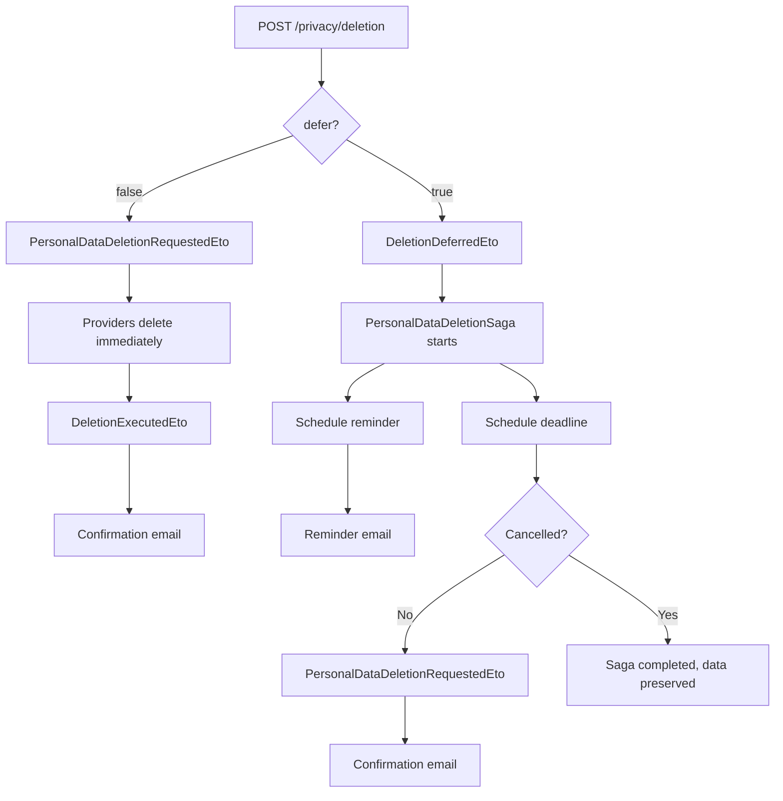

import { Aside, Badge } from "@astrojs/starlight/components";

## Deletion modes

Two modes are supported — **immediate** (default) and **deferred** with an opt-in
cooling-off period:



## Cooling-off period

When the user sets `defer: true`, the deletion is postponed for a configurable
grace period (default from the regulation profile). During this period the user
can cancel via `POST /privacy/deletion/{requestId}/cancel`. A reminder email is
sent a few days before the deadline. A daily safety-net job
(`DeletionDeadlineEnforcerJob`) catches any requests that the saga might have
missed.

## Endpoints

| Method | Route | Operation | Permission |
| ------ | ----- | --------- | ---------- |
| <Badge text="POST" variant="success" /> | `/deletion` | RequestPrivacyDeletion | `Privacy.Deletion.Execute` |
| <Badge text="POST" variant="success" /> | `/deletion/{requestId}/cancel` | CancelPrivacyDeletion | `Privacy.Deletion.Execute` |
| <Badge text="GET" variant="note" /> | `/deletion/{requestId}` | GetPrivacyDeletionStatus | *(owner only)* |
| <Badge text="GET" variant="note" /> | `/deletion` | ListPrivacyDeletions | *(owner only)* |

## Configuration

Grace periods default from the regulation profile. Override globally or per-regulation:

```json
{
  "Privacy": {
    "DefaultGracePeriodDays": 30,
    "MaxGracePeriodDays": 90,
    "ReminderDaysBefore": 3,
    "RegulationOverrides": {
      "BR_LGPD": { "DefaultGracePeriodDays": 15 },
      "US_CCPA": { "DefaultGracePeriodDays": 45, "MaxGracePeriodDays": 90 }
    }
  }
}
```

Applications must provide a tracker implementation for deferred deletion state:

```csharp
privacy.UseDeletionRequestTracker<EfCoreDeletionRequestTracker>();
```

## Notifications

`Granit.Privacy.Notifications` covers the full lifecycle of a deletion request.
Every notification renders against application-provided templates and can use
the `{{ privacy }}` global context to embed the controller / DPO contact.

| Notification name | Trigger | Channels | Severity | Purpose |
| ----------------- | ------- | -------- | -------- | ------- |
| `privacy.deletion_acknowledged` | `PersonalDataDeletionRequestedEto` | Email | `Info` | Receipt acknowledgement (GDPR Art. 12 §3 — paper trail of "without undue delay" response) |
| `privacy.deletion_deferred_confirmed` | `DeletionDeferredEto` | Email | `Info` | Confirms the new scheduled deletion date when the user opts to defer |
| `privacy.deletion_reminder` | `DeletionReminderDueEto` | Email + InApp | `Warning` | J-N reminder before the scheduled deadline so the user can still cancel |
| `privacy.deletion_cancelled` | `DeletionCancelledEto` | Email | `Info` | Confirms revocation of a deferred deletion (data is retained) |
| `privacy.deletion_confirmed` | `DeletionExecutedEto` | Email | `Info` | Final confirmation that the deletion was executed |

The `*_acknowledged`, `*_deferred_confirmed` and `*_cancelled` notifications carry
the `RequestId`, the relevant timestamp(s) and the `Regulation` code so templates
can quote the regulatory deadline directly from the active `PrivacyRegulationProfile`.
