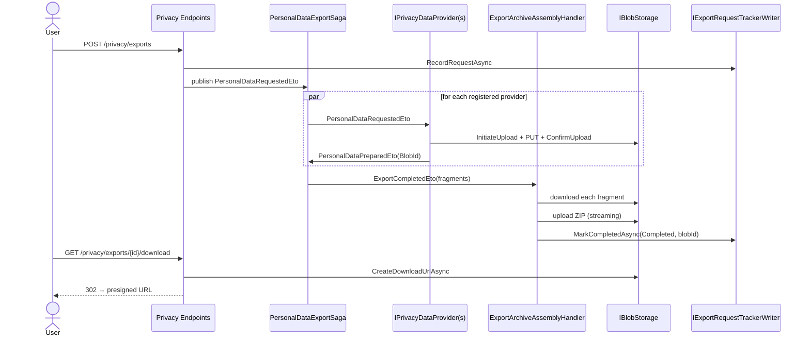
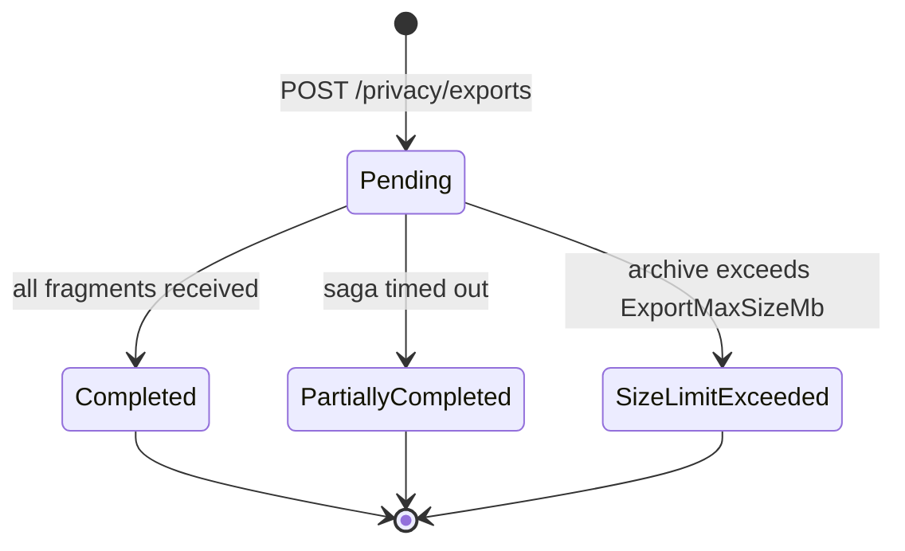

import { Aside, Badge } from "@astrojs/starlight/components";

The framework ships an end-to-end export pipeline. Wire the tracker, opt into
the built-in providers you need, add providers for app-specific data, and
`POST /privacy/exports` → `GET /privacy/exports/{id}/download` works out of the
box. See [ADR-021](../../architecture/adr/021-privacy-data-export-defaults) for
the design rationale.

## Pipeline at a glance



## Wiring

```csharp
services.AddGranitPrivacy(privacy => privacy
    .UseEntityFrameworkCoreTrackers()             // EF tracker defaults
    .AddGranitIdentityLocalPrivacyProvider()      // identity-local.json
    .AddGranitAuditingPrivacyProvider()           // auditing.json
    .AddGranitNotificationsPrivacyProvider());    // notifications.json

app.MapGranitPrivacy();                           // core endpoints
app.MapGranitPrivacyExportDownload();             // GET /privacy/exports/{id}/download
```

Load modules:

```csharp
[DependsOn(
    typeof(GranitPrivacyEntityFrameworkCoreModule),
    typeof(GranitPrivacyBlobStorageModule),
    typeof(GranitIdentityLocalPrivacyModule),
    typeof(GranitAuditingPrivacyModule),
    typeof(GranitNotificationsPrivacyModule))]
public class MyAppModule : GranitModule { }
```

<Aside type="tip">
`UseEntityFrameworkCoreTrackers()` adds `privacy_export_requests` and
`privacy_deletion_requests` to `PrivacyDbContext`. Run
`dotnet ef migrations add AddPrivacyTrackers` against the registered
`PrivacyDbContext` to generate the schema.
</Aside>

## Built-in providers

| Module | Provider name | Package | Fragment | Cap |
| ------ | ------------- | ------- | -------- | --- |
| `Identity.Local` | `identity-local` | `Granit.Identity.Local.Privacy` | Profile + roles | — |
| `Identity.Federated` | `identity-federated` | `Granit.Identity.Federated.Privacy` | Local cache entry (profile mirror + sync metadata) | — |
| `Auditing` | `auditing` | `Granit.Auditing.Privacy` | User-authored audit trail | 10 000 entries |
| `Notifications` | `notifications` | `Granit.Notifications.Privacy` | Inbox + preferences + subscriptions | 5 000 inbox items |

Providers return `ReadOnlyMemory<byte>.Empty` when the user has no data — the
framework records the provider in `manifest.EmptyProviders` without uploading
an empty blob.

## Writing a custom provider

For data not covered by a built-in, implement `IPrivacyDataProvider` and ship
a one-line Wolverine handler next to it. The static-abstract members let the
uploader and scatter-gather registry reason about the provider without
instantiating it.

```csharp
public sealed class MedicalRecordPrivacyDataProvider(
    IMedicalRecordReader reader) : IPrivacyDataProvider
{
    public static string ProviderName => "playground-medical";
    public static string ContentType => "application/json";
    public static string FileName(Guid requestId) => "medical-records.json";

    public async Task<ReadOnlyMemory<byte>> ExportAsync(Guid userId, CancellationToken ct)
    {
        IReadOnlyList<MedicalRecord> records = await reader
            .GetByPatientAsync(userId, ct).ConfigureAwait(false);
        if (records.Count == 0) return ReadOnlyMemory<byte>.Empty;

        return JsonSerializer.SerializeToUtf8Bytes(records, JsonOptions);
    }
}

public class MedicalRecordPersonalDataExportHandler
{
    public static Task HandleAsync(
        PersonalDataRequestedEto request,
        MedicalRecordPrivacyDataProvider provider,
        PrivacyFragmentUploader uploader,
        CancellationToken ct) =>
        uploader.UploadAsync(request, provider, ct);
}
```

Register with:

```csharp
services.AddGranitPrivacy(privacy => privacy
    .AddDataProvider<MedicalRecordPrivacyDataProvider>());
```

<Aside type="caution">
The framework's architecture test (`PrivacyDataProviderConventionTests`)
enforces that every non-abstract `IPrivacyDataProvider` has a matching
`*PersonalDataExportHandler` in the same assembly. Without the pairing, the
saga registers the provider but never receives a fragment — the export times
out silently at `ExportTimeoutMinutes`.
</Aside>

## Endpoints

| Method | Route | Operation | Permission |
| ------ | ----- | --------- | ---------- |
| <Badge text="POST" variant="success" /> | `/privacy/exports` | RequestPrivacyExport | `Privacy.Export.Execute` |
| <Badge text="GET" variant="note" /> | `/privacy/exports/{id}` | GetPrivacyExportStatus | *(owner only)* |
| <Badge text="GET" variant="note" /> | `/privacy/exports` | ListPrivacyExports | *(owner only)* |
| <Badge text="GET" variant="note" /> | `/privacy/exports/{id}/download` | DownloadPrivacyExportArchive | *(owner only)* |

The download endpoint returns `302 Found` with a short-lived presigned URL when
the request is `Completed` or `PartiallyCompleted`. Pending, timed-out, or
`SizeLimitExceeded` requests return `409 Conflict`; requests that do not exist
or belong to another user return `404 Not Found`.

## Archive layout

```
personal-data-export-{requestId}.zip
├── manifest.json
├── identity-local.json        (from Granit.Identity.Local.Privacy)
├── auditing.json              (from Granit.Auditing.Privacy)
├── notifications.json         (from Granit.Notifications.Privacy)
└── {custom-provider}.json     (from each app-specific IPrivacyDataProvider)
```

`manifest.json` records:

- `requestId`, `userId`, `regulation`, `requestedAt`, `completedAt`
- `isPartial` — `true` when the saga timed out before every provider responded
- `missingProviders` — names of providers that never emitted a fragment
- `emptyProviders` — names of providers that returned `ReadOnlyMemory<byte>.Empty`
- `fragments[]` — one entry per fragment file in the ZIP (provider name, file name, content type, blob reference)

## Configuration

```json
{
  "Privacy": {
    "ExportTimeoutMinutes": 5,
    "ExportMaxSizeMb": 100,
    "ArchiveAssemblyDownloadUrlExpiryMinutes": 15,
    "RegulationOverrides": {
      "BR_LGPD": { "ExportTimeoutMinutes": 3 }
    }
  }
}
```

| Option | Default | Purpose |
| ------ | ------- | ------- |
| `ExportTimeoutMinutes` | 5 | Saga timeout — providers must emit a fragment within this window or the export is marked `PartiallyCompleted`. |
| `ExportMaxSizeMb` | 100 | Hard cap on the archive size, enforced by a streaming `CountingStream` decorator. Exceeding it transitions the request to `SizeLimitExceeded` and no archive is uploaded. |
| `ArchiveAssemblyDownloadUrlExpiryMinutes` | 15 | TTL for the presigned URLs the assembler uses to fetch each fragment. Covers the saga timeout plus Wolverine retry budget. |

## Saga lifecycle



## Notifications

`Granit.Privacy.Notifications` ships two transactional notification types tied
to the export saga. Application templates resolve `ArchiveBlobReferenceId` to a
pre-signed download URL via the BlobStorage download endpoint, and can lean on
the `{{ privacy }}` template global context for the controller and DPO contact.

| Notification name | Trigger | Channels | Severity | Carried payload |
| ----------------- | ------- | -------- | -------- | --------------- |
| `privacy.export_ready` | `ExportCompletedEto` with `IsPartial = false` | Email | `Success` | `RequestId`, `ArchiveBlobReferenceId`, `RequestedAt`, `Regulation` |
| `privacy.export_failed` | `ExportCompletedEto` with `IsPartial = true` (saga timeout) | Email + InApp | `Warning` | `RequestId`, `ArchiveBlobReferenceId`, `MissingProviders`, `RequestedAt`, `Regulation` |

Both branches are routed by `ExportCompletedNotificationHandler` so that exactly
one outcome notification is sent per request — never both. The `MissingProviders`
list lets templates explain to the user which categories of data did not make it
into the partial archive (so they can decide whether to retry or accept).
