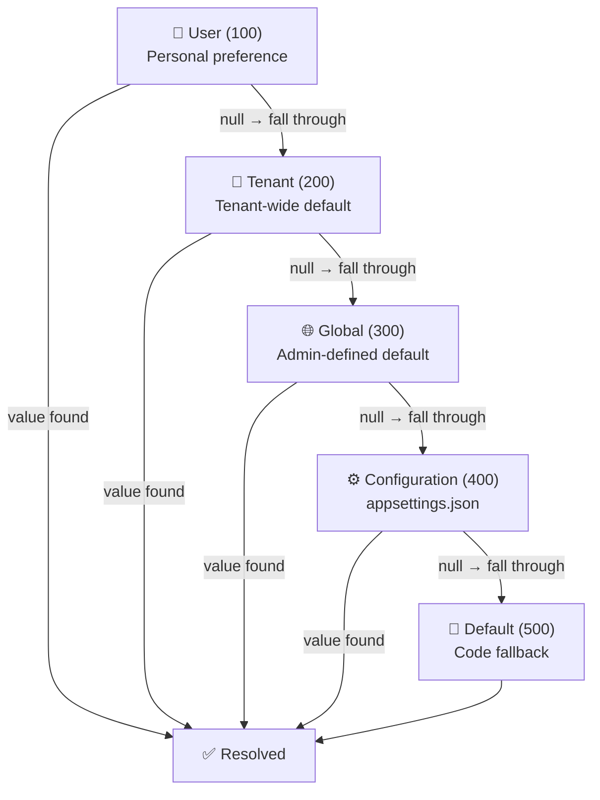
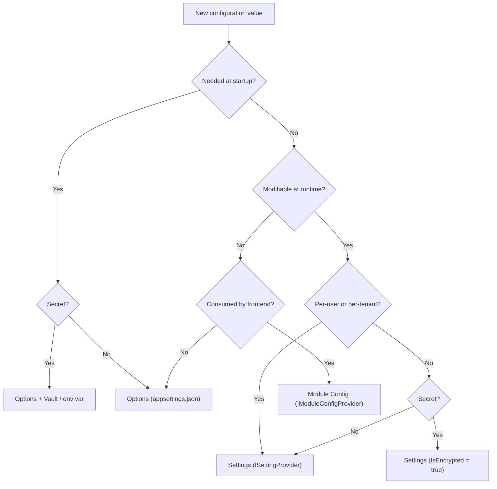

import { Tabs, TabItem } from "@astrojs/starlight/components";

## The problem

".NET has `IOptions<T>`, why do I need anything else?"

Because `IOptions<T>` is bound at startup from static files and environment variables.
It cannot change at runtime without a redeploy. But real applications need
user-specific preferences, tenant-level overrides, and admin-togglable knobs — all
modifiable through an API or UI while the application is running.

Granit provides three distinct configuration mechanisms. Each has a different purpose,
source, and audience. Using the wrong one leads to either unnecessary redeployments or
runtime fragility.

## The three mechanisms

| Mechanism | When | Source | Modifiable at runtime | Typing | Scope | Consumer |
|-----------|------|--------|-----------------------|--------|-------|----------|
| Options (`IOptions<T>`) | Startup | `appsettings.json`, env vars, Vault | No (redeploy) | Strong (C# class) | Application | Backend |
| Settings (`ISettingProvider`) | Runtime | Database | Yes (API/UI) | Weak (string) | User > Tenant > Global > Config > Default | Backend + Frontend |
| Module Config (`IModuleConfigProvider<T>`) | Runtime | Depends on impl | Read-only | Strong (C# record) | Application / module | Frontend mainly |

:::note[Good to know]
These three mechanisms are complementary, not competing. A module typically uses
Options for its infrastructure wiring (connection strings, timeouts), Settings for
user-facing preferences (locale, page size), and Module Config to expose read-only
flags to the frontend (feature availability, module version).
:::

---

## Options (`IOptions<T>`)

Options are the standard .NET mechanism for strongly-typed startup configuration.
Granit enforces a strict pattern for all module options. See
[Dependency Injection](./dependency-injection/) for the full recipe.

### Configuration sources hierarchy

ASP.NET Core loads configuration in this order. Later sources override earlier ones:

```
appsettings.json
  -> appsettings.{Environment}.json
    -> Environment variables
      -> CLI arguments
        -> User Secrets (Development only)
          -> Vault (via Granit.Vault dynamic credentials)
```

### Defining options

```csharp
public sealed class VaultOptions
{
    public const string SectionName = "Vault";

    [Required]
    public string Address { get; set; } = string.Empty;

    [Required]
    public string RoleId { get; set; } = string.Empty;

    [Required]
    public string SecretId { get; set; } = string.Empty;

    public TimeSpan TokenRenewalInterval { get; set; } = TimeSpan.FromMinutes(15);
}
```

### Registering options

```csharp
services
    .AddOptions<VaultOptions>()
    .BindConfiguration(VaultOptions.SectionName)
    .ValidateDataAnnotations()
    .ValidateOnStart();
```

### When to use Options

- Connection strings, endpoint URLs, timeouts
- Feature flags that require a redeploy to change (infrastructure-level)
- Secrets injected via environment variables or Vault
- Anything consumed before the DI container is built (Serilog, OpenTelemetry)

:::caution[Warning]
Never store secrets in `appsettings.json`. Use environment variables, User Secrets
(development), or Vault (production). The Options pattern binds from all configuration
sources transparently — the consuming code does not know where the value came from.
:::

---

## Settings (`ISettingProvider`)

Settings are runtime key-value pairs stored in the database. They support a cascading
resolution model: a value set at the user level overrides the same key at the tenant
level, which overrides the global level, and so on.

### Value cascade

Settings resolve through a provider chain. The first provider that returns a non-null
value wins:

| Priority | Provider | Scope | Description |
|----------|----------|-------|-------------|
| 100 | User | Per-user | Personal preferences (locale, theme, page size) |
| 200 | Tenant | Per-tenant | Tenant-wide defaults |
| 300 | Global | Application-wide | Admin-defined defaults |
| 400 | Configuration | `appsettings.json` | Deployment-time defaults |
| 500 | Default | Code | Hardcoded fallback in `SettingDefinition` |



When `IsInherited = false` on a `SettingDefinition`, each scope is independent and the
cascade does not fall through.

### Defining a setting

Implement `ISettingDefinitionProvider` in any module. Providers are auto-discovered at
startup.

```csharp
public sealed class AcmeSettingDefinitionProvider : ISettingDefinitionProvider
{
    public void Define(ISettingDefinitionContext context)
    {
        context.Add(new SettingDefinition("Acme.DefaultPageSize")
        {
            DefaultValue = "25",
            IsVisibleToClients = true,
            IsInherited = true,
            Description = "Default number of items per page"
        });

        context.Add(new SettingDefinition("Acme.SmtpPassword")
        {
            DefaultValue = null,
            IsEncrypted = true,
            IsVisibleToClients = false,
            Providers = { "G" }  // Global scope only
        });
    }
}
```

### Reading a setting (with cascade)

```csharp
public class ReportService(ISettingProvider settings)
{
    public async Task<int> GetPageSizeAsync(CancellationToken ct)
    {
        // Resolves User -> Tenant -> Global -> Config -> Default
        string? value = await settings
            .GetOrNullAsync("Acme.DefaultPageSize", ct)
            .ConfigureAwait(false);

        return int.TryParse(value, out int size) ? size : 25;
    }
}
```

### Writing a setting

```csharp
public class AdminService(ISettingManager settingManager)
{
    public async Task SetGlobalPageSizeAsync(
        int size, CancellationToken ct)
    {
        await settingManager
            .SetGlobalAsync("Acme.DefaultPageSize", size.ToString(), ct)
            .ConfigureAwait(false);
    }

    public async Task SetUserLocaleAsync(
        string userId, string locale, CancellationToken ct)
    {
        await settingManager
            .SetForUserAsync(userId, "Granit.PreferredCulture", locale, ct)
            .ConfigureAwait(false);
    }
}
```

### Encrypted settings

Settings marked `IsEncrypted = true` are encrypted at rest in the database using
`IStringEncryptionService`. The cache holds plaintext values — when Redis is used,
the cache transport is encrypted separately via TLS and Granit's cache encryption
layer. This means:

- Database backups do not contain plaintext secrets.
- The application reads plaintext from cache without decryption overhead on every access.
- Cache invalidation triggers re-read and re-decrypt from the database.

### When to use Settings

- User preferences (locale, timezone, theme, page size)
- Tenant-level configuration (SMTP server, billing thresholds)
- Admin-togglable knobs that must change without a redeploy
- Any key-value pair that needs per-user or per-tenant scoping

---

## Module Config (`IModuleConfigProvider<T>`)

Module Config is a lightweight read-only mechanism for exposing module state to the
frontend. Unlike Options (which are internal to the backend) and Settings (which are
read-write), Module Config provides a typed, public-facing snapshot of a module's
current configuration.

### Defining a module config provider

```csharp
public sealed record WebhookModuleConfigResponse(bool StorePayload);

internal sealed class WebhookModuleConfigProvider(
    IOptions<WebhooksOptions> options)
    : IModuleConfigProvider<WebhookModuleConfigResponse>
{
    public WebhookModuleConfigResponse GetConfig() =>
        new(options.Value.StorePayload);
}
```

### Exposing via HTTP

```csharp
// Program.cs
app.MapGranitModuleConfig<WebhookModuleConfigProvider,
    WebhookModuleConfigResponse>();
// GET /webhooks/config -> { "storePayload": true }
```

### When to use Module Config

- Frontend needs to know if a module feature is available
- Frontend conditionally renders UI based on backend configuration
- Read-only — if the frontend needs to change the value, use Settings instead

---

## Decision diagram

Use this diagram to pick the right mechanism for a new configuration value:



---

## Comparison at a glance

| Question | Options | Settings | Module Config |
|----------|---------|----------|---------------|
| Can a user change it? | No | Yes | No |
| Can a tenant override it? | No | Yes | No |
| Requires redeploy to change? | Yes | No | Depends on source |
| Strongly typed? | Yes (`sealed class`) | No (string values) | Yes (`sealed record`) |
| Encrypted at rest? | Via Vault / env vars | `IsEncrypted` flag | N/A |
| Cached? | In memory (singleton) | Distributed cache | In memory (singleton) |
| Exposed via HTTP? | No | Yes (`/settings/*`) | Yes (`/{module}/config`) |
| Typical consumer | Backend services | Backend + frontend | Frontend |

---

## See also

- [Dependency Injection](./dependency-injection/) -- Options pattern details, `ValidateOnStart`, `PostConfigure`
- [Settings, Features & Reference Data](../dotnet/infrastructure/application-settings/) -- full API reference for `ISettingProvider`, `ISettingManager`, and endpoints
- [Vault](../data/vault/) -- secret management for Options-level configuration
- [Caching](../dotnet/data/caching/) -- cache layer used by Settings for value resolution
