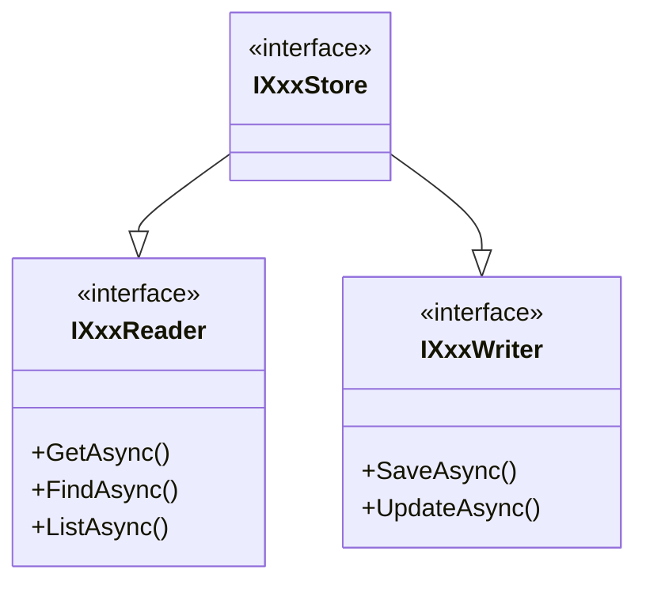

import { Tabs, TabItem } from "@astrojs/starlight/components";

## The problem

A typical data access layer exposes a single interface per
entity — `IProductStore` — with both `GetAsync` and `DeleteAsync`
on the same contract. Any consumer that injects the store can
read **and** write, even if it only needs to display a list.

This causes three concrete issues:

1. **Principle of least privilege violated** — a reporting endpoint has access to
   `DeleteAsync` it should never call.
2. **ISO 27001 audit** — when reviewing who can mutate data,
   every class injecting the store must be inspected manually.
   The DI graph gives no signal.
3. **GDPR risk** — a Reader that accidentally calls a write method can corrupt or
   destroy personal data outside its intended scope.

## The Granit approach

Every data module in Granit exposes **three interfaces**:



| Interface | Injected by | Purpose |
| --- | --- | --- |
| `IXxxReader` | Read endpoints, queries | Read-only |
| `IXxxWriter` | Write endpoints, commands | Mutations |
| `IXxxStore` | DI registration only | **Never inject** |

The `Store` exists so a single EF Core class can implement both interfaces and be
registered once in the container. Application code always injects the narrower
`Reader` or `Writer`.

## Compliance benefits

### ISO 27001 — instant write-access audit

Because write access requires injecting `IXxxWriter`, the DI graph is a live audit
trail. A single query answers "which components can mutate blob metadata?":

```bash
# Find every class that injects a Writer
grep -r "IXxxWriter" src/ --include="*.cs" -l
```

No manual code review needed — the type system enforces the boundary.

### GDPR — no accidental data destruction

`IXxxReader` interfaces expose no `Delete` or `Update` methods. A read endpoint
**cannot** accidentally destroy personal data, even if a developer makes a mistake.
This is structural protection, not convention.

## Where you will encounter it

CQRS shows up everywhere in Granit, not just in persistence:

- **Endpoints** — modules split routes into `*ReadEndpoints.cs` and
  `*WriteEndpoints.cs`, each injecting only the interface they need.
- **Wolverine handlers** — command handlers inject Writers, query handlers inject
  Readers. The message type (command vs query) aligns with the interface.
- **Interceptors and filters** — EF Core interceptors (`AuditedEntityInterceptor`,
  `SoftDeleteInterceptor`) operate on the write path. The read path uses
  `AsNoTracking` for performance.
- **Testing** — InMemory implementations of Reader/Writer make unit tests fast and
  isolated. No database needed.

## Quick example

<Tabs>
  <TabItem label="Read endpoint">
```csharp
// Injects ONLY the Reader — cannot mutate data
private static async Task<Ok<PagedResult<BackgroundJobStatus>>> GetAllJobsAsync(
    IBackgroundJobReader reader,
    [FromQuery] int page = 1,
    [FromQuery] int pageSize = 20,
    CancellationToken cancellationToken = default)
{
    IReadOnlyList<BackgroundJobStatus> all = await reader
        .GetAllAsync(cancellationToken).ConfigureAwait(false);
    return TypedResults.Ok(new PagedResult<BackgroundJobStatus>(/* ... */));
}
```
  </TabItem>
  <TabItem label="Write endpoint">
```csharp
// Injects ONLY the Writer — cannot read data
private static async Task<Results<NoContent, NotFound>> PauseJobAsync(
    string name,
    IBackgroundJobWriter writer,
    CancellationToken cancellationToken)
{
    await writer.PauseAsync(name, cancellationToken).ConfigureAwait(false);
    return TypedResults.NoContent();
}
```
  </TabItem>
  <TabItem label="Wolverine handler">
```csharp
// Command handler — Writer only
public static async Task Handle(
    SendWebhookCommand command,
    IWebhookDeliveryWriter deliveryWriter,
    CancellationToken cancellationToken)
{
    await deliveryWriter.RecordSuccessAsync(command, /* ... */, cancellationToken)
        .ConfigureAwait(false);
}
```
  </TabItem>
</Tabs>

## Common mistakes

:::caution[Never inject the Store directly]
The `IXxxStore` interface is a DI registration convenience.
If you inject it in a constructor, you bypass the entire CQRS
separation. Architecture tests will catch this — but
understanding why avoids the surprise.
:::

:::caution[Never merge Reader and Writer into a single interface]
Creating `IProductService` with both read and write methods undoes the separation.
If you need both in a single workflow, inject both interfaces separately:

```csharp
// Correct — two explicit dependencies
public class ExportHandler(
    IProductReader reader,
    IExportJobWriter writer)
```

```csharp
// Wrong — combined interface defeats CQRS
public class ExportHandler(
    IProductService service) // has Read + Write
```

:::

## Further reading

- [CQRS pattern reference](/dotnet/architecture/patterns/cqrs/) —
  full Reader/Writer inventory across all 27+ modules,
  ArchUnitNET enforcement, and implementation details
- [Repository (Store) pattern](/dotnet/architecture/patterns/repository/)
  — how Store interfaces map to EF Core and InMemory implementations
- [Anti-patterns](/troubleshooting/anti-patterns/) — "Merging Reader/Writer interfaces"
  section with detailed problem description
- [Persistence concept](./persistence/) — isolated DbContexts and interceptors that
  power the write path
