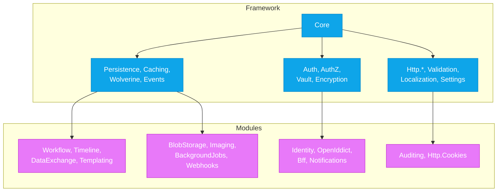

import { Tabs, TabItem } from "@astrojs/starlight/components";

## The problem

When a codebase reaches %%PACKAGE_COUNT%% packages in a flat directory, it becomes
unclear which packages are foundational infrastructure and which are optional business
features. Without a formal boundary:

- A "utility" package quietly gains a dependency on a business module, coupling the
  core to a feature.
- Removing or replacing a module becomes impossible because framework packages depend
  on it.
- New contributors cannot tell which packages they *must* understand versus which
  they can skip.

Some frameworks solve this by splitting into separate repositories (`framework/` vs `modules/`).
Granit solves it with a **classification rule**, an **architecture test**, and
**solution filters** -- no physical split required.

## The rule

> A package is a **module** if its name (after stripping `Granit.`) matches one of
> 17 registered *module roots*. Everything else under `src/Granit.*` (except bundles)
> is **framework**.

One sentence, one test, zero ambiguity.

## Characteristics

| Axis | Framework | Module |
| --- | --- | --- |
| **Abstraction level** | Low-level, generic | High-level, domain-specific |
| **Reusability** | Any application type | Specific business need |
| **Change frequency** | Rare (stability contract) | Frequent (feature evolution) |
| **Business knowledge** | Zero -- no domain concepts | Full -- owns the domain model |

A framework package must **never** contain business-domain types. If `Granit.Caching`
starts defining `OrderCachePolicy`, it must be refactored or moved to a module.

## Module roots

The 17 registered module roots, grouped by domain:

### Application

| Root | Packages | Description |
| --- | --- | --- |
| `DataExchange` | 7 | Import/export pipeline (CSV, Excel, Wolverine) |
| `DocumentGeneration` | 3 | PDF and Excel document rendering |
| `ReferenceData` | 3 | Lookup data management |
| `Templating` | 6 | Scriban template engine, workflow integration |
| `Timeline` | 5 | Event timeline with notifications |
| `Workflow` | 5 | State machine workflows |

### Infrastructure

| Root | Packages | Description |
| --- | --- | --- |
| `BackgroundJobs` | 4 | Recurring and delayed job scheduling |
| `BlobStorage` | 10 | File storage (S3, Azure, GCS, local) |
| `Imaging` | 3 | Image processing (MagickNet) |
| `Webhooks` | 4 | Outbound webhook management |

### Security

| Root | Packages | Description |
| --- | --- | --- |
| `Bff` | 5 | Backend for Frontend (YARP proxy) |
| `Identity` | 9 | User identity management |
| `OpenIddict` | 5 | OpenID Connect server |

### Compliance

| Root | Packages | Description |
| --- | --- | --- |
| `Auditing` | 4 | Audit trail and configuration change tracking |
| `Http.Cookies` | 3 | Cookie consent (GDPR, Klaro) |

### Notifications

| Root | Packages | Description |
| --- | --- | --- |
| `Notifications` | 28 | Multi-channel notifications (Email, SMS, Push, WebPush, SignalR) |

### Other

| Root | Packages | Description |
| --- | --- | --- |
| `Oidc` | 2 | OpenID Connect client utilities |

## Framework families

Everything that is **not** a module root (and not a bundle) is framework:

| Family | Packages | Role |
| --- | --- | --- |
| `Granit` (core) | 1 | Module system, domain types, shared abstractions |
| Timing, Guids, Diagnostics | 3 | Zero-dependency primitives |
| Validation | 5 | FluentValidation infrastructure + regional rules |
| Persistence | 5 | EF Core 10, migrations, DB providers |
| Caching | 2 | Distributed cache (FusionCache + Redis) |
| Http.\* | 10 | API docs, versioning, CORS, resilience, output caching |
| Security, Encryption, Vault | 6 | Encryption, secret management (4 cloud providers) |
| Authentication | 7 | JWT, DPoP, API keys (4 IdP providers) |
| Authorization | 3 | RBAC engine, EF persistence, management endpoints |
| Wolverine | 3 | Message bus + DB providers |
| Events | 2 | Domain and distributed event bus |
| Localization | 4 | i18n engine, EF persistence, source generator |
| Settings, Features | 6 | Runtime settings and feature flags |
| QueryEngine | 3 | Generic filtering, sorting, paging |
| MultiTenancy | 1 | Tenant resolution and context |
| Privacy | 4 | GDPR tooling, erasure, anonymization |
| AI | 8 | AI abstractions, providers, extraction, vector data |
| Observability, Testing | 3 | OpenTelemetry, test utilities |
| Analyzers | 2 | Roslyn analyzers and code fixes |
| RateLimiting | 1 | Rate limiting with feature flag integration |

## Dependency direction

**The arrow always points from framework to module.** A module *depends on* the
framework. A framework package *never* imports a module.

## Integration bridges

Some framework packages need optional integration with a module. Instead of adding
a direct dependency, Granit uses **bridge sub-packages**:

| Bridge package | Framework parent | Module dependency |
| --- | --- | --- |
| `Granit.Privacy.BackgroundJobs` | `Granit.Privacy` | `Granit.BackgroundJobs` |
| `Granit.Privacy.Notifications` | `Granit.Privacy` | `Granit.Notifications` |

The base framework package (`Granit.Privacy`) stays independent. The bridge is
opt-in: applications that use both Privacy and BackgroundJobs add
`Granit.Privacy.BackgroundJobs` explicitly.

The architecture test exempts bridges automatically: a framework project
`Granit.X.{ModuleRoot}` is allowed to reference `Granit.{ModuleRoot}`.

## Decision tree

When creating a new package:

1. **Does it fall under an existing module root?** (e.g., `Granit.BlobStorage.Minio`)
   -- It is a **module** sub-package. No action needed.

2. **Does it provide horizontal capability used by 3+ unrelated modules?**
   -- It is **framework**. Ensure it has zero business-domain knowledge.

3. **Is it a new vertical business feature?** (e.g., `Granit.Scheduling`)
   -- It is a new **module**. Add its root to `FrameworkBoundaryRules.ModuleRootPrefixes`.

4. **Is it a bridge between framework and module?** (e.g., `Granit.Encryption.BlobStorage`)
   -- Framework sub-package with bridge exemption. The naming convention
   `Granit.{FrameworkFamily}.{ModuleRoot}` triggers the exemption automatically.

## Enforcement

The `FrameworkBoundaryTests` architecture test enforces the boundary in CI:

- **`Framework_packages_should_not_reference_module_packages`** -- scans every
  framework `.csproj` and fails if any `ProjectReference` points to a module project.
- **`Every_src_package_should_be_classified`** -- catches new packages that do not
  match any category (missing module root registration).

Source: `tests/Granit.ArchitectureTests/FrameworkBoundaryTests.cs`

## See also

- [Module System](./module-system/) -- `[DependsOn]`, topological sort, lifecycle hooks
- [Bundles](./bundles/) -- meta-packages for quick onboarding
- [Dependency Graph](/dotnet/architecture/dependency-graph/) -- full package-level dependency
  diagrams for all %%PACKAGE_COUNT%% packages
