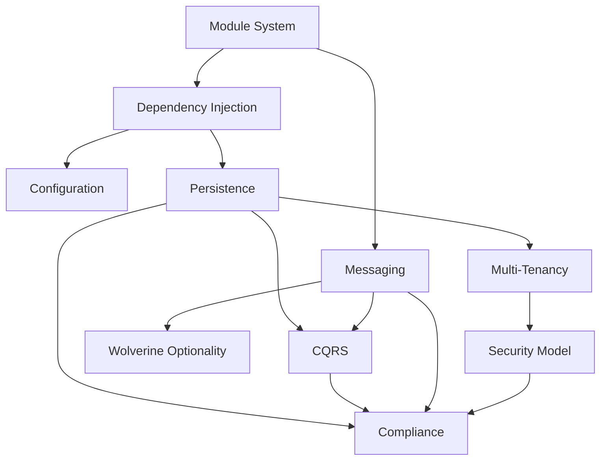

Granit is not a collection of independent utilities. Every design decision flows from
a small set of principles: modules compose with explicit dependency declarations, data
is always scoped to its tenant, events cross boundaries without coupling, and compliance
is structural rather than bolted on.

Understanding these concepts gives you the mental model to use Granit effectively
and extend it without surprises.

## How concepts connect

Start with the **Module System** — every other concept builds on it.

## Core architecture

- [Module System](./module-system/) — `[DependsOn]`, topological sort, conditional modules,
  two-phase lifecycle
- [Dependency Injection](./dependency-injection/) — module service registration, Options
  pattern, PostConfigure
- [Configuration](./configuration/) — Options (startup), Settings (runtime), Module Config
  (frontend read-only)

## Data and infrastructure

- [Persistence](./persistence/) — isolated DbContext, interceptors (audit, soft delete,
  versioning), automatic query filters
- [CQRS](./cqrs/) — Reader/Writer separation, compliance-driven data access,
  least-privilege injection
- [Multi-Tenancy](./multi-tenancy/) — three isolation strategies, transparent query filters,
  async-safe tenant context
- [Messaging](./messaging/) — domain events, integration events, transactional outbox,
  automatic context propagation
- [Wolverine Optionality](./wolverine-optionality/) — Channel fallback, crash behavior,
  when you actually need a message bus

## Security and compliance

- [Security Model](./security-model/) — JWT authentication, provider-agnostic RBAC,
  per-role caching, back-channel logout
- [Compliance](./compliance/) — GDPR and ISO 27001 enforcement as structural patterns

## Architecture

- [Framework vs Modules](./framework-vs-modules/) — classification boundary and
  dependency rules between horizontal framework and vertical business modules

## Tooling

- [Bundles](./bundles/) — meta-packages and the fluent `GranitBuilder` API for quick onboarding

## Architecture decisions

- [Modular Monolith vs Microservices](./modular-monolith-vs-microservices/) — decision
  framework, migration path, operational trade-offs
