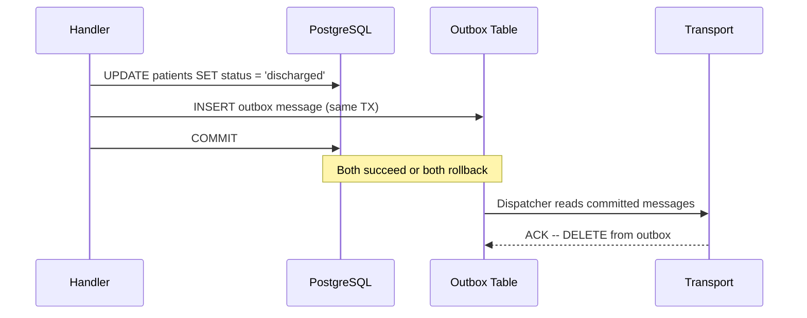
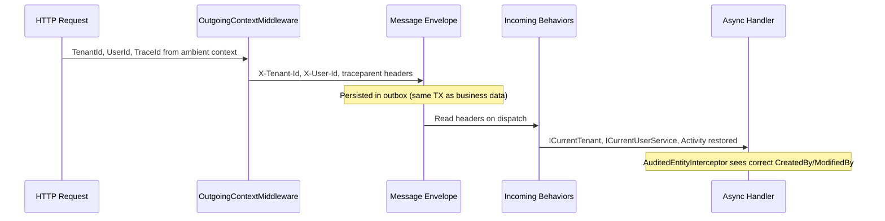

import { Tabs, TabItem } from "@astrojs/starlight/components";

## The problem

In a modular monolith, modules need to communicate without coupling. A patient discharge in module A should release a bed in module B -- but module A must not reference module B. The obvious answer is events. The less obvious problem: background processing needs the **same tenant, user, and trace context** as the originating HTTP request, or your audit trails break, your multi-tenant queries return wrong data, and your distributed traces have gaps.

Granit solves both problems through two event types, a transactional outbox, and automatic context propagation.

## Two event types

### IDomainEvent -- local, in-process

Domain events stay within the same process. They are routed to a local queue named `"domain-events"` and never leave the application boundary. Use them for side effects that belong to the same bounded context.

```csharp
public sealed record PatientDischargedEvent(
    Guid PatientId, Guid BedId) : IDomainEvent;
```

**Characteristics:**

- Same process, same transaction boundary
- Routed to the local `"domain-events"` queue
- Never serialized to an external transport
- Retried according to the configured retry policy

### IIntegrationEvent -- durable, cross-module

Integration events cross module boundaries. They are persisted in the transactional outbox and survive process crashes. Use them when the consumer is a different module or when at-least-once delivery matters.

```csharp
public sealed record BedReleasedEto(
    Guid BedId, Guid WardId, DateTimeOffset ReleasedAt) : IIntegrationEvent;
```

**Characteristics:**

- Persisted in the outbox alongside business data
- Delivered at-least-once (survives crashes, restarts)
- Serialized as flat DTOs -- never include EF Core entities or internal domain objects
- Transported via PostgreSQL-based transport

:::caution[Integration events must be flat DTOs]
Never put EF Core entities, navigation properties, or internal domain objects into integration events. These events cross module boundaries and are serialized to the outbox. Include only primitive types, value objects, and identifiers.
:::

## Transactional outbox

The outbox pattern eliminates dual-write problems. Events are persisted in the **same database transaction** as business data. If the transaction commits, events will be delivered. If it rolls back, events are discarded. No orphaned messages, no lost updates.



The handler does not need to manage any of this explicitly. Returning an event from a handler is enough:

```csharp
public static class DischargePatientHandler
{
    public static IEnumerable<object> Handle(
        DischargePatientCommand command,
        PatientDbContext db)
    {
        var patient = db.Patients.Find(command.PatientId)
            ?? throw new EntityNotFoundException(typeof(Patient), command.PatientId);

        patient.Discharge();

        // Domain event -- same transaction, local queue
        yield return new PatientDischargedEvent(patient.Id, patient.BedId);

        // Integration event -- persisted in outbox, durable delivery
        yield return new BedReleasedEto(
            patient.BedId, patient.WardId, DateTimeOffset.UtcNow);
    }
}
```

:::tip[Atomic fan-out]
When a handler returns `IEnumerable<object>`, **all** yielded messages are persisted atomically in the same transaction. This is how webhook delivery fans out N messages, how notifications dispatch to multiple channels, and how recurring jobs reschedule themselves -- all without dual-write risks.
:::

## Automatic context propagation

Three contexts propagate automatically through message envelopes, so background handlers behave exactly like the original HTTP request.

### Outgoing: HTTP request to envelope

`OutgoingContextMiddleware` reads the current tenant, user, and trace context from the ambient scope and writes them as headers on the outgoing message envelope:

| Header | Source | Purpose |
|--------|--------|---------|
| `X-Tenant-Id` | `ICurrentTenant.Id` | Tenant isolation in background handlers |
| `X-User-Id` | `ICurrentUserService.UserId` | Audit trail (`CreatedBy`, `ModifiedBy`) |
| `X-Actor-Kind` | `ICurrentUserService.ActorKind` | `User`, `ExternalSystem`, or `System` |
| `X-Api-Key-Id` | `ICurrentUserService.ApiKeyId` | Service account identification |
| `traceparent` | `Activity.Current?.Id` | W3C Trace Context for distributed tracing |

Headers are omitted when the corresponding context is absent. First name and last name
are intentionally excluded from message headers (GDPR Art. 5(1)(c) — data minimization).
Background handlers that need display names should resolve them from the identity store.

### Incoming: envelope to handler context

Three behaviors restore the context before the handler executes:

| Behavior | Restores | Mechanism |
|----------|----------|-----------|
| `TenantContextBehavior` | `ICurrentTenant` | Sets `AsyncLocal` tenant scope |
| `UserContextBehavior` | `ICurrentUserService` | Sets `AsyncLocal` user override via `WolverineCurrentUserService` |
| `TraceContextBehavior` | `Activity` (trace/span) | Creates a new `Activity` linked to the parent `traceparent` |

### The full flow



The result: Grafana/Tempo shows a continuous trace from the original HTTP request through every async handler it triggered. Audit fields are populated correctly. Multi-tenant query filters apply the right tenant.

## WolverineCurrentUserService

In an HTTP request, `ICurrentUserService` reads claims from `HttpContext.User`. In a background handler, there is no `HttpContext`. `WolverineCurrentUserService` bridges this gap with a two-level resolution strategy:

1. **AsyncLocal override** -- set by `UserContextBehavior` from envelope headers. Used in background handlers.
2. **HttpContext fallback** -- reads claims from `IHttpContextAccessor`. Used in normal HTTP requests.

This is registered automatically by `AddGranitWolverine()`. You never interact with it directly -- `ICurrentUserService` just works in both contexts.

## Atomic rescheduling

`RecurringJobSchedulingMiddleware` inserts the next cron schedule in the **same outbox transaction** as the current job's completion. If the handler fails and the transaction rolls back, the reschedule is also rolled back -- preventing duplicate schedules or missed runs.

## Configuration

```json
{
  "Wolverine": {
    "MaxRetryAttempts": 3,
    "RetryDelays": ["00:00:05", "00:00:30", "00:05:00"]
  },
  "WolverinePostgresql": {
    "TransportConnectionString": "Host=db;Database=myapp;Username=app;Password=..."
  }
}
```

| Property | Default | Description |
|----------|---------|-------------|
| `MaxRetryAttempts` | `3` | Maximum delivery attempts before dead-letter |
| `RetryDelays` | `[5s, 30s, 5min]` | Delay between retries (exponential backoff) |
| `TransportConnectionString` | -- | PostgreSQL connection for the outbox transport |

:::note[ValidationException bypasses retries]
Messages that fail `FluentValidation` are sent directly to the error queue -- no retry. Retrying a structurally invalid message is pointless.
:::

## Setup

<Tabs>
<TabItem label="With PostgreSQL outbox">

```csharp
[DependsOn(typeof(GranitWolverinePostgresqlModule))]
public class AppModule : GranitModule { }
```

Production setup. Events are persisted in the outbox and delivered durably.

</TabItem>
<TabItem label="In-memory only">

```csharp
[DependsOn(typeof(GranitWolverineModule))]
public class AppModule : GranitModule { }
```

Development setup. Events are in-memory only -- lost on crash.

</TabItem>
</Tabs>

## See also

- [Wolverine Optionality](./wolverine-optionality/) -- what works without Wolverine and when you actually need a message bus
- [Wolverine reference](/dotnet/infrastructure/wolverine-messaging/) -- full API surface, setup variants, handler conventions
- [BackgroundJobs reference](/dotnet/infrastructure/background-jobs/) -- recurring job scheduling with cron expressions
