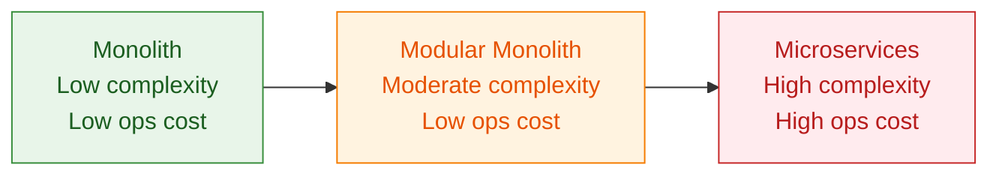
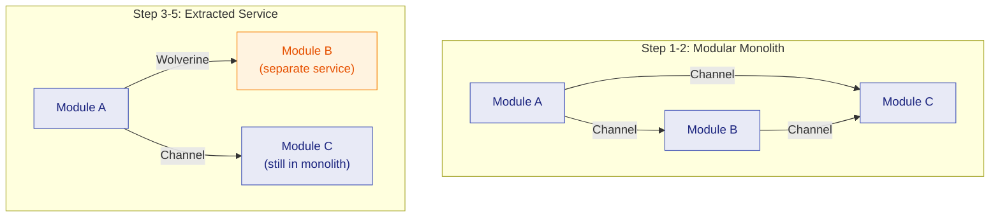

import { Tabs, TabItem } from "@astrojs/starlight/components";

Architecture is not a binary choice between monolith and microservices. It is a spectrum, and the right position depends on your team size, operational maturity, and scaling requirements. Granit is designed to let you start at the sweet spot and move along the spectrum when the trade-offs justify it.

## The spectrum



| | Monolith | Modular Monolith | Microservices |
|---|---|---|---|
| Deployment | Single unit | Single unit | Independent per service |
| Module boundaries | None or conventions | Enforced in code | Enforced by network |
| Data isolation | Shared tables | Isolated DbContext per module | Separate databases |
| Communication | Direct method calls | In-process channels or messaging | Network (HTTP, messaging) |
| Operational cost | Low | Low | High |
| Team scalability | Limited | Good | High |
| Failure isolation | None | Partial | Full |

Every step to the right adds operational cost: distributed tracing, network failure handling, data consistency challenges, deployment orchestration. That cost is justified only when the benefit — independent scaling, team autonomy, fault isolation — outweighs it.

## Where Granit sits

Granit is designed for modular monoliths. Every architectural decision — isolated DbContext per module, explicit `DependsOn` graphs, channel-based messaging — enforces module boundaries that mirror microservice boundaries. This is deliberate: when extraction becomes necessary, the seams already exist.

The same `GranitModule` that runs inside a modular monolith can run as the entry point of an independent service. No rewrite required.

## Modular monolith with Granit

A single deployable process composed of multiple modules, each with clear boundaries.

```csharp title="Program.cs"
var builder = WebApplication.CreateBuilder(args);

builder.AddGranit(granit =>
{
    // Core infrastructure
    granit.AddModule<GranitPersistenceModule>();
    granit.AddModule<GranitCachingModule>();
    granit.AddModule<GranitObservabilityModule>();

    // Domain modules — each owns its DbContext
    granit.AddModule<GranitIdentityModule>();
    granit.AddModule<GranitWorkflowModule>();
    granit.AddModule<GranitNotificationsModule>();
    granit.AddModule<GranitBlobStorageModule>();

    // Application module
    granit.AddModule<AppHostModule>();
});

var app = builder.Build();
app.UseGranit();
app.Run();
```

What this gives you:

- **Module isolation** — each module declares its dependencies via `[DependsOn]`. Circular references are rejected at startup.
- **Database isolation** — each `*.EntityFrameworkCore` module owns a separate `DbContext`. No shared tables, no accidental coupling.
- **In-process messaging** — modules communicate through channels without requiring Wolverine or any external infrastructure.
- **Single process** — inter-module calls are fast method invocations. No serialization, no network latency.
- **Bundles** — related modules are grouped into bundles for convenience, but each module remains independently configurable.

:::tip[Pro tip]
Channel-based messaging inside a modular monolith gives you the decoupling benefits of event-driven architecture without the operational overhead of a message broker. When you later need durability or cross-process delivery, upgrade to Wolverine — your handler code stays the same.
:::

## Microservices with Granit

When a module needs independent scaling, a different deployment cadence, or team-level ownership, extract it into its own service.

```csharp title="NotificationService/Program.cs"
var builder = WebApplication.CreateBuilder(args);

builder.AddGranit(granit =>
{
    granit.AddModule<GranitPersistenceModule>();
    granit.AddModule<GranitObservabilityModule>();
    granit.AddModule<GranitWolverinePostgresqlModule>();

    // This module now runs as an independent service
    granit.AddModule<GranitNotificationsModule>();
});

var app = builder.Build();
app.UseGranit();
app.Run();
```

What changes:

- **Wolverine replaces channels** — durable messaging over PostgreSQL transport handles inter-service communication with transactional outbox guarantees.
- **Separate database** — the module already had its own `DbContext`. Now it gets its own PostgreSQL database.
- **Independent deployment** — ship notification changes without redeploying the entire platform.
- **Independent scaling** — scale notification processing horizontally without scaling the rest of the system.
- **Multi-tenancy per service** — each service can apply its own tenant isolation strategy.

What stays the same:

- The `GranitModule` class and its `[DependsOn]` declarations.
- Message handlers — a handler that processed channel messages processes Wolverine messages with zero code changes.
- The `DbContext` and all entity configurations.
- Observability — context propagation ensures distributed traces span services.

## Migration path

The migration from modular monolith to extracted microservices is incremental. No big-bang rewrite.



<Tabs>
  <TabItem label="Step 1: Start modular">
    Deploy all modules in a single process. Use channel-based messaging for inter-module communication. This is the default and covers most teams.
  </TabItem>
  <TabItem label="Step 2: Add durability">
    When you need guaranteed message delivery (e.g., notification fan-out must not lose messages), add `GranitWolverinePostgresqlModule`. The transactional outbox ensures messages survive process crashes. Your handlers do not change.
  </TabItem>
  <TabItem label="Step 3: Identify the candidate">
    Look for modules with: different scaling requirements, a different release cadence, a dedicated team, or regulatory isolation needs (e.g., a payment module that requires PCI DSS scope reduction).
  </TabItem>
  <TabItem label="Step 4: Extract the service">
    Create a new host project for the extracted module. It gets its own `Program.cs`, its own `GranitModule` composition, and Wolverine for messaging back to the monolith.
  </TabItem>
  <TabItem label="Step 5: Split the database">
    Because each module already owns an isolated `DbContext`, the database split is mechanical. Point the extracted service's connection string to a new database and run its migrations independently.
  </TabItem>
</Tabs>

:::note[Good to know]
Steps 3 through 5 are repeatable. Extract one module at a time, validate the operational overhead is manageable, then consider the next candidate. Rushing to extract everything at once is the most common microservices failure mode.
:::

## Decision framework

The question is never "should we use microservices?" — it is "does extracting this specific module justify the operational cost?"

<Tabs>
  <TabItem label="Stay monolith">
    - Fewer than 5 developers working on the codebase
    - Under 100k requests per minute
    - Single team with a shared release cycle
    - No module requires independent scaling
    - Deployment frequency is uniform across modules
  </TabItem>
  <TabItem label="Consider extraction">
    - A module has fundamentally different scaling needs (e.g., notification delivery spikes)
    - A module has a different deployment cadence (daily vs. weekly)
    - Team boundaries align with module boundaries
    - Regulatory isolation requires a reduced compliance scope (e.g., PCI DSS for payments)
    - A module failure should not take down the entire system
  </TabItem>
</Tabs>

:::caution[Warning]
Microservices are not a goal. They are a trade-off. The operational cost is real — monitoring, distributed tracing, network failures, data consistency, deployment orchestration, contract versioning. Only extract when the benefit outweighs the cost. A well-structured modular monolith outperforms a poorly operated microservices architecture every time.
:::

## Why Granit works in both modes

Granit does not bet on one architecture. It enforces patterns that work regardless of deployment topology:

| Pattern | Monolith benefit | Microservice benefit |
|---|---|---|
| Isolated `DbContext` per module | No accidental table coupling | Database split is mechanical |
| `[DependsOn]` graph | Startup validation, no circular refs | Explicit service contracts |
| Channel / Wolverine messaging | In-process decoupling | Durable cross-service messaging |
| Context propagation (OpenTelemetry) | Structured logs per module | Distributed traces across services |
| Multi-tenancy (`ICurrentTenant`) | Tenant-scoped queries | Per-service tenant strategy |
| `GranitModule` as entry point | Composable monolith | Independent service host |

The key insight: the upgrade from channel to Wolverine requires zero handler code changes. You change the infrastructure registration, not the business logic. This is the difference between an architecture that supports migration and one that requires a rewrite.

## Further reading

- [Module System](/dotnet/concepts/module-system/) — how `GranitModule` and `[DependsOn]` work
- [Messaging](/dotnet/concepts/messaging/) — channels, Wolverine, and the handler model
- [Wolverine Optionality](/dotnet/concepts/wolverine-optionality/) — why Wolverine is optional and how to upgrade
- [Wolverine reference](/dotnet/infrastructure/wolverine-messaging/) — configuration, PostgreSQL transport, transactional outbox
